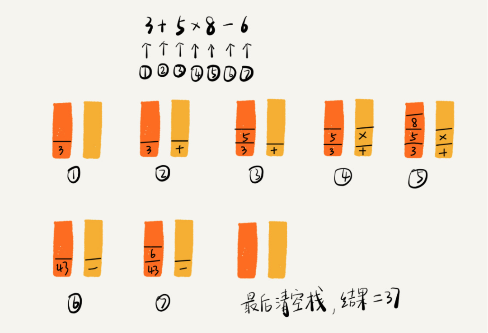

# 栈

> 栈是一种“操作受限”的线性表，只允许在一端插入和删除数据

当某个数据集合只涉及在一端插入和删除数据，并且满足后进先出、先进后出的特性，这时我们就应该首选“栈”这种数据结构。

## 如何实现一个“栈”？

栈既可以用数组来实现，也可以用链表来实现。用数组实现的栈，我们叫作顺序栈，用链表实现的栈，我们叫作链式栈。

## 支持动态扩容的顺序栈

使用可以扩容的容器作为底层存储数据模型。

通过这个例子的实战分析，也印证了前面讲到的，均摊时间复杂度一般都等于最好情况时间复杂度。因为在大部分情况下，入栈操作的时间复杂度 O 都是 O(1)，只有在个别时刻才会退化为 O(n)，所以把耗时多的入栈操作的时间均摊到其他入栈操作上，平均情况下的耗时就接近 O(1)。

不管基于数组还是链表，入栈、出栈的时间复杂度都为 O(1)。

## 栈在函数调用中的应用

## 栈在表达式求值中的应用

编译器就是通过两个栈来实现的。其中一个保存操作数的栈，另一个是保存运算符的栈。我们从左向右遍历表达式，当遇到数字，我们就直接压入操作数栈；当遇到运算符，就与运算符栈的栈顶元素进行比较。

如果比运算符栈顶元素的优先级高，就将当前运算符压入栈；如果比运算符栈顶元素的优先级低或者相同，从运算符栈中取栈顶运算符，从操作数栈的栈顶取 2 个操作数，然后进行计算，再把计算完的结果压入操作数栈，继续比较。

我将 3+5*8-6 这个表达式的计算过程画成了一张图，你可以结合图来理解我刚讲的计算过程。



## 栈在括号匹配中的应用

我们用栈来保存未匹配的左括号，从左到右依次扫描字符串。当扫描到左括号时，则将其压入栈中；当扫描到右括号时，从栈顶取出一个左括号。如果能够匹配，比如“(”跟“)”匹配，“[”跟“]”匹配，“{”跟“}”匹配，则继续扫描剩下的字符串。如果扫描的过程中，遇到不能配对的右括号，或者栈中没有数据，则说明为非法格式。

当所有的括号都扫描完成之后，如果栈为空，则说明字符串为合法格式；否则，说明有未匹配的左括号，为非法格式。

## 如何实现浏览器的前进、后退功能

我们使用两个栈，X 和 Y，我们把首次浏览的页面依次压入栈 X，当点击后退按钮时，再依次从栈 X 中出栈，并将出栈的数据依次放入栈 Y。当我们点击前进按钮时，我们依次从栈 Y 中取出数据，放入栈 X 中。当栈 X 中没有数据时，那就说明没有页面可以继续后退浏览了。当栈 Y 中没有数据，那就说明没有页面可以点击前进按钮浏览了。

双向链表也可以

数组也可以

## 问题

1. 我们在讲栈的应用时，讲到用函数调用栈来保存临时变量，为什么函数调用要用“栈”来保存临时变量呢？用其他数据结构不行吗？

> 为什么函数调用要用“栈”来保存临时变量呢？用其他数据结构不行吗？
>
> 其实，我们不一定非要用栈来保存临时变量，只不过如果这个函数调用符合后进先出的特性，用栈这种数据结构来实现，是最顺理成章的选择。
>
> 从调用函数进入被调用函数，对于数据来说，变化的是什么呢？是作用域。所以根本上，只要能保证每进入一个新的函数，都是一个新的作用域就可以。而要实现这个，用栈就非常方便。在进入被调用函数的时候，分配一段栈空间给这个函数的变量，在函数结束的时候，将栈顶复位，正好回到调用函数的作用域内。

2. 我们都知道，JVM 内存管理中有个“堆栈”的概念。栈内存用来存储局部变量和方法调用，堆内存用来存储 Java 中的对象。那 JVM 里面的“栈”跟我们这里说的“栈”是不是一回事呢？如果不是，那它为什么又叫作“栈”呢？

> 内存中的堆栈和数据结构堆栈不是一个概念，可以说内存中的堆栈是真实存在的物理区，数据结构中的堆栈是抽象的数据存储结构。
>     内存空间在逻辑上分为三部分：代码区、静态数据区和动态数据区，动态数据区又分为栈区和堆区。
> 代码区：存储方法体的二进制代码。高级调度（作业调度）、中级调度（内存调度）、低级调度（进程调度）控制代码区执行代码的切换。
> 静态数据区：存储全局变量、静态变量、常量，常量包括final修饰的常量和String常量。系统自动分配和回收。
> 栈区：存储运行方法的形参、局部变量、返回值。由系统自动分配和回收。
> 堆区：new一个对象的引用或地址存储在栈区，指向该对象存储在堆区中的真实数据。

## LeetCode

### [有效的括号](https://leetcode-cn.com/problems/valid-parentheses/)

```swift
class Solution {
    func isValid(_ s: String) -> Bool {
        var tmp : [Character] = []
        for character in s {
            if character == "(" || character == "{" || character == "[" {
                tmp.append(character)
            } else {
                if character == ")" && tmp.last == "(" {
                    tmp.removeLast()
                }
                else if character == "}" && tmp.last == "{" {
                    tmp.removeLast()
                }
                else if character == "]" && tmp.last == "[" {
                    tmp.removeLast()
                } else {
                    return false
                }
            }
        }
        return tmp.isEmpty
    }
}
```

#### [最小栈](https://leetcode-cn.com/problems/min-stack/)

> 辅助栈存储当前栈顶一一对应的最小值

```swift
class MinStack {
    var data = [Int]()
    var minData = [Int.max]
    var count = 0
    /** initialize your data structure here. */
    init() {

    }
    
    func push(_ x: Int) {
        data.append(x)
        count += 1
        var minValue = min(minData.last!,x)
        minData.append(minValue)
    }
    
    func pop() {
        guard count > 0 else {
            return
        }
        data.removeLast()
        count -= 1
        minData.removeLast()
    }
    
    func top() -> Int {
        guard count > 0 else {
            return Int.max
        }
        return data.last!
    }
    
    func getMin() -> Int {
        guard count > 0 else {
            return Int.max
        }
        return minData.last!
    }
}
```


leetcode上关于栈的题目大家可以先做20,155,232,844,224,682,496.