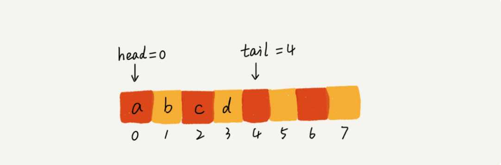
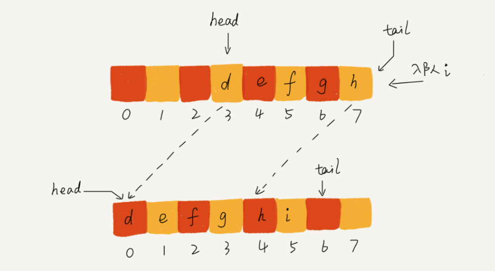
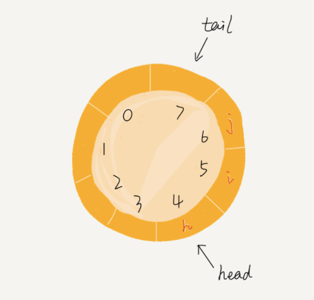
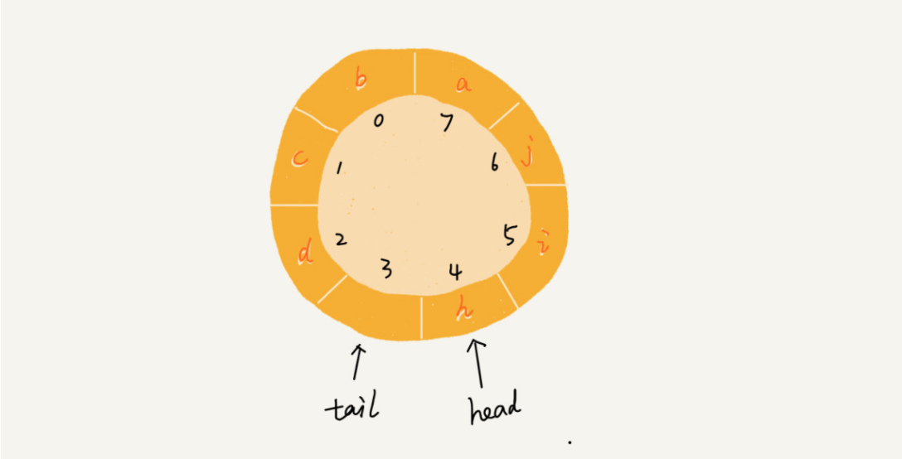

# 队列

## 如何理解“队列”？

先进者先出，这就是典型的“队列”。

基本的操作也是两个：入队 enqueue()，放一个数据到队列尾部；出队 dequeue()，从队列头部取一个元素。

队列跟栈一样，也是一种操作受限的线性表数据结构。

## 队列的实现

队列需要两个指针：一个是 head 指针，指向队头；一个是 tail 指针，指向队尾。

顺序队列中，当tail指针指向末尾的时候，一般进行数据搬移

## 循环队列

环形队列

难点：确定好队空和队满的判定条件。

当队满时，(tail+1)%n=head

当队列满时，图中的 tail 指向的位置实际上是没有存储数据的。所以，循环队列会浪费一个数组的存储空间。

## 阻塞队列和并发队列

阻塞队列其实就是在队列基础上增加了阻塞操作。简单来说，就是在队列为空的时候，从队头取数据会被阻塞。因为此时还没有数据可取，直到队列中有了数据才能返回；如果队列已经满了，那么插入数据的操作就会被阻塞，直到队列中有空闲位置后再插入数据，然后再返回。

线程安全的队列我们叫作并发队列。最简单直接的实现方式是直接在 enqueue()、dequeue() 方法上加锁，但是锁粒度大并发度会比较低，同一时刻仅允许一个存或者取操作。实际上，基于数组的循环队列，利用 CAS 原子操作，可以实现非常高效的并发队列。这也是循环队列比链式队列应用更加广泛的原因。

**实际上，对于大部分资源有限的场景，当没有空闲资源时，基本上都可以通过“队列”这种数据结构来实现请求排队。**

