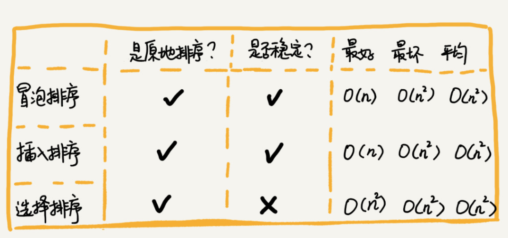

# 排序

## 一、几种经典排序算法及其时间复杂度级别

冒泡、插入、选择 O(n^2) 基于比较
快排、归并 O(nlogn) 基于比较
计数、基数、桶 O(n) 不基于比较

## 二、如何分析一个排序算法？

1. 学习排序算法的思路？明确原理、掌握实现以及分析性能。
2. 如何分析排序算法性能？从执行效率、内存消耗以及**稳定性**3个方面分析排序算法的性能。
3. 执行效率：从以下3个方面来衡量
   1）最好情况、最坏情况、平均情况时间复杂度
   2）时间复杂度的系数、常数、低阶：排序的数据量比较小时考虑
   3）比较次数和交换（或移动）次数
4. 内存消耗：通过空间复杂度来衡量。针对排序算法的空间复杂度，引入**原地排序**的概念，原地排序算法就是指空间复杂度为O(1)的排序算法。
5. 稳定性：如果待排序的序列中存在值等的元素，经过排序之后，相等元素之间原有的先后顺序不变，就说明这个排序算法时稳定的。

## 三、冒泡排序

1. 排序原理
   1）冒泡排序只会操作相邻的两个数据。
   2）对相邻两个数据进行比较，看是否满足大小关系要求，若不满足让它俩互换。
   3）一次冒泡会让至少一个元素移动到它应该在的位置，重复n次，就完成了n个数据的排序工作。
   4）优化：若某次冒泡不存在数据交换，则说明已经达到完全有序，所以终止冒泡。
2. 代码实现

```swift
// 冒泡排序
static func bubbleSort(_ arr:inout [Int]) {
  for i in 0..<arr.count-1 {
    for j in 0..<arr.count-i-1 {
      if arr[j] > arr[j+1] {
        arr.swapAt(j, j+1)
      }
    }
  }
}
```

3. 性能分析
   1）执行效率：最小时间复杂度、最大时间复杂度、平均时间复杂度
   最小时间复杂度：数据完全有序时，只需进行一次冒泡操作即可，时间复杂度是O(n)。
   最大时间复杂度：数据倒序排序时，需要n次冒泡操作，时间复杂度是O(n^2)。
   平均时间复杂度：通过有序度和逆序度来分析。

   * 什么是有序度？
     有序度是数组中具有有序关系的元素对的个数，比如[2,4,3,1,5,6]这组数据的有序度就是11，分别是[2,4][2,3][2,5][2,6][4,5][4,6][3,5][3,6][1,5][1,6][5,6]。同理，对于一个倒序数组，比如[6,5,4,3,2,1]，有序度是0；对于一个完全有序的数组，比如[1,2,3,4,5,6]，有序度为n*(n-1)/2，也就是15，完全有序的情况称为满有序度。
   * 什么是逆序度？逆序度的定义正好和有序度相反。核心公式：逆序度=满有序度-有序度。
   * 排序过程，就是有序度增加，逆序度减少的过程，最后达到满有序度，就说明排序完成了。

   冒泡排序包含两个操作原子，即比较和交换，每交换一次，有序度加1。不管算法如何改进，交换的次数总是确定的，即逆序度。
   对于包含n个数据的数组进行冒泡排序，平均交换次数是多少呢？最坏的情况初始有序度为0，所以要进行n*(n-1)/2交换。最好情况下，初始状态有序度是n*(n-1)/2，就不需要进行交互。我们可以取个中间值n*(n-1)/4，来表示初始有序度既不是很高也不是很低的平均情况。
   换句话说，平均情况下，需要n*(n-1)/4次交换操作，比较操作可定比交换操作多，而复杂度的上限是O(n^2)，所以平均情况时间复杂度就是O(n^2)。
   以上的分析并不严格，但很实用，这就够了。
   2）空间复杂度：每次交换仅需1个临时变量，故空间复杂度为O(1)，是原地排序算法。
   3）算法稳定性：如果两个值相等，就不会交换位置，故是稳定排序算法。

## 四、插入排序

1. 算法原理
   首先，我们将数组中的数据分为2个区间，即已排序区间和未排序区间。初始已排序区间只有一个元素，就是数组的第一个元素。插入算法的核心思想就是取未排序区间中的元素，在已排序区间中找到合适的插入位置将其插入，并保证已排序区间中的元素一直有序。重复这个过程，直到未排序中元素为空，算法结束。
2. 代码实现

```swift
// 插入排序
static func insertionSort(_ arr: inout [Int]) {
  if arr.count <= 1 {
    return
  }
  // 从第一个开始比较
  for i in 1..<arr.count {
    // 要插入的元素
    let value = arr[i]
    var j = i - 1
    // 移动元素 寻找插入位置
    while j >= 0 {
      if  arr[j] > value {
        arr[j+1] = arr[j]
      } else {
        break
      }
      j -= 1
    }
    arr[j+1] = value
  }
}
```

3. 性能分析
   1）时间复杂度：最好、最坏、平均情况
   如果要排序的数组已经是有序的，我们并不需要搬移任何数据。只需要遍历一遍数组即可，所以时间复杂度是O(n)。如果数组是倒序的，每次插入都相当于在数组的第一个位置插入新的数据，所以需要移动大量的数据，因此时间复杂度是O(n^2)。而在一个数组中插入一个元素的平均时间复杂都是O(n)，插入排序需要n次插入，所以平均时间复杂度是O(n^2)。
   2）空间复杂度：从上面的代码可以看出，插入排序算法的运行并不需要额外的存储空间，所以空间复杂度是O(1)，是原地排序算法。
   3）算法稳定性：在插入排序中，对于值相同的元素，我们可以选择将后面出现的元素，插入到前面出现的元素的后面，这样就保持原有的顺序不变，所以是稳定的。

## 五、选择排序

选择排序算法的实现思路有点类似插入排序，也分已排序区间和未排序区间。但是选择排序每次会从未排序区间中找到最小的元素，将其放到已排序区间的末尾。


选择排序空间复杂度为 O(1)，是一种原地排序算法。选择排序的最好情况时间复杂度、最坏情况和平均情况时间复杂度都为 O(n2)。

选择排序是一种不稳定的排序算法

## 六、总结



