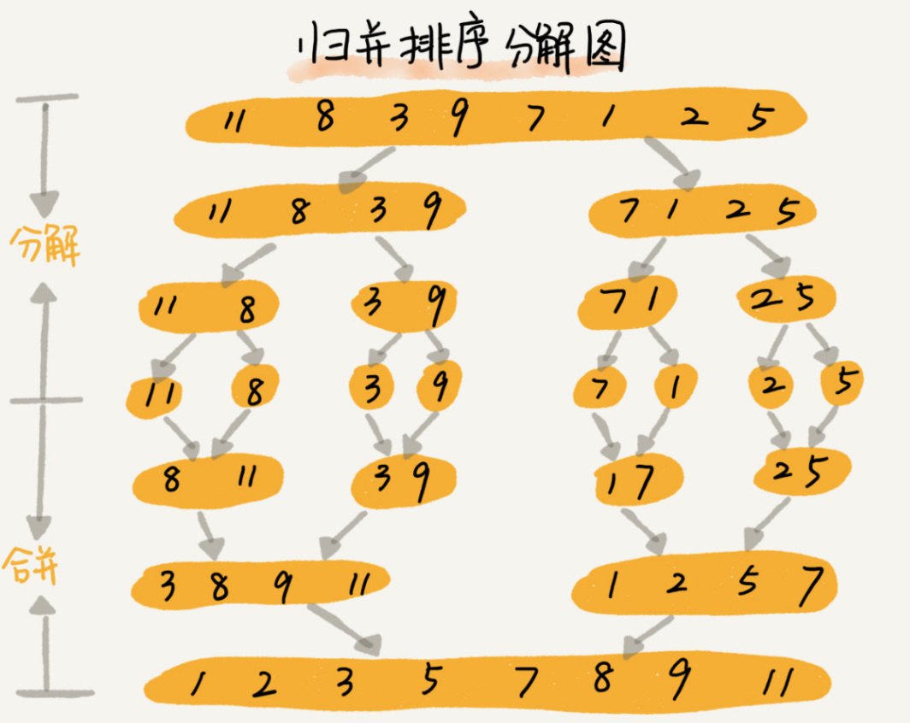
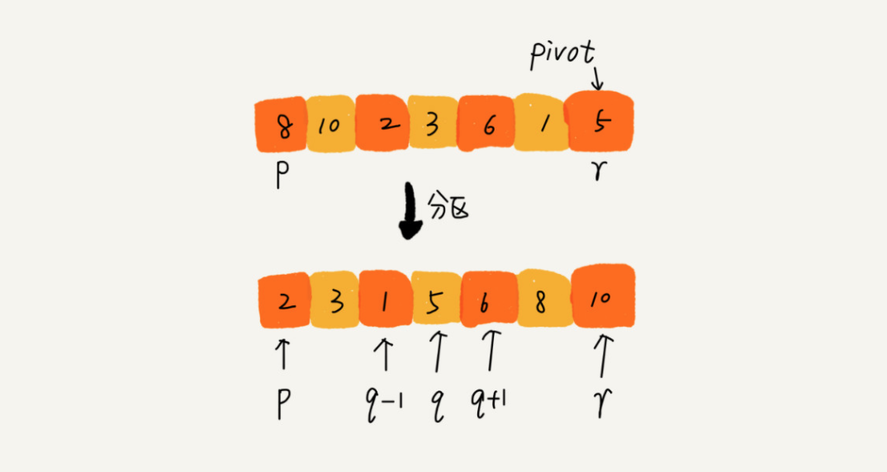
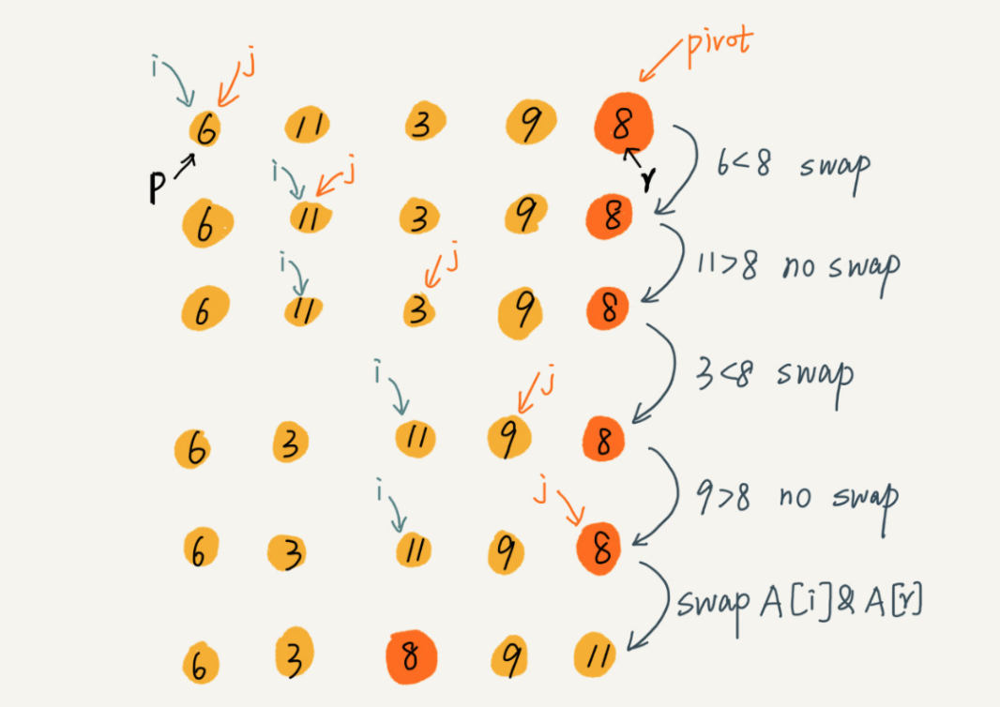
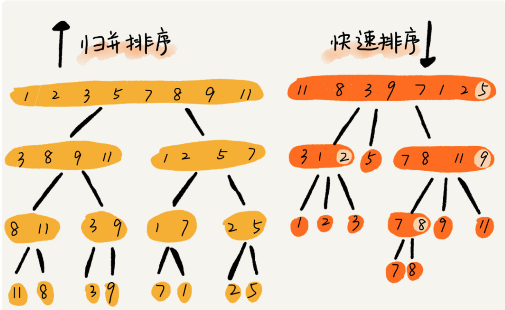

# 排序

**归并排序和快速排序。这两种排序算法适合大规模的数据排序**

**归并排序和快速排序都用到了分治思想**

**分治，顾名思义，就是分而治之，将一个大问题分解成小的子问题来解决。小的子问题解决了，大问题也就解决了。**

**分治思想跟我们前面讲的递归思想很像,分治算法一般都是用递归来实现的。**

**分治是一种解决问题的处理思想，递归是一种编程技巧**

## 归并排序

归并排序的核心思想还是蛮简单的。如果要排序一个数组，我们先把数组从中间分成前后两部分，然后对前后两部分分别排序，再将排好序的两部分合并在一起，这样整个数组就都有序了。



### 归并排序的递推公式

```js
//递推公式：
merge_sort(p…r) = merge(merge_sort(p…q), merge_sort(q+1…r))

//终止条件：
p >= r //不用再继续分解
```

### 伪代码

```js
// 归并排序算法, A是数组，n表示数组大小
merge_sort(A, n) {
  merge_sort_c(A, 0, n-1)
}

// 递归调用函数
merge_sort_c(A, p, r) {
  // 递归终止条件
  if p >= r  then return

  // 取p到r之间的中间位置q
  q = (p+r) / 2
  // 分治递归
  merge_sort_c(A, p, q)
  merge_sort_c(A, q+1, r)
  // 将A[p...q]和A[q+1...r]合并为A[p...r]
  merge(A[p...r], A[p...q], A[q+1...r])
}

// 合并
merge(A[p...r], A[p...q], A[q+1...r]) {
  var i := p，j := q+1，k := 0 // 初始化变量i, j, k
  var tmp := new array[0...r-p] // 申请一个大小跟A[p...r]一样的临时数组
  while i<=q AND j<=r do {
    if A[i] <= A[j] {
      tmp[k++] = A[i++] // i++等于i:=i+1
    } else {
      tmp[k++] = A[j++]
    }
  }
  
  // 判断哪个子数组中有剩余的数据
  var start := i，end := q
  if j<=r then start := j, end:=r
  
  // 将剩余的数据拷贝到临时数组tmp
  while start <= end do {
    tmp[k++] = A[start++]
  }
  
  // 将tmp中的数组拷贝回A[p...r]
  for i:=0 to r-p do {
    A[p+i] = tmp[i]
  }
}
```

### 遗留问题：用哨兵优化

### 复杂度

稳定排序

最好情况、最坏情况，还是平均情况，时间复杂度都是 O(nlogn)。

空间复杂度O(n)

### 代码实现

```swift
// 归并排序
static func mergeSort(_ arr:inout [Int]) {
  self.merge_sort_c(&arr, 0, arr.count - 1)
}
static func merge_sort_c(_ arr:inout [Int],_ startIndex: Int,_ endIndex:Int) {
  guard startIndex < endIndex else {
    return
  }
  let midIndex = (startIndex + endIndex) / 2
  merge_sort_c(&arr, startIndex, midIndex)
  merge_sort_c(&arr, midIndex + 1, endIndex)
  self.merge(&arr,startIndex,midIndex,endIndex)
}
static func merge(_ arr:inout [Int],_ startIndex: Int,_ midIndex: Int,_ endIndex:Int) {
  var i = startIndex, j = midIndex + 1, k = 0
  let count = endIndex - startIndex + 1
  var tmp = Array(repeating: 0, count: count)
  while i <= midIndex && j <= endIndex {
    if arr[i] <= arr[j] {
      tmp[k] = arr[i]
      i += 1
    } else {
      tmp[k] = arr[j]
      j += 1
    }
    k += 1
  }
  // 判断数组剩余
  var start = i, end = midIndex
  if j <= endIndex {
    start = j
    end = endIndex
  }
  // 将剩余的数据拷贝到临时数组tmp
  while start <= end {
    tmp[k] = arr[start]
    k += 1
    start += 1
  }
  // 将tmp中的数组拷贝回A[p...r]
  for index in 0..<count {
    arr[startIndex + index] = tmp[index]
  }
}
```

## 快速排序

快排的思想是这样的：如果要排序数组中下标从 p 到 r 之间的一组数据，我们选择 p 到 r 之间的任意一个数据作为 pivot（分区点）。

我们遍历 p 到 r 之间的数据，将小于 pivot 的放到左边，将大于 pivot 的放到右边，将 pivot 放到中间。经过这一步骤之后，数组 p 到 r 之间的数据就被分成了三个部分，前面 p 到 q-1 之间都是小于 pivot 的，中间是 pivot，后面的 q+1 到 r 之间是大于 pivot 的。

根据分治、递归的处理思想，我们可以用递归排序下标从 p 到 q-1 之间的数据和下标从 q+1 到 r 之间的数据，直到区间缩小为 1，就说明所有的数据都有序了。



### 递推公式

```js
//递推公式：
quick_sort(p…r) = quick_sort(p…q-1) + quick_sort(q+1… r)

//终止条件：
p >= r
```

### 伪代码

```js
// 快速排序，A是数组，n表示数组的大小
quick_sort(A, n) {
  quick_sort_c(A, 0, n-1)
}
// 快速排序递归函数，p,r为下标
quick_sort_c(A, p, r) {
  if p >= r then return
  
  q = partition(A, p, r) // 获取分区点
  quick_sort_c(A, p, q-1)
  quick_sort_c(A, q+1, r)
}
// 分组
partition(A, p, r) {
  pivot := A[r]
  i := p
  for j := p to r-1 do {
    if A[j] < pivot {
      swap A[i] with A[j]
      i := i+1
    }
  }
  swap A[i] with A[r]
  return i
```

分组过程：



### 复杂度

不稳定

最好情况时间复杂度： O(nlogn)

最坏情况时间复杂度：O(n^2)

空间复杂度：O(1)

### 代码实现

```swift
// 快速排序
static func quickSort(_ arr:inout [Int]) {
  self.quick_sort_c(&arr, 0, arr.count - 1)
}
static func quick_sort_c(_ arr:inout [Int],_ startIndex:Int,_ endIndex:Int) {
  guard startIndex < endIndex else {
    return
  }
  let p = self.partition(&arr, startIndex, endIndex)
  quick_sort_c(&arr, startIndex, p - 1)
  quick_sort_c(&arr, p + 1, endIndex)
}
// 分区 并返回分区点
// 最优解 交换 原地排序
static func partition(_ arr:inout [Int],_ startIndex:Int,_ endIndex:Int) -> Int {
  var i = startIndex
  let pValue = arr[endIndex]
  for j in startIndex...endIndex {
    if arr[j] <= pValue {
      arr.swapAt(i, j)
      i += 1
    }
  }
  return i - 1
}
// 第一种分组方法，利用临时数组 空间复杂度提升
static func partition_1(_ arr:inout [Int],_ startIndex:Int,_ endIndex:Int) -> Int {
  var tmpLittle = [Int]()
  var tmpLarge = [Int]()
  let pValue = arr[endIndex]
  for i in startIndex..<endIndex {
    if arr[i] <= pValue {
      tmpLittle.append(arr[i])
    } else {
      tmpLarge.append(arr[i])
    }
  }
  let tmp = tmpLittle + [pValue] + tmpLarge
  for (index,value) in tmp.enumerated() {
    arr[startIndex + index] = value
  }
  return startIndex + tmpLittle.count
}
```


## 归并和快排的区别

快排在拆分时排序，归并是在合并时排序。



## 问题求解

> O(n) 时间复杂度内求无序数组中的第 K 大元素。比如，4， 2， 5， 12， 3 这样一组数据，第 3 大元素就是 4。

**题解：**

我们选择数组区间 A[0...n-1]的最后一个元素 A[n-1]作为 pivot，对数组 A[0...n-1]原地分区，这样数组就分成了三部分，A[0...p-1]、A[p]、A[p+1...n-1]。

如果 p+1=K，那 A[p]就是要求解的元素；如果 K>p+1, 说明第 K 大元素出现在 A[p+1...n-1]区间，我们再按照上面的思路递归地在 A[p+1...n-1]这个区间内查找。同理，如果 K<p+1，那我们就在 A[0...p-1]区间查找。

如果我们把每次分区遍历的元素个数加起来，就是：n+n/2+n/4+n/8+...+1。这是一个等比数列求和，最后的和等于 2n-1。所以，上述解决思路的时间复杂度就为 O(n)。

## 课后思考

> 现在你有 10 个接口访问日志文件，每个日志文件大小约 300MB，每个文件里的日志都是按照时间戳从小到大排序的。你希望将这 10 个较小的日志文件，合并为 1 个日志文件，合并之后的日志仍然按照时间戳从小到大排列。如果处理上述排序任务的机器内存只有 1GB，你有什么好的解决思路，能“快速”地将这 10 个日志文件合并吗？

题解：每次从各个文件中取一条数据，在内存中根据数据时间戳构建一个最小堆，然后每次把最小值给写入新文件，同时将最小值来自的那个文件再出来一个数据，加入到最小堆中。这个空间复杂度为常数，但没能很好利用1g内存，而且磁盘单个读取比较慢，所以考虑每次读取一批数据，没了再从磁盘中取，时间复杂度还是一样O(n)。