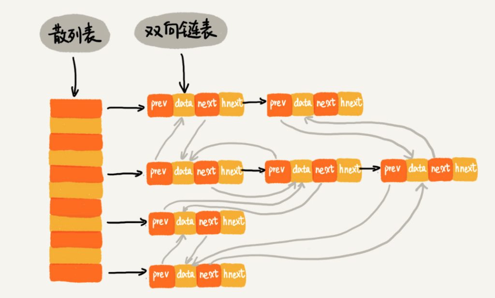

# 散列表

## LRU 缓存淘汰算法

需要淘汰一个数据的时候，我们就直接将链表头部的结点删除

当要缓存某个数据的时候，先在链表中查找这个数据。如果没有找到，则直接将数据放到链表的尾部；如果找到了，我们就把它移动到链表的尾部。因为查找数据需要遍历链表，所以单纯用链表实现的 LRU 缓存淘汰算法的时间复杂很高，是 O(n)。

* 往缓存中添加一个数据；
* 从缓存中删除一个数据；
* 在缓存中查找一个数据。

这三个操作都要涉及“查找”操作，如果单纯地采用链表的话，时间复杂度只能是 O(n)。如果我们将散列表和链表两种数据结构组合使用，可以将这三个操作的时间复杂度都降低到 O(1)。具体的结构就是下面这个样子：

前驱和后继指针是为了将结点串在双向链表中，hnext 指针是为了将结点串在散列表的拉链中。

这整个过程涉及的查找操作都可以通过散列表来完成。

总结：主要是利用散列表的O(1)查找复杂度

## Redis 有序集合

## 为什么散列表和链表经常一块使用？

> 散列表无序，配合链表进行有序访问