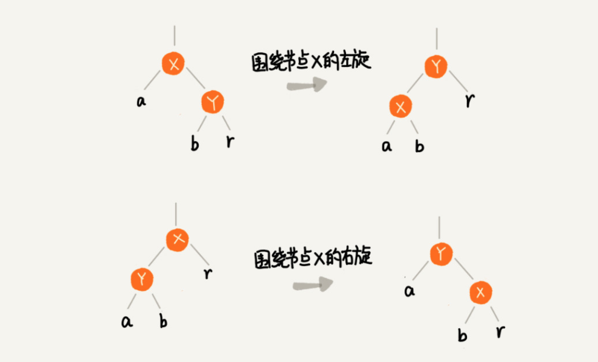
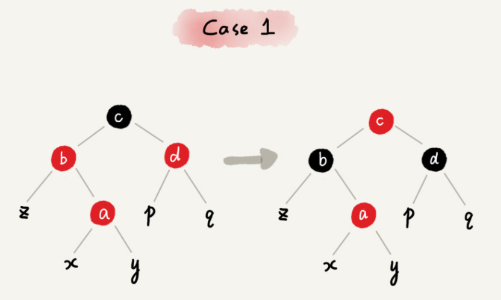
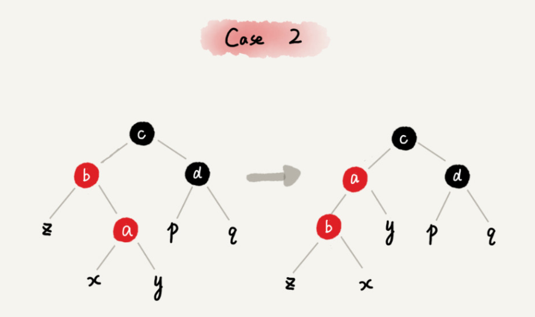
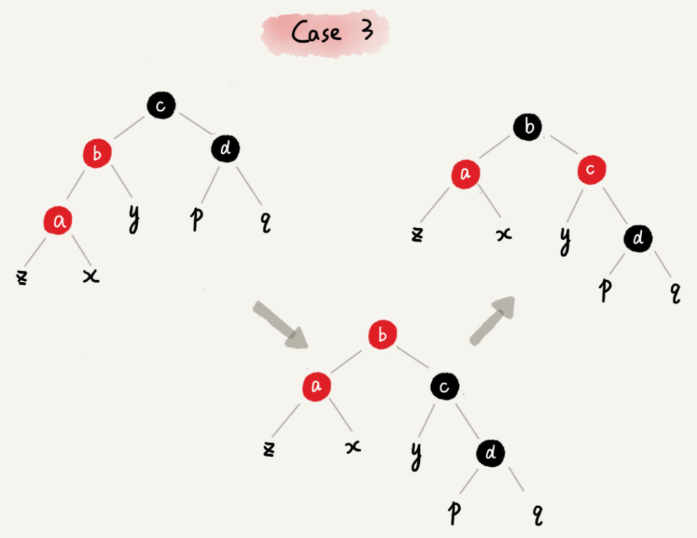

# 红黑树

[红黑树的演变和2-3树](https://www.cnblogs.com/tiancai/p/9072813.html)

## 什么是“平衡二叉查找树”？

平衡二叉树的严格定义是这样的：二叉树中任意一个节点的左右子树的高度相差不能大于 1。

AVL 树，它严格符合平衡二叉查找树的定义，即任何节点的左右子树高度相差不超过 1，是一种高度平衡的二叉查找树。

## 如何定义一棵“红黑树”？

红黑树的英文是“Red-Black Tree”，简称 R-B Tree。它是一种不严格的平衡二叉查找树。

* 根节点是黑色的；
* 每个叶子节点都是黑色的空节点（NIL），也就是说，叶子节点不存储数据；
* 任何相邻的节点都不能同时为红色，也就是说，红色节点是被黑色节点隔开的；（相邻结点指的是同一路经上的结点）
* 每个节点，从该节点到达其可达叶子节点的所有路径，都包含相同数目的黑色节点；

## 为什么说红黑树是“近似平衡”的？

红黑树的高度近似 2logn

所以，红黑树的高度只比高度平衡的 AVL 树的高度（logn）仅仅大了一倍，在性能上，下降得并不多。（这样推导出来的结果不够精确，实际上红黑树的性能更好。）

## 为什么工程中都用红黑树

AVL 树是一种高度平衡的二叉树，所以查找的效率非常高，但是，有利就有弊，AVL 树为了维持这种高度的平衡，就要付出更多的代价。每次插入、删除都要做调整，就比较复杂、耗时。所以，对于有频繁的插入、删除操作的数据集合，使用 AVL 树的代价就有点高了。

红黑树只是做到了近似平衡，并不是严格的平衡，所以在维护平衡的成本上，要比 AVL 树要低。

所以，红黑树的插入、删除、查找各种操作性能都比较稳定。对于工程应用来说，要面对各种异常情况，为了支撑这种工业级的应用，我们更倾向于这种性能稳定的平衡二叉查找树。

## 总结

红黑树是一种平衡二叉查找树。它是为了解决普通二叉查找树在数据更新的过程中，复杂度退化的问题而产生的。红黑树的高度近似 log2n，所以它是近似平衡，插入、删除、查找操作的时间复杂度都是 O(logn)。

因为红黑树是一种性能非常稳定的二叉查找树，所以，在工程中，但凡是用到动态插入、删除、查找数据的场景，都可以用到它。不过，它实现起来比较复杂，如果自己写代码实现，难度会有些高，这个时候，我们其实更倾向用跳表来替代它。

## 问题

动态数据结构支持动态的数据插入、删除、查找操作，除了红黑树，我们前面还学习过哪些呢？能对比一下各自的优势、劣势，以及应用场景吗？

> 散列表：插入删除查找都是O(1), 是最常用的，但其缺点是不能顺序遍历以及扩容缩容的性能损耗。适用于那些不需要顺序遍历，数据更新不那么频繁的。
>
> 跳表：插入删除查找都是O(logn), 并且能顺序遍历。缺点是空间复杂度O(n)。适用于不那么在意内存空间的，其顺序遍历和区间查找非常方便。
>
> 红黑树：插入删除查找都是O(logn), 中序遍历即是顺序遍历，稳定。缺点是难以实现，去查找不方便。其实跳表更佳，但红黑树已经用于很多地方了。

## 红黑树的左旋和右旋

## 插入操作的平衡调整

红黑树规定，插入的节点必须是红色的。而且，二叉查找树中新插入的节点都是放在叶子节点上。

* 如果插入节点的父节点是黑色的，那我们什么都不用做，它仍然满足红黑树的定义。
* 如果插入的节点是根节点，那我们直接改变它的颜色，把它变成黑色就可以了。

### CASE 1：如果关注节点是 a，它的叔叔节点 d 是红色

* 将关注节点 a 的父节点 b、叔叔节点 d 的颜色都设置成黑色；
* 将关注节点 a 的祖父节点 c 的颜色设置成红色；
* 关注节点变成 a 的祖父节点 c；如果节点c不是根节点，就转到case2或3；如果c是根节点，则将c转成黑色，就调整结束了。 
* 跳到 CASE 2 或者 CASE 3。

### CASE 2：如果关注节点是 a，它的叔叔节点 d 是黑色，关注节点 a 是其父节点 b 的右子节点

* 关注节点变成节点 a 的父节点 b；
* 围绕新的关注节点b 左旋；
* 跳到 CASE 3。

### CASE 3：如果关注节点是 a，它的叔叔节点 d 是黑色，关注节点 a 是其父节点 b 的左子节点

* 围绕关注节点 a 的祖父节点 c 右旋；
* 将关注节点 a 的父节点 b、兄弟节点 c 的颜色互换。
* 调整结束。

## 删除操作的平衡调整

