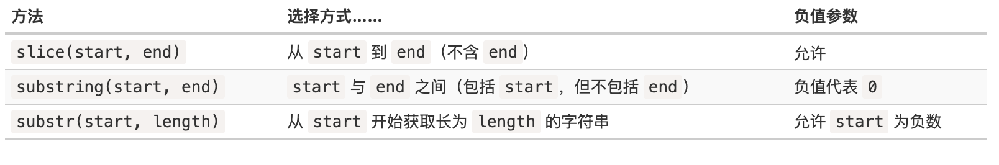

# 字符串的常见操作

* JavaScript中，字符串是不可变的
* JavaScript中，所有字符串都使用UTF-16编码
* 大写字母对应的ASCII范围为：65~90
* 小写字母对应的ASCII范围为：97~122

## 基本操作

字符串可以包含在单引号、双引号或反引号中：

```js
let single = 'single-quoted';
let double = "double-quoted";

let backticks = `backticks`;

```

单引号和双引号基本相同。但是，反引号允许我们通过 `${…}` 将任何表达式嵌入到字符串中：

```js
function sum(a, b) {
  return a + b;
}

alert(`1 + 2 = ${sum(1, 2)}.`); // 1 + 2 = 3.
```

使用反引号的另一个优点是它们允许字符串跨行：

```js
let guestList = `Guests:
 * John
 * Pete
 * Mary
`;

alert(guestList); // 客人清单，多行
```

字符串长度

```js
alert( `My\n`.length ); // 3
```

## 访问字符

```js
let str = `Hello`;

// 第一个字符
alert( str[0] ); // H
alert( str.charAt(0) ); // H

// 最后一个字符
alert( str[str.length - 1] ); // o
```

## 遍历字符串

`for..of`

```js
for (let char of "Hello") {
  alert(char); // H,e,l,l,o（char 变为 "H"，然后是 "e"，然后是 "l" 等）
}
```

## 改变大小写

```js
alert( 'Interface'.toUpperCase() ); // INTERFACE
alert( 'Interface'.toLowerCase() ); // interface
```

## 查找字符串

* str.indexOf(substr, pos)：它从给定位置 `pos` 开始，在 `str` 中查找 `substr`，如果没有找到，则返回 `-1`，否则返回匹配成功的位置。
* lastIndexOf：和indexOf类型，从结尾开始搜索

```js
let str = 'Widget with id';
alert( str.indexOf('Widget') ); // 0，因为 'Widget' 一开始就被找到
alert( str.indexOf('widget') ); // -1，没有找到，检索是大小写敏感的
alert( str.indexOf("id") ); // 1，"id" 在位置 1 处（……idget 和 id）

let str = 'Widget with id';
alert( str.indexOf('id', 2) ) // 12
```

## includes、startWith、endWith

* str.includes(subStr,pos)

```js
alert( "Widget with id".includes("Widget") ); // true
alert( "Hello".includes("Bye") ); // false

alert( "Midget".includes("id") ); // true
alert( "Midget".includes("id", 3) ); // false, 从位置 3 开始没有 "id"
```

```js
alert( "Widget".startsWith("Wid") ); // true，"Widget" 以 "Wid" 开始
alert( "Widget".endsWith("get") ); // true，"Widget" 以 "get" 结束
```

## 获取子串

* **str.slice(start [, end])**

```js
let str = "stringify";
alert( str.slice(0, 5) ); // 'strin'，从 0 到 5 的子字符串（不包括 5）
alert( str.slice(0, 1) ); // 's'，从 0 到 1，但不包括 1，所以只有在 0 处的字符

// 如果没有第二个参数，slice 会一直运行到字符串末尾：
let str = "stringify";
alert( str.slice(2) ); // 从第二个位置直到结束

// start/end 也有可能是负值。它们的意思是起始位置从字符串结尾计算：
let str = "stringify";
// 从右边的第四个位置开始，在右边的第一个位置结束
alert( str.slice(-4, -1) ); // 'gif'
```

* **str.substring(start [, end])**

返回字符串在 `start` 和 `end` **之间** 的部分。

这与 `slice` 几乎相同，但它允许 `start` 大于 `end`。

不支持负参数。

```js
let str = "stringify";

// 这些对于 substring 是相同的
alert( str.substring(2, 6) ); // "ring"
alert( str.substring(6, 2) ); // "ring"

// ……但对 slice 是不同的：
alert( str.slice(2, 6) ); // "ring"（一样）
alert( str.slice(6, 2) ); // ""（空字符串）
```

* **str.substr(start [, length])**

返回字符串从 `start` 开始的给定 `length` 的部分。

```js
let str = "stringify";
alert( str.substr(2, 4) ); // 'ring'，从位置 2 开始，获取 4 个字符

// 第一个参数可能是负数，从结尾算起：
let str = "stringify";
alert( str.substr(-4, 2) ); // 'gi'，从第 4 位获取 2 个字符
```



## 字符串比较

* **str.codePointAt(pos)** ：返回unicode编码

```js
// 不同的字母有不同的代码
alert( "z".codePointAt(0) ); // 122
alert( "Z".codePointAt(0) ); // 90
```

* **String.fromCodePoint(code)**：通过code创建字符串

```js
alert( String.fromCodePoint(90) ); // Z
```

* 用 `\u` 后跟十六进制代码，通过这些代码添加 unicode 字符：

```js
// 在十六进制系统中 90 为 5a
alert( '\u005a' ); // Z
```

## 字符和ASCII转换

```js
let str = "abc"
console.log(str.charCodeAt(0)) // 97

console.log(String.fromCharCode(97)) // a
```

