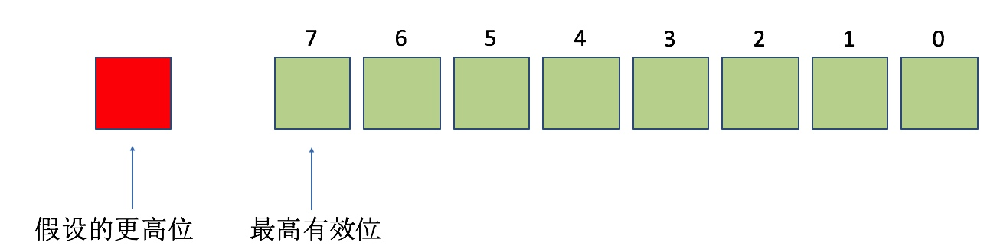

# 汇编

## 一、硬件相关

### 总线

* 地址总线
* 控制总线
* 数据总线

### 寄存器

对于arm64系的CPU来说， 如果寄存器以x开头则表明的是一个64位的寄存器，如果以w开头则表明是一个32位的寄存器，在系统中没有提供16位和8位的寄存器供访问和使用。其中32位的寄存器是64位寄存器的低32位部分并不是独立存在的。

* 对程序员来说，CPU中最主要部件是寄存器，可以通过改变寄存器的内容来实现对CPU的控制
* 不同的CPU，寄存器的个数、结构是不相同的

#### 浮点和向量寄存器

因为浮点数的存储以及其运算的特殊性,CPU中专门提供浮点数寄存器来处理浮点数

* 浮点寄存器 64位: D0 - D31  32位: S0 - S31

现在的CPU支持向量运算.(向量运算在图形处理相关的领域用得非常的多)为了支持向量计算系统了也提供了众多的向量寄存器.

* 向量寄存器 128位:V0-V31

#### 通用寄存器

* 通用寄存器也称**数据地址寄存器**通常用来做数据计算的临时存储、做累加、计数、地址保存等功能。定义这些寄存器的作用主要是用于在CPU指令中保存操作数，在CPU中当做一些常规变量来使用。
* ARM64拥有有32个64位的通用寄存器 x0 到 x30，以及XZR(零寄存器),这些通用寄存器有时也有特定用途。
  * 那么w0 到 w28 这些是32位的. 因为64位CPU可以兼容32位.所以可以只使用64位寄存器的低32位.
  * 比如 w0 就是 x0的低32位!

#### pc寄存器(program counter)

* 为指令指针寄存器，它指示了CPU当前要读取指令的地址
* 在内存或者磁盘上，指令和数据没有任何区别，都是二进制信息
* CPU在工作的时候把有的信息看做指令，有的信息看做数据，为同样的信息赋予了不同的意义
  * 比如 1110 0000 0000 0011 0000 1000 1010 1010 
  * 可以当做数据   0xE003008AA 
  * 也可以当做指令  mov    x0, x8
* CPU根据什么将内存中的信息看做指令？
  * CPU将pc指向的内存单元的内容看做指令
  * 如果内存中的某段内容曾被CPU执行过，那么它所在的内存单元必然被pc指向过

#### SP(x31)和FP(x29)寄存器

* sp寄存器在任意时刻会保存我们栈顶的地址.
* fp寄存器也称为x29寄存器属于通用寄存器,但是在某些时刻我们利用它保存栈底的地址!

 > 注意:ARM64开始,取消32位的 LDM,STM,PUSH,POP指令! 取而代之的是ldr\ldp  str\stp
 > **ARM64里面 对栈的操作是16字节对齐的!!**

#### x30寄存器

x30寄存器存放的是函数的返回地址.当ret指令执行时刻,会寻找x30寄存器保存的地址值!

>注意:在函数嵌套调用的时候.需要讲x30入栈!

#### 修改寄存器的值

```shell
register read pc
register write pc 0x879899
```

#### 高速缓存

* CPU先在高速缓存中找指令或者数据
* 高度缓存到内存有映射，类似虚拟内存

#### 指令

* 占用四个字节

#### 编写汇编代码

```assembly
.text
.global _A, _B
_A:
    mov x0,#0xa0
    mov x1,#0xb0
    add x1,x0,#0x0a
    mov x1,x0
    bl _B
    mov x0,#0x00
    ret

_B:
    add x0,x1,#0x10
    ret
```

## 二、函数调用栈

常见的函数调用开辟和恢复的栈空间

```objc
sub    sp, sp, #0x40             ; 拉伸0x40（64字节）空间
stp    x29, x30, [sp, #0x30]  ;x29\x30 寄存器入栈保护
add    x29, sp, #0x30            ; x29指向栈帧的底部
... 
ldp    x29, x30, [sp, #0x30]  ;恢复x29/x30 寄存器的值
add    sp, sp, #0x40             ; 栈平衡
ret
```

#### 关于内存读写指令

>注意:读/写 数据是都是往高地址读/写
>
>栈空间往低开辟，往高读写

**str(store register)指令**

将数据从寄存器中读出来,存到内存中.

**ldr(load register)指令**

将数据从内存中读出来,存到寄存器中

此ldr 和 str 的变种ldp 和 stp 还可以操作2个寄存器.

#### 堆栈操作练习

使用32个字节空间作为这段程序的栈空间,然后利用栈将x0和x1的值进行交换.

```
sub    sp, sp, #0x20 ;拉伸栈空间32个字节
stp    x0, x1, [sp, #0x10] ;sp往上加16个字节,存放x0 和 x1
ldp    x1, x0, [sp, #0x10] ;将sp偏移16个字节的值取出来,放入x1 和 x0
```

#### bl和ret指令

##### bl指令

* CPU从何处执行指令是由pc中的内容决定的，我们可以通过改变pc的内容来控制CPU执行目标指令
* ARM64提供了一个mov指令（传送指令），可以用来修改大部分寄存器的值，比如
  * mov x0,#10、mov x1,#20
* 但是，mov指令不能用于设置pc的值，ARM64没有提供这样的功能
* ARM64提供了另外的指令来修改PC的值，这些指令统称为转移指令，最简单的是bl指令

##### bl 地址

* 将下一条指令的地址放入lr(x30)寄存器。lr保存的就是回家的路

* 转到地址处执行指令

* bl跳转之前，需要保存当前lr寄存器的值。保护回去的路。保存到栈上，保存到寄存器容易被其他函数修改导致破坏

  ```assembly
  # 将x29，x30存储到 sp减去0x10的地方，往低地址开辟，存储的时候先存x29，再x30，往高地址存。[]后面的感叹号表示sp-0x10后的值赋值给sp
  # [] 操作符，代表取里面的地址进行运算
  stp			x29, x30, [sp, #-0x10]!
  # 注意[]中没有数字，意思是直接从sp中开始读取，往高地址读取，放入到x29和x30，然后将sp+0x10后的值赋值给sp
  ldp 		x29, x30, [sp], #0x10
  ```

* 如果对sp开辟8字节，stp/str数据的时候没事，ldp/ldr 的时候就会崩溃。因为**ARM64里面 对栈的操作是16字节对齐的!!**。所以sp拉伸一定是16个字节的整数倍

##### ret

* 默认使用lr(x30)寄存器的值,通过底层指令提示CPU此处作为下条指令地址!

>ARM64平台的特色指令,它面向硬件做了优化处理的

##### x30寄存器

x30寄存器存放的是函数的返回地址.当ret指令执行时刻,会寻找x30寄存器保存的地址值!

>注意:在函数嵌套调用的时候.需要讲x30入栈!

## 三、函数参数

#### 函数的参数和返回值

ARM64下,**函数的参数**是存放在X0到X7(W0到W7)这8个寄存器里面的.如果超过8个参数,就会入栈.
**函数的返回值**是放在X0 寄存器里面的。oc参数不超过6个（self,sel）

看代码：实际sp拉伸了0x40，从0x30开始存x29，x30。然后将x29指向0x30的地方。就是说虽然拉伸了0x40，但是fp是从0x30开始算的。从0x30开始存自己调用栈的东西，前两两个用来保护现场

> adrp & add 到内存的某一页偏移一个地址取数据

看代码：超过8个低参数，存到了当前函数的栈里面，从sp位置开始往高处存。到下一个函数时，下一个函数会从上一个函数的栈空间取参数。返回值最终放入到x0

看代码：如果返回值大于一个寄存器的长度（8个字节），函数返回值是直接写入到上一个函数的栈中。步骤大概是上一个函数bl之前，会保存当前sp偏移的一个地址（还是当前栈中的一个地址，即大小是返回值的大小）到寄存器中，然后下一个函数返回值就写到这个寄存器指向的上一个栈中的位置

#### 函数的局部变量

函数的局部变量放在栈里面!

栈平衡后，就会被回收

函数的嵌套调用

#### 状态寄存器（也称标记寄存器）cpsr

> 控制程序执行流程
>
> 8位寄存器

修改cpsr寄存器的内容，可以改变程序的运行流程

add是加法运算，adds是可以改变标志位的add

CPU内部的寄存器中,有一种特殊的寄存器(对于不同的处理器,个数和结构都可能不同).这种寄存器在ARM中,被称为状态寄存器就是CPSR(current program status register)寄存器 CPSR和其他寄存器不一样,其他寄存器是用来存放数据的,都是整个寄存器具有一个含义.而CPSR寄存器是按位起作用的,也就是说,它的每一位都有专门的含义,记录特定的信息.

> 注:CPSR寄存器是32位的

- CPSR的低8位（包括I、F、T和M[4：0]）称为控制位，程序无法修改,除非CPU运行于特权模式下,程序才能修改控制位!
- N、Z、C、V均为条件码标志位。它们的内容可被算术或逻辑运算的结果所改变，并且可以决定某条指令是否被执行!意义重大!


##### N（Negative）标志

> CPSR的第31位是 N，符号标志位。它记录相关指令执行后,其结果是否为负.如果为负 N = 1,如果是非负数 N = 0.

&emsp;&emsp;&ensp;**注意**,在ARM64的指令集中,有的指令的执行时影响状态寄存器的,比如add\sub\or等,他们大都是运算指令(进行逻辑或算数运算)；

##### Z(Zero)标志

> CPSR的第30位是Z，0标志位。它记录相关指令执行后,其结果是否为0.如果结果为0.那么Z = 1.如果结果不为0,那么Z = 0.

&emsp;&emsp;&ensp;对于Z的值,我们可以这样来看,Z标记相关指令的计算结果是否为0,如果为0,则Z要记录下"是0"这样的肯定信息.在计算机中1表示逻辑真,表示肯定.所以当结果为0的时候Z = 1,表示"结果是0".如果结果不为0,则Z要记录下"不是0"这样的否定信息.在计算机中0表示逻辑假,表示否定,所以当结果不为0的时候Z = 0,表示"结果不为0"。

##### C(Carry)标志

> CPSR的第29位是C，进位标志位。一般情况下,进行**无符号数**的运算。 
>
> 加法运算：当运算结果产生了进位时（无符号数溢出），C=1，否则C=0。 
>
> 减法运算（包括CMP）：当运算时产生了借位时（无符号数溢出），C=0，否则C=1。

加法溢出，C标志位为1，没溢出为0

减法溢出，C标志位为0（被借走了），没溢出为1

&emsp;&emsp;&ensp;对于位数为N的无符号数来说，其对应的二进制信息的最高位，即第N - 1位，就是它的最高有效位，而假想存在的第N位，就是相对于最高有效位的更高位。如下图所示：



##### 进位

&emsp;&emsp;&ensp;我们知道，当两个数据相加的时候，有可能产生从最高有效位想更高位的进位。比如两个32位数据：0xaaaaaaaa + 0xaaaaaaaa,将产生进位。由于这个进位值在32位中无法保存，我们就只是简单的说这个进位值丢失了。其实CPU在运算的时候，并不丢弃这个进位制，而是记录在一个特殊的寄存器的某一位上。ARM下就用C位来记录这个进位值。比如，下面的指令

```
mov w0,#0xaaaaaaaa；0xa 的二进制是 1010
adds w0,w0,w0； 执行后 相当于 1010 << 1 进位1（无符号溢出） 所以C标记 为 1
adds w0,w0,w0； 执行后 相当于 0101 << 1 进位0（无符号没溢出） 所以C标记 为 0
adds w0,w0,w0； 重复上面操作
adds w0,w0,w0
```

##### 借位

&emsp;&emsp;&ensp;当两个数据做减法的时候，有可能向更高位借位。再比如，两个32位数据：0x00000000 - 0x000000ff,将产生借位，借位后，相当于计算0x100000000 - 0x000000ff。得到0xffffff01 这个值。由于借了一位，所以C位 用来标记借位。C = 0.比如下面指令：

```
mov w0,#0x0
subs w0,w0,#0xff ;
subs w0,w0,#0xff
subs w0,w0,#0xff
```

##### V(Overflow)溢出标志  

> CPSR的第28位是V，溢出标志位。在进行有符号数运算的时候，如果超过了机器所能标识的范围，称为溢出。

- 正数 +  正数  为负数  溢出
- 负数 +  负数  为正数  溢出
- 正数 +  负数  不可能溢出

C和V不管是不是有符号或者无符号数进行运算，C永远把计算当成无符号数，V永远当成有符号数。

### 四、全局变量

`adrp`：address page

```assembly
; adrp：
; 1、将当前pc寄存器的后三位(十六进制)清零 0x10258e1a0->0x10258e000
; 2、将运算符中的1左移三位(十六进制) 1->1000
; 3、将运算的结果相加 0x10258e000+1000 -> 0x10258F000
; 意义：内存的pagesize=4k=0xFFF 也就是左移三位，adrp就是定位到内存中的某一页的位置 （mac是4k，ios是16k）
0x10258e1a0 <+20>: adrp   x0, 1
0x10258e1a4 <+24>: add    x0, x0, #0xfa3            ; =0xfa3 
; 4、然后加#0xfa3 0x10258F000+#0xfa3  = 0x10258Ffa3
; 意义：定位到某一页的偏移位置
```

看到 第四节课《if的识别》