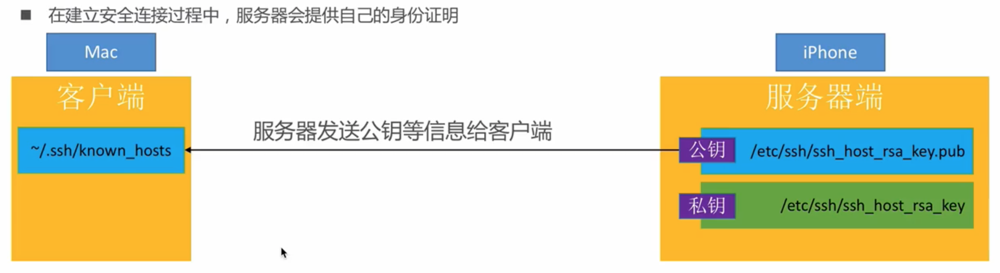
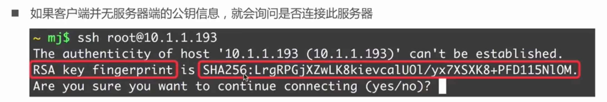
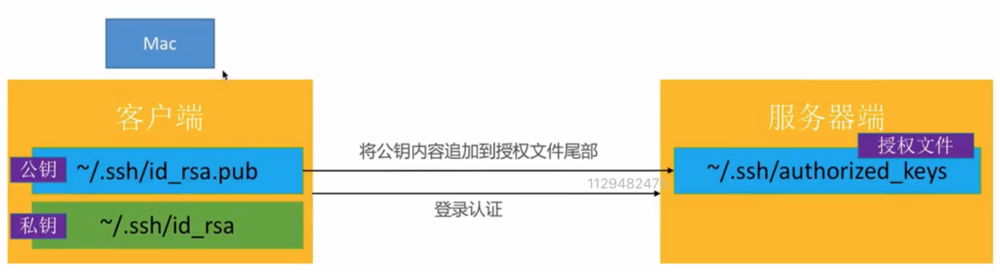

# SSH远程访问越狱设备

> 前置条件：
>
> 已越狱
>
> 已安装OpenSSH

## 一、SSH简介

SSH 是 Secure Shell 的缩写，由 IETF 的网络小组（Network Working Group）所制定；SSH 为建立在应用层基础上的安全协议。SSH 是目前广泛采用的安全登录协议，专为远程登录会话和其他网络服务提供安全性的协议，替代以前不安全的Telnet协议。利用 SSH 协议可以有效防止远程管理过程中的信息泄露问题。

SSH包括二个部分，服务端的SSHD（Secure Shell Daemon）和SSH客户端。我们通常所说的用SSH登录到某某主机，指的是用SSH客户端远程登录到某台主机（该主机运行了SSHD服务端程序）。

SCP和SFTP都是SSH软件包的组成部分。

SCP是Secure Copy的简称，是用来与远程主机之间进行数据传输的协议，相当于经过加密的Copy命令。SCP数据传输使用 ssh协议，并且和ssh 使用相同的认证方式，提供相同的安全保证 。

SFTP=SSH File Transfer Protocol ，有时也被称作 Secure File Transfer Protocol 。SFTP是用SSH封装过的FTP协议，相当于经过加密的FTP协议，功能与FTP一样，只是传输数据经过加密。

SFTP支持断点续传，SCP则不支持。

总结：SSH其实是专门为shell设计的一种通信协议，它垮了两个网络层（传输层和应用层）。通俗点讲就是只有SSH客户端，和SSH服务器端之间的通信才能使用这个协议，其他软件服务无法使用它。

**OpenSSH**是SSL的开源实现

通信端口：**22**

### 1.1 SSL

SSL(Secure Sockets Layer 安全套接字协议),及其继任者传输层安全（Transport Layer Security，TLS）是为网络通信提供安全及数据完整性的一种安全协议。TLS与SSL在传输层与应用层之间对网络连接进行加密。

Https = Http + SSL/TLS

可支持更多协议，支持安全传输

**OpenSSL**是SSL的开源实现

## 二、SSH配置文件

### 2.1 配置文件

客户端配置文件：`/etc/ssh/ssh_config`

服务端配置文件：`/etc/ssh/sshd_config`

客户端公钥文件：`~/.ssh/id_rsa.pub`

客户端私钥文件：`~/.ssh/id_rsa`

服务端公钥文件：`/etc/ssh/ssh_host_ras_key.pub`

服务端私钥文件：`/etc/ssh/ssh_host_rsa_key`

### 2.2 known_hosts

客户端文件`~/.ssh/known_hosts`中保存了登录过的，远程服务器中的公钥

```shell
10.94.51.82 ssh-rsa AAAAB3NzaC1yc2EAAAADAQABAAABgQCy4yU9Yt2bKmJ4vjuYlorL8j56EXEi6p17Zw+h0+Ymgt6IjFPCfoWr/RBnwGtb/gGCOVM3UUyTbzeXysr4rSxxxxxxxxVP27Oyo8BzXJI+pcZ2px8DWujTjab7Zi7Lq8w28inndBN7RszF+0bNf+/q/v1XfXE9cZk33bGn1oxybHQXSF3OqQQpP+GwtDJVLZTJfINc9jOAS1i35xEvMwvrfAei6NiMpLmka0=
```

### 2.3 authorized_keys

服务端文件`~/.ssh/authorized_keys`文件中，存储了客户端的公钥

```shell
$ cat authorized_keys
ssh-rsa AAAAB3NzaC1yc2EAAAADxxxxxxxxxxxxQKveQBbrR5TMqqKCK+huaekNhK14wGhZ7rt6Rr8FFWUYSQsS0jua/Ukm/Mmo9Mn test@test.net
```

### 2.4 SSH流程

1）建立安全连接，服务端提供公钥信息



2）收到服务端提供的信息，客户端首次会进行询问



3）客户端验证

* 账号密码验证
* 秘钥验证
  * 客户端生成一对秘钥对，将公钥追加到服务端的`authorized_keys`中



## SSH相关命令

生成秘钥对

```shell
$ ssh-keygen -t rsa -C "your_email@example.com" -f fileName
# -t 指定密钥类型，默认是 rsa ，可以省略。
# -C 设置注释文字，比如邮箱。
# -f 指定密钥文件存储文件名，默认id_rsa，可以省略。
```

删除旧的公钥

```shell
ssh-keygen -R 10.xx.xx.10
```

将公钥追加到服务端的`authorized_keys`中

```shell
$  ssh-copy-id -i .ssh/id_rsa.pub serverName@192.168.x.xxx
# -i 指定公钥名称，可省略，默认使用id_rsa.pub
```

如果配置了秘钥还需要输入密码，则需要在服务端设置文件权限

```shell
chmod 755 ~
chmod 755 ~/.ssh
chmod 644 ~/.ssh/authorized_keys
```

## SCP相关命令

scp [参数] [原路径] [目标路径]

常用参数 -r : 复制文件夹

1）复制文件

```shell
# 拷贝本地文件到服务端
scp dumpdecrypted.dylib root@12.34.51.82:/usr/lib
# 拷贝服务端文件到本地
scp root@12.34.56.122:/root/Downloads/compass.tar ./path
```

2）复制文件夹

```shell
# 拷贝本地文件夹到服务端
scp -r ./path root@12.34.56.122:/root/Downloads 
# 拷贝服务端文件夹到本地
scp -r root@12.34.56.122:/root/Downloads ./path
```

## 参考文献

[SSH原理与运用 by 阮一峰](https://www.ruanyifeng.com/blog/2011/12/ssh_remote_login.html)

[说说SSH、SCP和SFTP的那些事儿](https://cloud.tencent.com/developer/article/1042350)

[SSL/TLS协议运行机制的概述](https://www.ruanyifeng.com/blog/2014/02/ssl_tls.html)

