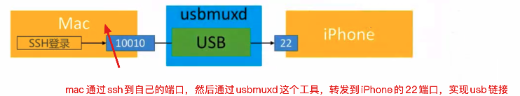

# 通过usbmuxd服务，实现MAC与iPhone的通信

## 一、usbmuxd

usbmuxd 是苹果的一个服务，这个服务主要用于在USB协议上实现多路TCP连接，将USB通信抽象为TCP通信。苹果的iTunes、Xcode，都直接或间接地用到了这个服务。

这个服务在Mac端是由/System/Library/PrivateFrameworks/MobileDevice.framework/Resources/usbmuxd提供的, 开机自动启动。

它创建了一个Unix Domain Socket 在 /var/run/usbmuxd. usbmuxd服务程序监控iPhone在USB口上的连接, 当它监控到iPhone以用户模式连接到USB, (相对的是recovery模式), usbmuxd服务程序就会连接到这个/var/run/usbmuxd的TCP端口, 并开始成为一个USB - TCP 请求转发器

那么,如果想编写个第三方程序与iphone进行通信,实现类似iTunes的功能, 你的程序可以通过usbmuxd! 建立一个TCP连接到/var/run/usbmuxd端口, 根据协议发送对应的请求包, usbmuxd服务会将请求转发到USB的iPhone上。

## 二、SSH通过USB远程到iPhone

默认情况下，ssh通过TCP远程到iPhone


可通过usbmuxd进行端口转发，通过usb连接到iPhone



开源实现：

[python-client](https://cgit.sukimashita.com/usbmuxd.git)：下载v1.0.8版本 usbmuxd-1.0.8/python-client/tcprelay.py

[peertalk](https://github.com/rsms/peertalk)

iproxy

## 三、iproxy转发

```shell
$ brew install usbmuxd
# 安装usbmuxd库之后，就顺带安装了一个小工具iproxy
# iproxy 本地端口 映射端口 
$ iproxy 10010 22
```

## 四、python-client转发

1）开启python-client

* 加 -t 参数可支持多个ssh链接

```shell
$ python tcprelay.py -t 22:10010
Forwarding local port 10010 to remote port 22
```

2）ssh链接本地端口，python-client会进行转发

```shell
$ ssh root@localhost -p 10010
Last login: Mon Mar  8 15:16:23 2021 from 127.0.0.1
Cchukou:~ root#
```

3）scp也可通过usb进行拷贝

```shell
# -P 进行端口指定（大写P）
scp -P dumpdecrypted.dylib root@localhost:/usr/lib
```


