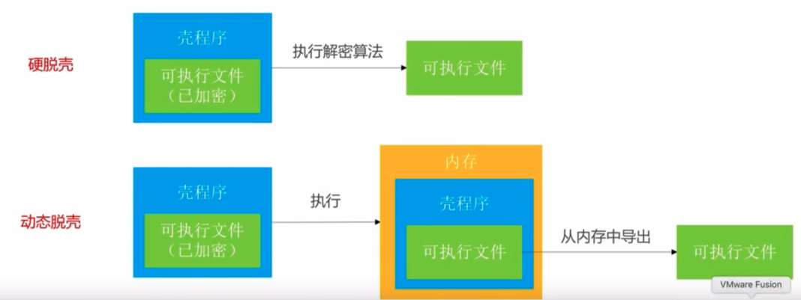

# 脱壳

## 一、加壳

上传至Apple Store的应用，会被加密，无法正常查看Mach-O信息，需要脱壳

## 二、脱壳工具

*  脱壳的两种方法：硬脱壳和动态脱壳



* 如何检查Mach-O是否已经脱壳

查看LC中的`LC_ENCRyPTION_INFO`中的`Crypt ID`，如果等于`0`则未加密

### 2.1 砸壳工具dumpdecrypted

1. [下载源码](https://github.com/stefanesser/dumpdecrypted)，修改`makefile`

```sh
## 这里指定越狱设备的架构
GCC_UNIVERSAL=$(GCC_BASE) -arch armv7 -arch armv7s -arch arm64改成 GCC_UNIVERSAL=$(GCC_BASE) -arch arm64
## 这里指定越狱设备的版本号
## 网上也有其他操作，下载对应设备版本的Xcode
CFLAGS = 改成CFLAGS = -target arm64-apple-ios12.4
```

2. `make`，生成`dumpdecrypted.dylib`
3. 用`codesign`和个人调试证书给`dumpdecrypted.dylib`签名

```shell
# 查找可用的证书，然后用找到的证书签名
security find-identity -v -p codesigning 
codesign --force --verify --verbose --sign "找到的可用证书名称" dumpdecrypted.dylib
```

#### 遇到的错误

```shell
Killed: 9
# 切换mobile用户：su mobile 
# 或者
# dumpdecrypted.dylib未签名，参考上面步骤进行重签名
```

```shell
dyld: warning: could not load inserted library 'dumpdecrypted.dylib' into hardened process because no suitable image found.  Did find:
	dumpdecrypted.dylib: file system sandbox blocked mmap() of 'dumpdecrypted.dylib'
2021-02-23 10:54:50.669 brush_free[1563:120502] Checking for file at /var/mobile/Containers/Data/Application/D627C61F-4A0C-4DA3-978D-BD710C904571/Library/Caches/flex-extract.signal
2021-02-23 10:54:50.686 brush_free[1563:120502] FLXX Error: Couldn't get contents of file: /var/mobile/Library/Application Support/Flex3/patches.plist
Abort trap: 6
# 未将dylib放到/usr/lib/目录下
# 新版iOS不支持将dylib放在.app或Documents目录下来注入
```

```shell
dyld: Symbol not found: ___chkstk_darwin
# dumpdecrypted.dylib对应的SDK版本号不对，修改makefile重新编译或者下载对应版本的Xcode
```

### 2.2 class-dump

可以将Objective-C编写的二进制文件反编出头文件，需要是已砸壳的二进制文件。

[官网](https://links.jianshu.com/go?to=http%3A%2F%2Fstevenygard.com%2Fprojects%2Fclass-dump%2F)

[源码](https://links.jianshu.com/go?to=https%3A%2F%2Fgithub.com%2Fnygard%2Fclass-dump)

[MonkeyDev/class-dump](https://github.com/AloneMonkey/MonkeyDev/blob/master/bin/class-dump)：支持swift和oc混编

#### 遇到的错误

```shell
Error: Cannot find offset for address 0x40000000010053e2 in stringAtAddress:
# 项目中存在Swift，使用其他改版的class-dump
```

### 2.3 Hopper

目标文件代码分析

[官网](https://www.hopperapp.com/)

## 三、脱壳-dumpdecrypted-硬脱壳

1）越狱手机上下载要破解的应用

2）在mac上ssh远程到越狱手机

```shell
# Mac
# 密码默认alpine
$ ssh root@10.94.51.82
root@10.94.51.82's password:
Cchukou:~ root#
```

3）运行app，`ps`查看进程信息，查找破解App的bundle地址

```shell
# iPhone
Cchukou:~ root# ps -e | grep brush
 1492 ??         1:18.02 /var/containers/Bundle/Application/EA717F2A-A0F7-4988-BA96-95B5830539B0/brush_free.app/brush_free
 1532 ttys000    0:00.01 grep brush
```

一些其他操作：

* 导出app包

```shell
# Mac
scp -r root@10.94.51.82:/var/containers/Bundle/Application/EA717F2A-A0F7-4988-BA96-95B5830539B0/brush_free.app .
```

* 代码查看手机上安装的所有应用的bundle id，使用了私有api，需要在越狱机上使用

```objective-c
#import <objc/runtime.h>
// 获取安装app 的bundle id
Class LSApplicationWorkspace_class = NSClassFromString(@"LSApplicationWorkspace");
NSObject *workspace = [LSApplicationWorkspace_class performSelector:@selector(defaultWorkspace)];
NSArray *arrAPP = [workspace performSelector:@selector(allApplications)];
NSLog(@"arrAPP: %@", arrAPP);
```

4）`cycript`寻找app的沙盒Documents具体路径 ，`Ctrl+D`退出`cycript`

```shell
# iPhone
Cchukou:~ root# cycript -p brush_free
cy# NSSearchPathForDirectoriesInDomains(NSDocumentDirectory, NSUserDomainMask, YES)[0]
@"/var/mobile/Containers/Data/Application/D627C61F-4A0C-4DA3-978D-BD710C904571/Documents"
```

5）使用`scp`指令把`dumpdecrypted.dylib`拷贝到`/usr/lib/`，老一点的系统版本可能需要放到`Documents`下

```shell
# Mac
$ scp -r dumpdecrypted.dylib root@10.94.51.82:/usr/lib
```

6）切换`mobile`用户(旧版本可能不需要)

```shell
# iPhone
$ su mobile
```

7）执行`dumpdecrypted`砸壳，这里是在`Documents`路径下操作，砸壳后会将dump放到此文件夹下，可在任意文件夹下操作

```shell
# iPhone
Cchukou:~/Containers/Data/Application/D627C61F-4A0C-4DA3-978D-BD710C904571/Documents mobile$ DYLD_INSERT_LIBRARIES=/usr/lib/dumpdecrypted.dylib /var/containers/Bundle/Application/EA717F2A-A0F7-4988-BA96-95B5830539B0/brush_free.app/brush_free
mach-o decryption dumper

DISCLAIMER: This tool is only meant for security research purposes, not for application crackers.

[+] detected 64bit ARM binary in memory.
[+] offset to cryptid found: @0x100a05028(from 0x100a04000) = 1028
[+] Found encrypted data at address 00004000 of length 6275072 bytes - type 1.
[+] Opening /private/var/containers/Bundle/Application/EA717F2A-A0F7-4988-BA96-95B5830539B0/brush_free.app/brush_free for reading.
[+] Reading header
[+] Detecting header type
[+] Executable is a plain MACH-O image
[+] Opening brush_free.decrypted for writing.
[+] Copying the not encrypted start of the file
[+] Dumping the decrypted data into the file
[+] Copying the not encrypted remainder of the file
[+] Setting the LC_ENCRYPTION_INFO->cryptid to 0 at offset 1028
[+] Closing original file
[+] Closing dump file
Cchukou:~/Containers/Data/Application/D627C61F-4A0C-4DA3-978D-BD710C904571/Documents mobile$ ls
brush_free.decrypted
```

8）将生成的.decrypted导出

```shell
# Mac
$ scp root@10.94.51.82:/var/mobile/Containers/Data/Application/D627C61F-4A0C-4DA3-978D-BD710C904571/Documents/brush_free.decrypted .
```

## 四、class-dump

可使用`class-dump`导出可执行文件的头文件

1）使用`class-dump`导出头文件

```shell
class-dump -H brush_free.decrypted -o brush_header
```

## 五、frida-ios-dump一键脱壳

[frida-ios-dump](https://github.com/AloneMonkey/frida-ios-dump)

1）Mac安装frida

```shell
$ sudo pip install frida
```

2） 下载[frida-ios-dump](https://github.com/AloneMonkey/frida-ios-dump)

3）进入`frida-ios-dump`，安装依赖，可能会出现错误，可先不用管，部分库未下载下来可在后面根据提示在进行安装

```shell
sudo pip install -r requirements.txt --upgrade
```

4）使用iproxy映射端口

```shell
$ iproxy 10010 22
```

5）修改`frida-ios-dump`中的`dump.py`文件的端口配置

```shell
Port = 10010
```

6）手机`Cydia`中安装`frida`

```shell
# 打开Cydia->软件源->编辑->添加，输入build.frida.re，添加软件源后，搜索安装Frida即可，注意Frida对应的Cpu型号
```

7）`frida-ios-dump`工程中执行dump

```shell
$ ./dump.py com.tencent.xin
Start the target app com.tencent.xin
.....
Generating "微信.ipa"

# 如果报错 ImportError: No module named 'xxx'
# sudo pip install 'xxx'
```