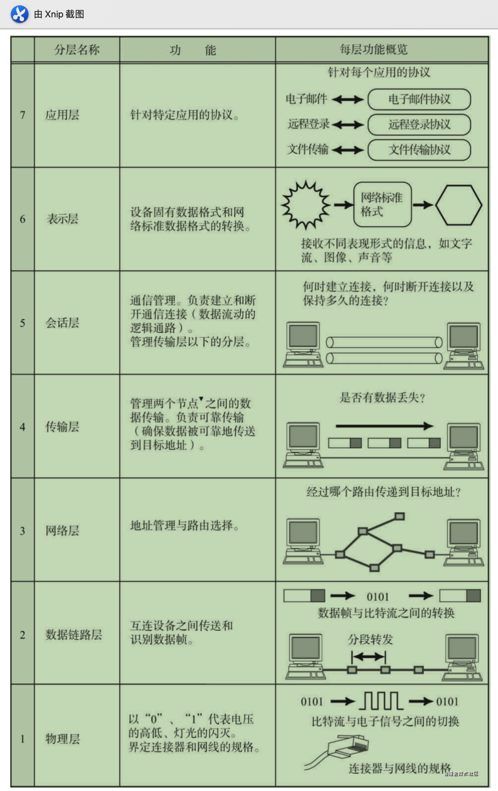
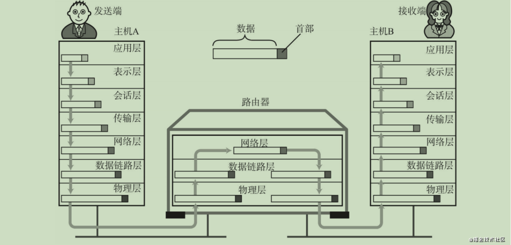
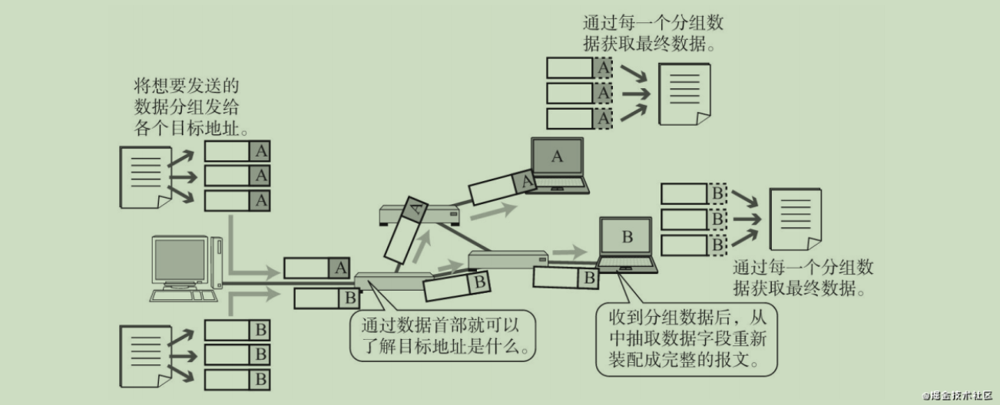
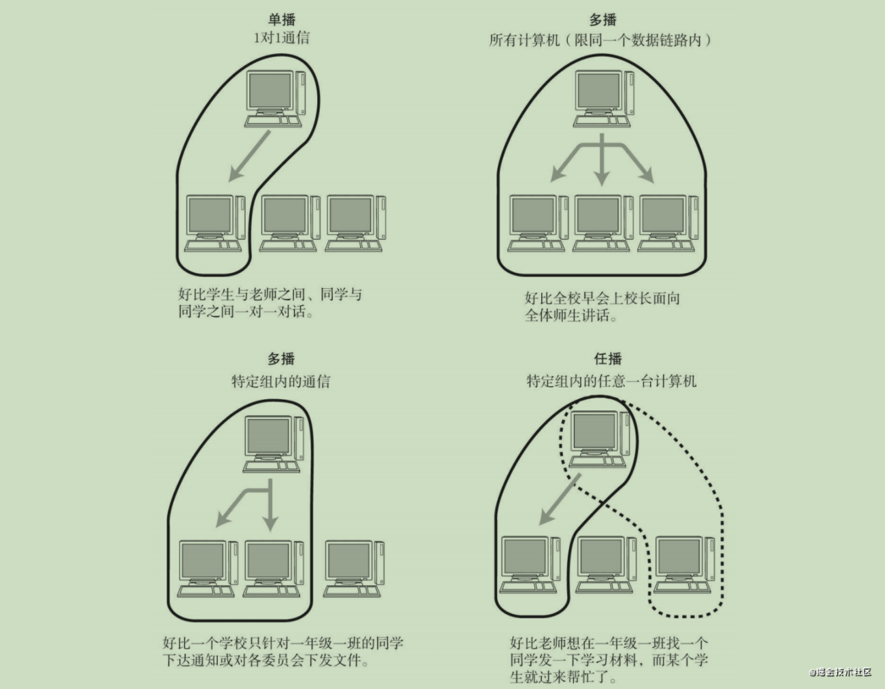
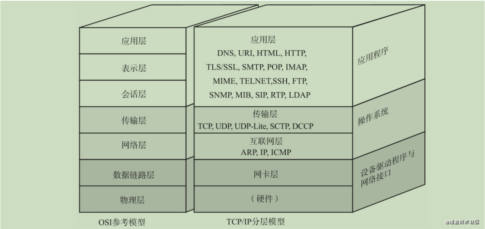
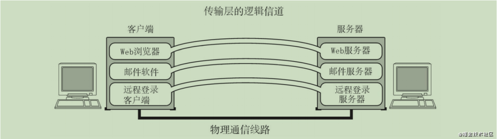
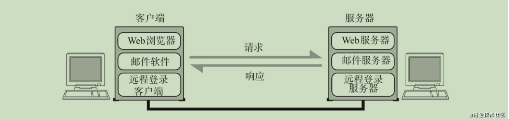

# 图解TCP/IP

## 一、网络基础知识

> 本模块主要深入了解TCP/IP所必备的基础知识：OSI参考模型、网络概念的本质等。

### 1.1 OSI参考模型

- 应用层

为应用程序提供服务并规定应用程序中通信相关的细节。包括文件传输、电子邮件、远程登录（虚拟 终端）等协议。

- 表示层

将应用处理的信息转换为适合网络传输的格式，或将来自下一层的数据转换为上层能够处理的格式。 因此它主要负责数据格式的转换。

具体来说，就是将设备固有的数据格式转换为网络标准传输格式。不同设备对同一比特流解释的结果 可能会不同。因此，使它们保持一致是这一层的主要作用。

- 会话层

负责建立和断开通信连接（数据流动的逻辑通路），以及数据的分割等数据传输相关的管理。

- 传输层

起着可靠传输的作用。只在通信双方节点上进行处理，而无需在路由器上处理。

-  网络层

将数据传输到目标地址。目标地址可以是多个网络通过路由器连接而成的某一个地址。因此这一层主 要负责寻址和路由选择。

- 数据链路层

负责物理层面上互连的、节点之间的通信传输。

例如与1个以太网相连的2个节点之间的通信。 将0、1序列划分为具有意义的数据帧传送给对端（数据帧的生成与接收）。

- 物理层

负责0、1比特流（0、1序列）与电压的高低、光的闪灭之间的互换。

### 1.2 传输方式的分类

#### 1.2.1 面向有连接型与面向无连接型

> 通过网络发送数据，大致可以分为**面向有连接**与**面向无连接**两种类型（面向无连接型包括以太网、 IP、UDP等协议。面向有连接型包括ATM、帧中继、TCP等协议。） 

**面向有连接型**

面向有连接型中，在发送数据之前，需要在收发主机之间连接一条通信线路 （在不同的分层协议中，连接的具体含义可能有所不同。在数据链路层中的连接，就是指物理的、通信线 路的连接。而传输层则负责创建与管理逻辑上的连接。） 

**面向无连接型**

> 因此，在面向无连接的通信中，不需要确认对端是否存在。即使接收端不存在或无法接收数据，发送 端也能将数据发送出去。

面向无连接型则不要求建立和断开连接。发送端可于任何时候自由发送数据，反之，接收端也永远不知道自己会在何时从哪里收到数据。因此，在面向无连接的情况下，接收端需要时常确认是否收到了数据。

#### 1.2.2 电路交换和分组交换

> 目前，网络通信方式大致分为两种——电路交换和分组交换。

**电路交换**

在电路交换中，交换机主要负责数据的中转处理。计算机首先被连接到交换机上，而交换机与交换机之间则由众多通信线路再继续连接。因此计算机之间在发送数据时，需要通过交换机与目标主机建立通信电路。我们将连接电路称为建立连接。建立好连接以后，用户就可以一直使用这条电路，直到该连接被断开为止。

**分组交换**

让连接到通信电路的计算机将所要发送的数据分成多个数据包， 按照一定的顺序排列之后分别发送。这就是分组交换。有了分组交换，数据被细分后，所有的计算机就可以一齐收发数据，这样也就提高了通信线路的利用率。由于在分组的过程中，已经在每个分组的首部写入 了发送端和接收端的地址，所以即使同一条线路同时为多个用户提供服务，也可以明确区分每个分组数据 发往的目的地，以及它是与哪台计算机进行的通信。

在分组交换中，由分组交换机（路由器）连接通信线路。分组交换的大致处理过程是：发送端计算机将数据分组发送给路由器，路由器收到这些分组数据以后，缓存到自己的缓冲区，然后再转发给目标计算机。

#### 1.3.3 接收端数量分量

> 网络通信当中，也可以根据目标地址的个数及其后续的行为对通信进行分类。如广播、多播等就是这种分类的产物。 

- **单播**

组合起来就是指1对1通信。早先的固定电话就是单播通信的一个典型例子。 

- **广播**

它指是将消息从1台主机发送给与之相连的所有其他主机。将电视信号一起发送给非特定

的多个接收对象。

- **多播**

多播与广播类似，也是将消息发给多个接收主机。不同之处在于多播要限定某一组主机作为接收端。多播通信最典型的例子就是电视会议，这是由多组人在不同的地方参加的一种远程会议。在这种形式下，会由一台主机发送消息给特定的多台主机。电视会议通常不能使用广播方式。否则将无从掌握是谁在哪儿参与电视会议。 

- **任播**

任播是指在特定的多台主机中选出一台作为接收端的一种通信方式。虽然，这种方式与多播有相似之处，都是面向特定的一群主机，但是它的行为却与多播不同。任播通信从目标主机群中选择一台最符合网络条件的主机作为目标主机发送消息。通常，所被选中的那台特定主机将返回一个单播信号，随后发送端主机会只跟这台主机进行通信。

？是否类似需要负载均衡

## 二、TCP/IP基础知识

### 2.1 TCP/IP的具体含义

* 协议族，泛指整个网络通信协议，不单指某一个协议

### 2.2 TCP/IP与OSI参考模型

**2.2.1 硬件【物理层】**

TCP/IP的最底层是负责数据传输的硬件。这种硬件就相当于以太网或电话线路等物理层的设备。关于它的内容一直无法统一定义。因为只要人们在物理层面上所使用的传输媒介不同（如使用网线或无线）， 网络的带宽、可靠性、安全性、延迟等都会有所不同，而在这些方面又没有一个既定的指标。总之， TCP/IP是在网络互连的设备之间能够通信的前提下才被提出的协议。

**2.2.2 网络接口层【数据链路层】**

网络接口层（有时人们也将网络接口层与硬件层合并起来称作网络通信层。） 利用以太网中的数据链路层进行通信，因此属于接口层。也就是说，把它当做让NIC起作用的“驱动程序”也无妨。

驱动程序是在操作系统与硬件之间起桥梁作用的软件。计算机的外围附加设备或扩展卡，不是直接插到电脑上或电脑的扩展槽上就能马上使用的，还需要有相应驱动程序的支持。例如换了一个新的NIC网卡，不仅需要硬件，还需要软件才能真正投入使用。因此，人们常常还需要在操作系统的基础上安装一些驱动软件以便使用这些附加硬件

**2.2.3 互联网层【网络层】**

互联网层使用IP协议，它相当于OSI模型中的第3层网络层。IP协议基于IP地址转发分包数据。 

TCP/IP分层中的互联网层与传输层的功能通常由操作系统提供。尤其是路由器，它必须得实现通过互 联网层转发分组数据包的功能。

- **IP**

IP是跨越网络传送数据包，使整个互联网都能收到数据的协议。IP协议使数据能够发送到地球的另一 端，这期间它使用IP地址作为主机的标识【连接IP网络的所有设备必须有自己唯一的识别号以便识别具体 的设备。分组数据在IP地址的基础上被发送到对端。】

IP还隐含着数据链路层的功能。通过IP，相互通信的主机之间不论经过怎样的底层数据链路都能够实现通信。

虽然IP也是分组交换的一种协议，但是它不具有重发机制。即使分组数据包未能到达对端主机也不会重发。因此，属于非可靠性传输协议。

-  **ICMP**

IP数据包在发送途中一旦发生异常导致无法到达对端目标地址时，需要给发送端发送一个发生异常的通知。ICMP就是为这一功能而制定的。它有时也被用来诊断网络的健康状况。

- **ARP**

从分组数据包的IP地址中解析出物理地址（MAC地址）的一种协议。

**2.2.4 传输层**

TCP/IP的传输层有两个具有代表性的协议。该层的功能本身与OSI参考模型中的传输层类似。

传输层最主要的功能就是能够让应用程序之间实现通信。计算机内部，通常同一时间运行着多个程序。为此，必须分清是哪些程序与哪些程序在进行通信。识别这些应用程序的是端口号。 

- **TCP**

**TCP是一种面向有连接的传输层协议**。它可以保证两端通信主机之间的通信可达。TCP能够正确处理在传输过程中丢包、传输顺序乱掉等异常情况。此外，TCP还能够有效利用带宽，缓解网络拥堵。然而，为了建立与断开连接，有时它需要至少7次的发包收包，导致网络流量的浪费。此外，为了提高网络的利用率，TCP协议中定义了各种各样复杂的规范，因此不利于视频会议（音频、视频的数据量既定）等场合使用。 

- **UDP**

**UDP有别于TCP，它是一种面向无连接的传输层协议**。UDP不会关注对端是否真的收到了传送过去的 数据，如果需要检查对端是否收到分组数据包，或者对端是否连接到网络，则需要在应用程序中实现。 

UDP常用于分组数据较少或多播、广播通信以及视频通信等多媒体领域。

**2..2.5 应用层【会话层以上的分层】**

TCP/IP的分层中，将OSI参考模型中的会话层、表示层和应用层的功能都集中到了应用程序中实现。这 些功能有时由一个单一的程序实现，有时也可能会由多个程序实现。因此，细看TCP/IP的应用程序功能会 发现，它不仅实现OSI模型中应用层的内容，还要实现会话层与表示层的功能。

TCP/IP应用的架构绝大多数属于客户端/服务端模型。提供服务的程序叫服务端，接受服务的程序叫客 户端。在这种通信模式中，提供服务的程序会预先被部署到主机上，等待接收任何时刻客户可能发送的请求。

## 参考文献

[网络另一篇干货《图解TCP/IP》-封顶大吉【值得收藏】](https://juejin.cn/post/6928280495310503944)

