# 01_多环境配置

>  Project:包含了项目所有的代码，资源文件，所有信息 
>
> Target:对指定代码和资源文件的具体构建方式。 
>
> Scheme:对指定Target的环境配置。

## 多Target

1. Duplicate Target

2. 修改plist，关联plist路径

3. 修改bundle id、display name

4. 修改icon，launch等等

5. 多Target关联同一份代码，可以在build setting中预定义宏进行区分

6. Swift中有自己的定义宏的地方-Other Swift Flags，定义swift宏的话，加参数 -D

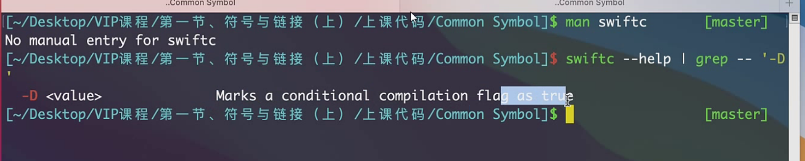

## Scheme

增加一个Scheme，就可以在build setting中根据不同的Scheme设置参数，build的时候选择不同Scheme即可运行不同参数

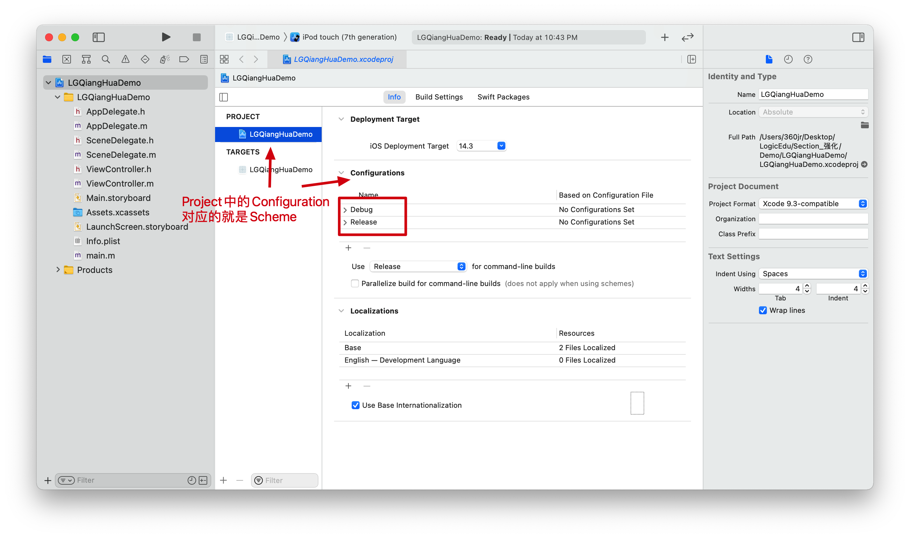

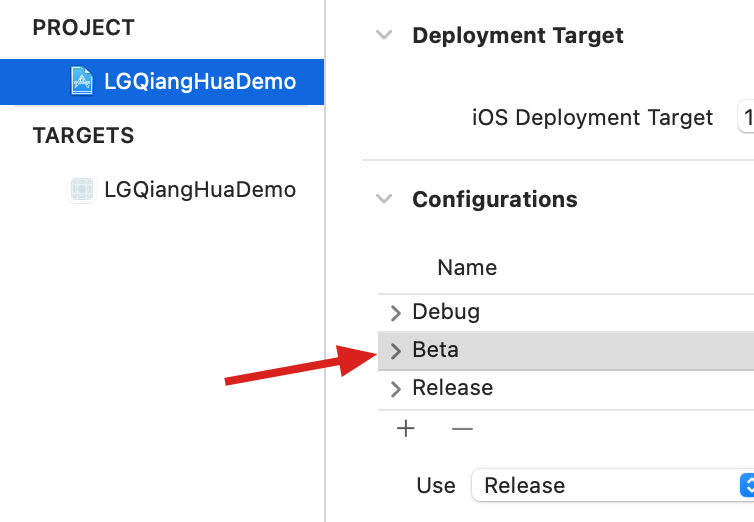

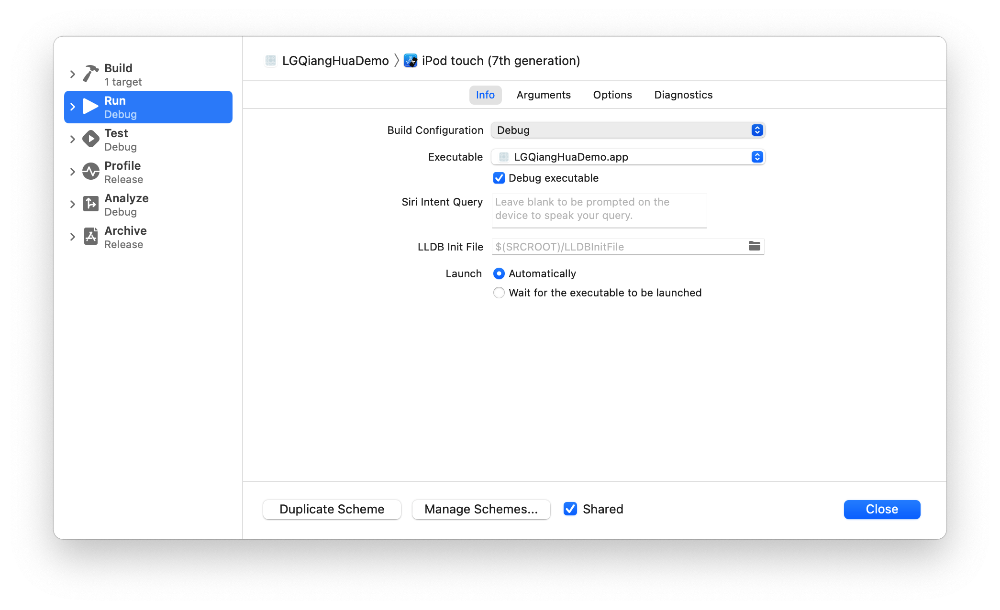

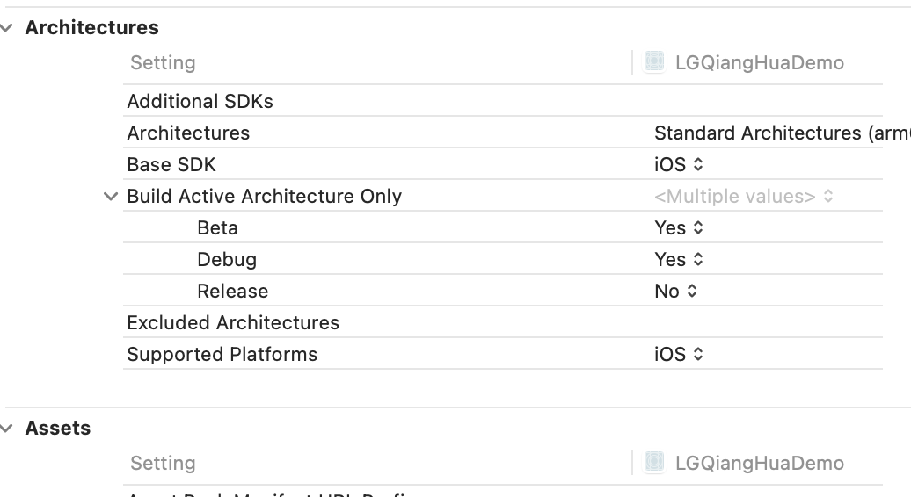

实操：

1. 添加用户定义

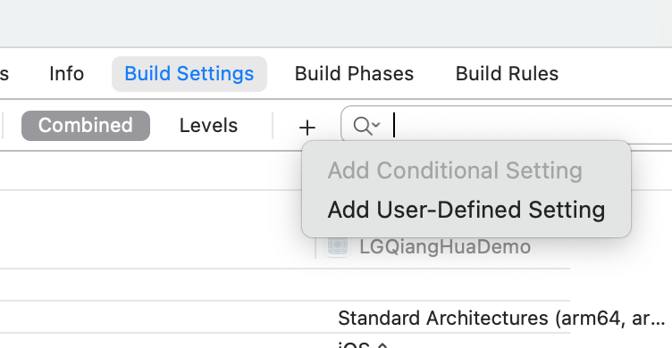

2. 自定义配置

- ~~经过测试，在User-Defined中添加的字符串，如果通过Macro方式读取，目前有问题，后续寻找解决方式~~
- 因为是宏引用，注意宏中定义的格式

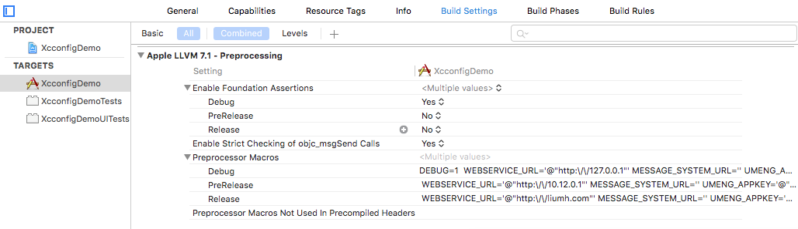

- 使用${DEFINE}读取

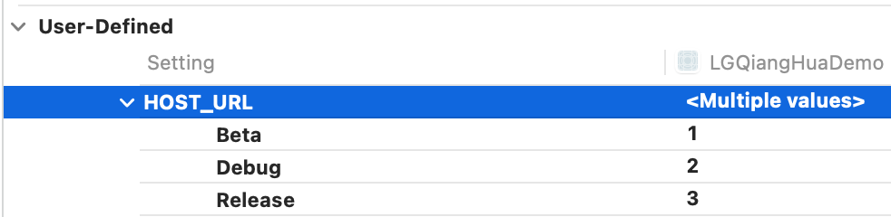

3. 在plist中读取或者在Macros中读取

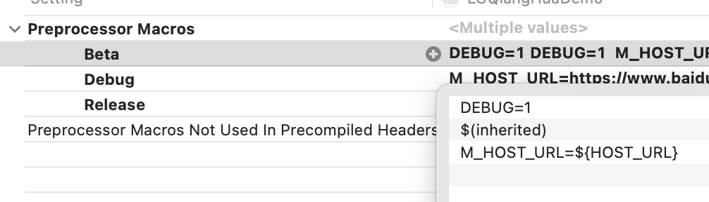

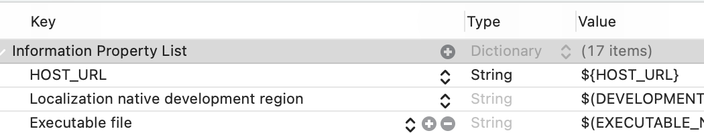

## xcconfig文件

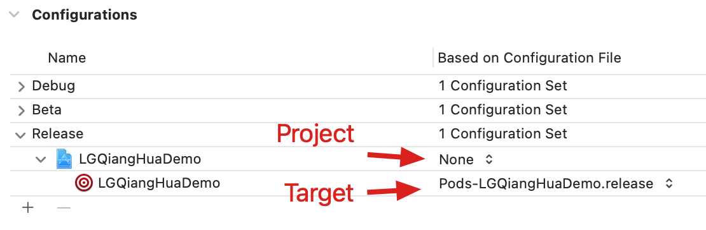

- 同User-Define一样，可以通过宏读取或者info.plist读取
- ${DEFINE}获取define的数据
- 注意Config文件中的特殊字符，

```shell
# 例如 / ,可以先定义一个变量：
SLASH=/
# 然后，通过下面方式间接访问：
SLASH=/
HOST_URL = http:$(SLASH)/127.0.0.1
```

- 可配置build setting中的一些值的设置，关于build setting中的设置，参考https://xcodebuildsettings.com/
- 在config中引用别的config，例如自定义的config，导入pod的config，否则pod install的时候会告警，运行也可能会出错

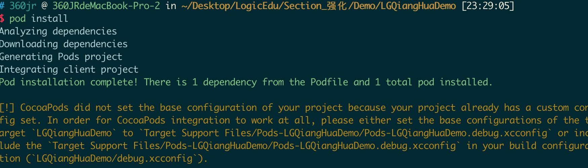

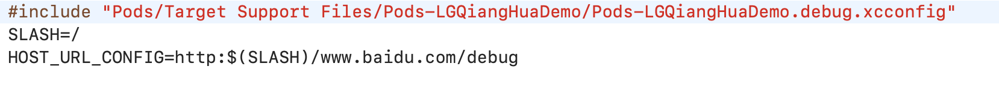

- 不同配置文件中对同一个key进行了设置，使用$(inherited)继承，可参考pod生成的config文件

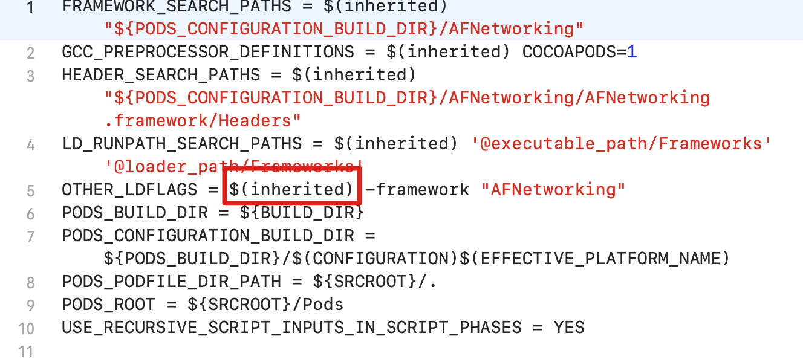

## main函数启动传参

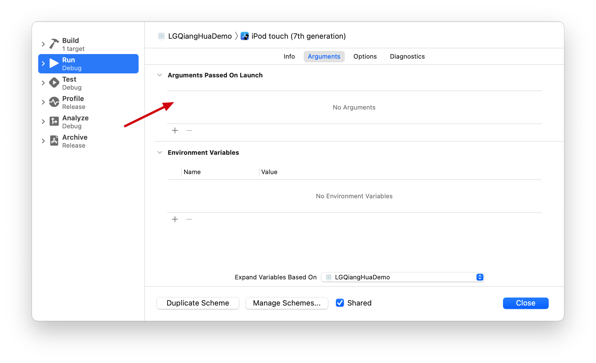

## mach-o与链接器

ABI：说明了mach-o的格式。ABI稳定，说明无需重新编译生成mach-o即可重新运行

可执行文件调用过程：

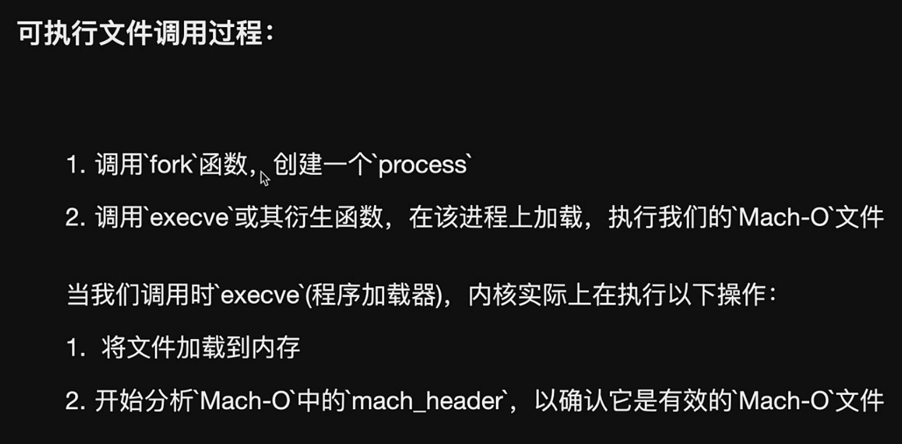

### 查看mach-o文件header格式

```shell
## objdump
$ objdump --macho --private-headers  /Users/360jr/Library/Developer/Xcode/DerivedData/LGQiangHuaDemo-cbqtsqzmnxlyglewsnjzasrkwdhh/Build/Products/Debug-iphoneos/LGQiangHuaDemo.app/LGQiangHuaDemo

/Users/360jr/Library/Developer/Xcode/DerivedData/LGQiangHuaDemo-cbqtsqzmnxlyglewsnjzasrkwdhh/Build/Products/Debug-iphoneos/LGQiangHuaDemo.app/LGQiangHuaDemo:

Mach header

   magic cputype cpusubtype caps  filetype ncmds sizeofcmds   flags

MH_MAGIC_64  ARM64    ALL 0x00   EXECUTE  26    3040  NOUNDEFS DYLDLINK TWOLEVEL PIE

Load command 0

   cmd LC_SEGMENT_64

 cmdsize 72

 segname __PAGEZERO
 ...
 
 # otool -h <Path>  查看header
 # otool -l <Path>  查看lc
 # 使用grep ‘xxx’ -A 5 -B 5 过滤，-A 5 向下显示五行， -B 5 向上显示5行
```

### mach-o的读取

编译过程：将代码中的符号进行分类，放置到mach-o中，外部符号，内部符号

链接过程：多个目标文件合并成一个文件。符号表合并


### 将Xcode上脚本运行输出到终端上

1. 终端输入 tty 命令获取终端重定向链

```shel
$ tty
/dev/ttys002
```

2. Xcode执行脚本重定向到控制台

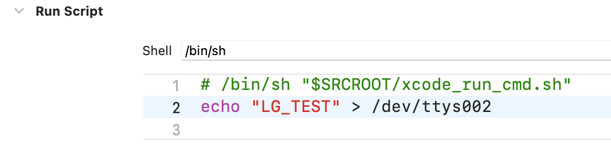

3. 运行即可看到终端上的输出
4. 将xcconfig文件中的配置输出到终端

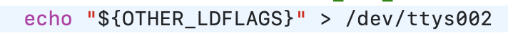

5. 利用以上，可以在Xcode编译时，将一些参数定义在config文件中，在编译完成后执行脚本命令，经结果输出到终端

## 查看符号：

```shell
nm -pa <mach-o>path
```

```shell
// config文件中定义生成的macho文件路径
MACHO_PATH=${BUILD_DIR}/$(CONFIGURATION)$(EFFECTIVE_PLATFORM_NAME)/*
```

strip在shell之后执行

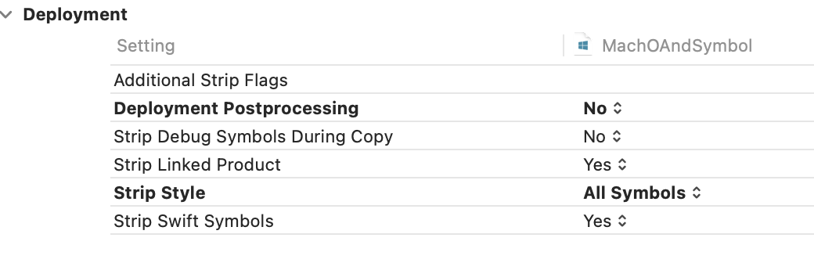

// OTHER_LDFLAGS 传给链接器的参数

// -Xlinker 表示参数是传递给连接器的 （Xcode前端有clang执行，但是参数传递给连接器）

// man ld 查看连接器使用手册

// -S 参数表示不输出调试符号到输出文件

OTHER_LDFLAGS = -Xlinker -S


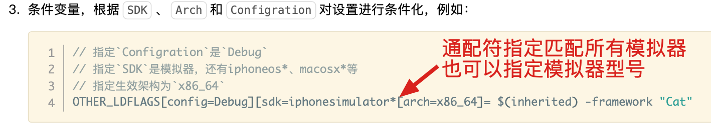

strip命令 剥离符号表

llvm编译

调试