# 02_Mach-O和符号

## Mach-O的格式

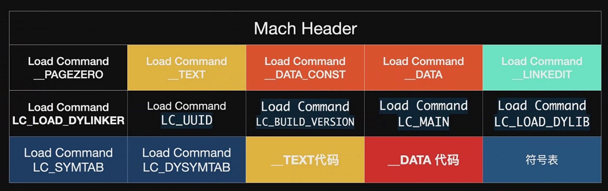

dyld按照约定的规则，通过Header，获取size，然后根据size获取LC，找到代码段，并执行

iOS小端模式

mach header：自描述，架构、文件类型。。。

```shell
Mach header
      magic  cputype cpusubtype  caps    filetype ncmds sizeofcmds      flags
 0xfeedfacf 16777228          0  0x00           2    26       3040 0x00200085
```

查看header，两种命令：objdump 和 otool

```shell
# objdump 更容易阅读
objdump --macho --private-header <path>
Mach header
      magic cputype cpusubtype  caps    filetype ncmds sizeofcmds      flags
MH_MAGIC_64  X86_64        ALL  0x00     EXECUTE    20       1960   NOUNDEFS DYLDLINK TWOLEVEL WEAK_DEFINES BINDS_TO_WEAK PIE
# otool -h <path> 更原始的信息
Mach header
      magic  cputype cpusubtype  caps    filetype ncmds sizeofcmds      flags
 0xfeedfacf 16777228          0  0x00           2    26       3040 0x00200085

```


查看__TEXT  \_\_text

```shell
objdump --macho -d <path>
(__TEXT,__text) section
-[ViewController viewDidLoad]:
100005d40:	ff c3 00 d1	sub	sp, sp, #48
100005d44:	fd 7b 02 a9	stp	x29, x30, [sp, #32]
100005d48:	fd 83 00 91	add	x29, sp, #32
100005d4c:	a0 83 1f f8	stur	x0, [x29, #-8]
100005d50:	e1 0b 00 f9	str	x1, [sp, #16]
100005d54:	a8 83 5f f8	ldur	x8, [x29, #-8]
100005d58:	e9 03 00 91	mov	x9, sp
100005d5c:	e8 03 00 f9	str	x8, [sp]
...
```

mach-o可读可写      mach-o + 签名

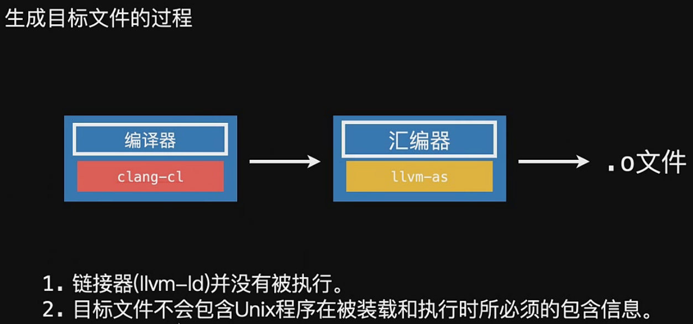

编译生成目标文件，目标文件中有符号表，重定位符号表。重定位符号表中存储的是当前.o中使用的外部API。在最终链接过程中合并符号表

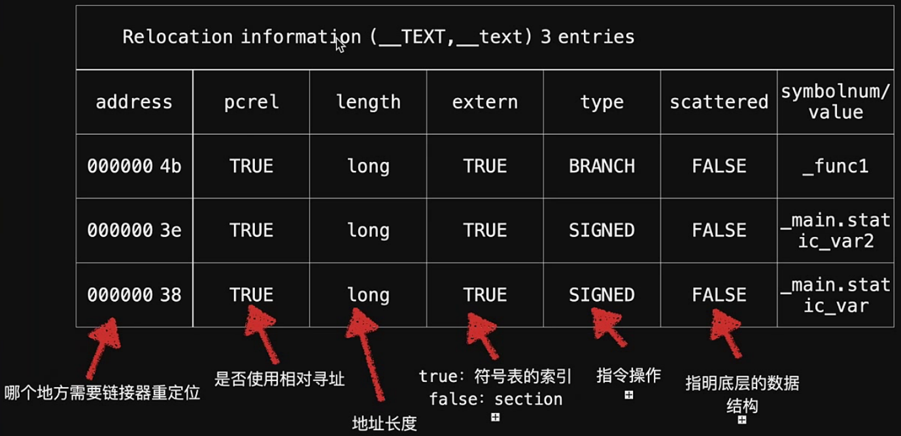

链接就是处理目标文件符号的过程

查看目标文件中的符号（全局符号，本地符号）

```shell
# objdump --macho -syms <path>
objdump --macho -syms /Users/360jr/Library/Developer/Xcode/DerivedData/LGQiangHuaDemo-cbqtsqzmnxlyglewsnjzasrkwdhh/Build/Products/Debug-iphoneos/LGQiangHuaDemo.app/LGQiangHuaDemo
/Users/360jr/Library/Developer/Xcode/DerivedData/LGQiangHuaDemo-cbqtsqzmnxlyglewsnjzasrkwdhh/Build/Products/Debug-iphoneos/LGQiangHuaDemo.app/LGQiangHuaDemo:
SYMBOL TABLE:
0000000100005d40 l     F __TEXT,__text -[ViewController viewDidLoad]
0000000100005d90 l     F __TEXT,__text -[AppDelegate application:didFinishLaunchingWithOptions:]
0000000100005ee0 l     F __TEXT,__text -[AppDelegate application:configurationForConnectingSceneSession:options:]
0000000100005ffc l     F __TEXT,__text -[AppDelegate application:didDiscardSceneSessions:]
0000000100006120 l     F __TEXT,__text -[SceneDelegate scene:willConnectToSession:options:]
00000001000061cc l     F __TEXT,__text -[SceneDelegate sceneDidDisconnect:]
```

全局符号和本地符号：可见性

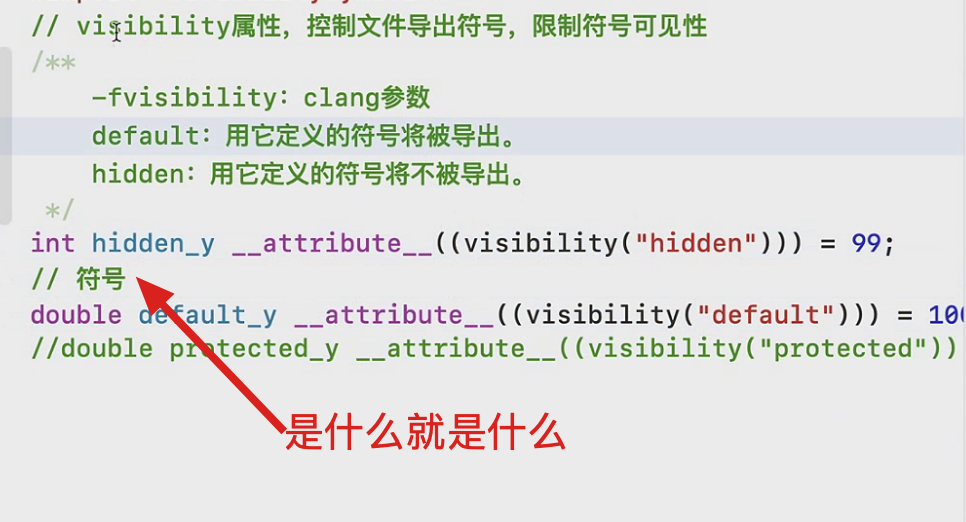

\_\_attribute\_\_ 编译器指令，传递编译器支持的参数给编译器

最好的隐藏全局符号的方式：变为本地符号

\_\_DATA\_\_     \_\_common段：未初始化的全局变量段

\_\_attribute\_\_((deprecated)) 方法被废弃

全局符号对全局可见，整个项目可见，对使用项目的人可见

全局符号：命名空间

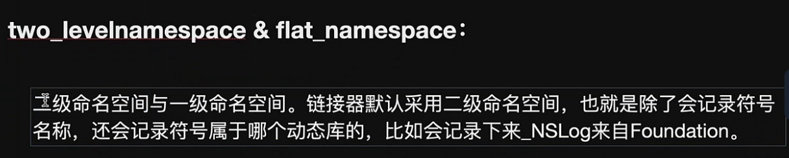

导入导出符号：

```shell
// 查看mach-header
//  objdump --macho -private-header ${MACH_PATH}
//  otool -l ${MACH_PATH}

// 查看__TEXT
// objdump --macho -d ${MACH_PATH}

// 查看符号表
// objdump --macho --syms ${MACH_PATH}
// 查看导出符号
// objdump --macho --exports-trie ${MACH_PATH}
// 查看间接符号表
// objdump --macho --indirect-symbols ${MACH_PATH}
// nm -m ${MACH_PATH}
CMD = objdump --macho --syms ${MACH_PATH}

TTY=/dev/ttys002

// mach-o + 签名
// mach-o __TEXT.__text只读
// 2016 7、8 60m 500m __TEXT.__text
```

全局符号默认会被导出

动态库运行时加载，则链接阶段提供符号就行

间接符号表	：使用的动态库的符号

全局符号可以变成导出符号，给外界使用

间接符号表优化时最不可能删除，找不到符号-》动态库提供的导出符号不可删除，及全局符号不可删除

strip动态库的时候，脱去不是全局符号的符号

OC默认就是导出符号

OC动态库->减小体积->脱去不想暴露的符号->借助一个连接器参数

```shell
#OC脱去指定符号
OTHER_LDFLAGS=$(inherited) -Xlinker -unexported_symbol -Xlinker _OBJC_CLASS_$_LGOneObject
OTHER_LDFLAGS=$(inherited) -Xlinker -unexported_symbol -Xlinker _OBJC_METACLASS_$_LGOneObject

#可以通过 -unexported_symbol-list指定一个文件，
```

拦截器参数：导出符号到一个文件 -map <path> ：符号信息，链接信息

```shell
OTHER_LDFLAGS=$(inherited) -Xlinker -S -Xlinker -map -Xlinker /Users/ws/Desktop/VIP课程/第一节、符号与链接（下）/上课代码/Symbol.text
```

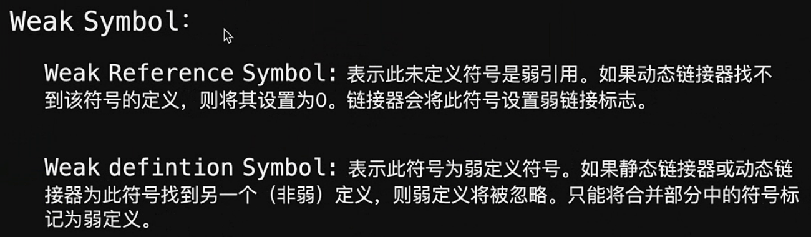

弱定义

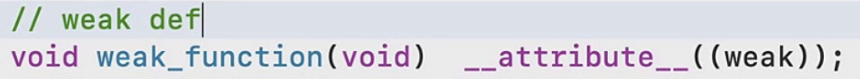

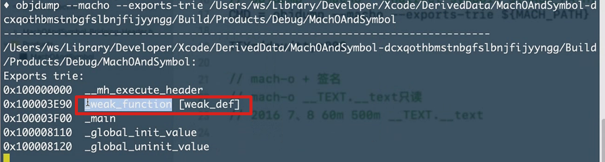

正常全局符号定义两个会冲突，把符号声明成弱定义，则找到一个符号就不会往下找了。其他的被忽略

弱引用

```c
// 弱引用 声明可以不实现
void weak_import_function(void) __attribute__((weak_import));
// 引用的时候判断
if (weak_import_function) {
  weak_import_function();
}
```

```shell
# -U （undefined）链接阶段忽略某个符号，运行阶段会有
OTHER_LDFLAGS=$(inherited) -Xlinker -U -Xlinker _weak_import_function
```

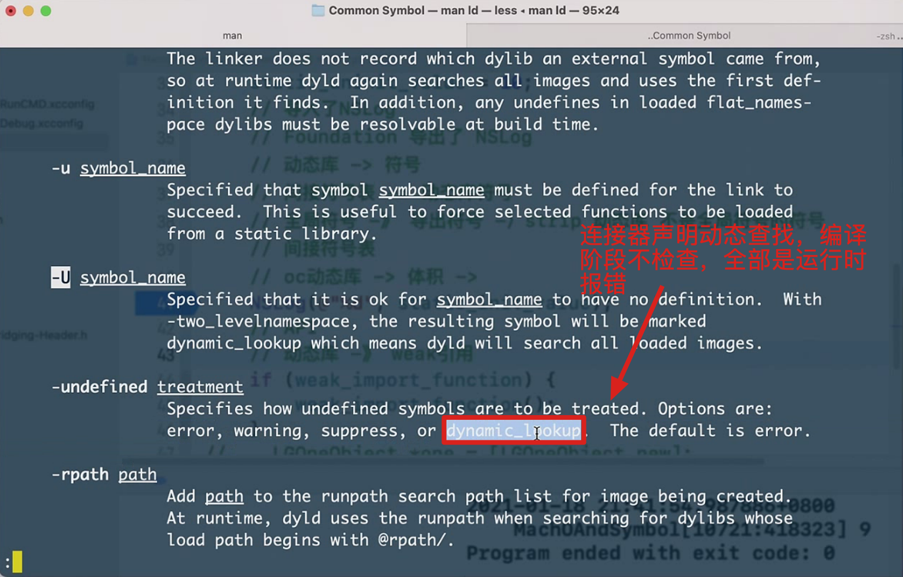

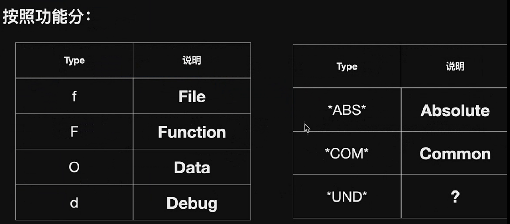

```c
// 重新导出 只能给间接符号表中的符号起别名
OTHER_LDFLAGS=$(inherited) -Xlinker -alias -Xlinker _NSLog -Xlinker Cat_NSLog

```

```shell
# 人类友好的方式输出符号表
nm -m <path>
```

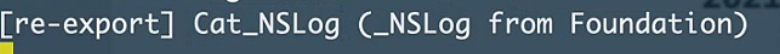

重新导出用法：将我链接的动态库重新导出，让引用我的程序可见

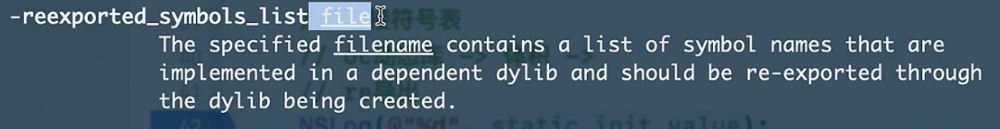

连接器参数，让整个文件重新导出


swift符号

默认本地符号

声明为public，编程全局符号