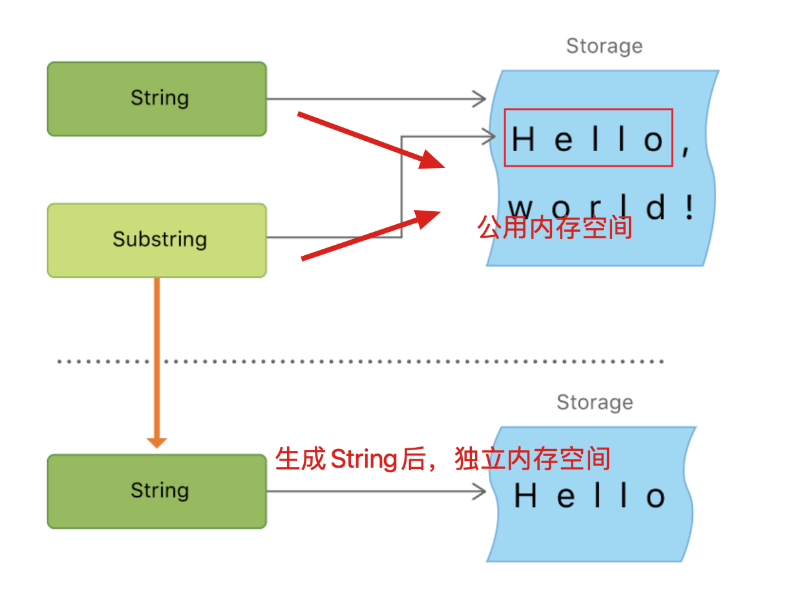

# 二、字符串

> Swift 的 `String` 类型与 Foundation `NSString` 类进行了无缝桥接。Foundation 还对 `String` 进行扩展使其可以访问 `NSString` 类型中定义的方法。这意味着调用那些 `NSString` 的方法，你无需进行任何类型转换。
>
> 更多关于在 Foundation 和 Cocoa 中使用 `String` 的信息请查看 [*Bridging Between String and NSString*](https://developer.apple.com/documentation/swift/string#2919514)。

## 1 多行字符串字面量

```swift
let quotation = """
The White Rabbit put on his spectacles.  "Where shall I begin,
please your Majesty?" he asked.

"Begin at the beginning," the King said gravely, "and go on
till you come to the end; then stop."
"""
```

如果你想换行，以便加强代码的可读性，但是你又不想在你的多行字符串字面量中出现换行符的话，你可以用在行尾写一个反斜杠（`\`）作为续行符

```swift
let softWrappedQuotation = """
The White Rabbit put on his spectacles.  "Where shall I begin, \
please your Majesty?" he asked.

"Begin at the beginning," the King said gravely, "and go on \
till you come to the end; then stop."
"""
```

一个多行字符串字面量能够缩进来匹配周围的代码。关闭引号（`"""`）之前的空白字符串告诉 Swift 编译器其他各行多少空白字符串需要忽略。然而，如果你在某行的前面写的空白字符串超出了关闭引号（`"""`）之前的空白字符串，则超出部分将被包含在多行字符串字面量中。


## 2 扩展字符串分隔符

可以将字符串文字放在扩展分隔符中，这样字符串中的特殊字符将会被直接包含而非转义后的效果。

将字符串放在引号（`"`）中并用数字符号（`#`）括起来。例如，打印字符串文字 `#"Line 1 \nLine 2"#` 会打印换行符转义序列（`\n`）而不是给文字换行。

如果需要字符串文字中字符的特殊效果，请匹配转义字符（`\`）后面添加与起始位置个数相匹配的 `#` 符。 例如，如果您的字符串是 `#"Line 1 \nLine 2"#` 并且您想要换行，则可以使用 `#"Line 1 \#nLine 2"#` 来代替。 同样，`###"Line1 \###nLine2"###` 也可以实现换行效果。

扩展分隔符创建的字符串文字也可以是多行字符串文字。 您可以使用扩展分隔符在多行字符串中包含文本 `"""`，覆盖原有的结束文字的默认行为。例如：

```swift
let threeMoreDoubleQuotationMarks = #"""
Here are three more double quotes: """
"""#
```

## 3 字符串是值类型

在实际编译时，Swift 编译器会优化字符串的使用，使实际的复制只发生在绝对必要的情况下，这意味着你将字符串作为值类型的同时可以获得极高的性能。

## 4 Character

单个字符

```swift
let exclamationMark: Character = "!"
```

字符串可以通过传递一个值类型为 `Character` 的数组作为自变量来初始化：

```swift
let catCharacters: [Character] = ["C", "a", "t", "!", "🐱"]
let catString = String(catCharacters)
print(catString)
// 打印输出：“Cat!🐱”
```

## 5 计算字符数量

如果想要获得一个字符串中 `Character` 值的数量，可以使用 `count` 属性：

```swift
let unusualMenagerie = "Koala 🐨, Snail 🐌, Penguin 🐧, Dromedary 🐪"
print("unusualMenagerie has \(unusualMenagerie.count) characters")
// 打印输出“unusualMenagerie has 40 characters”
```

注意在 Swift 中，使用可拓展的字符群集作为 `Character` 值来连接或改变字符串时，并不一定会更改字符串的字符数量。

> 注意
>
> 可扩展的字形群可以由多个 Unicode 标量组成。这意味着不同的字符以及相同字符的不同表示方式可能需要不同数量的内存空间来存储。所以 Swift 中的字符在一个字符串中并不一定占用相同的内存空间数量。因此在没有获取字符串的可扩展的字符群的范围时候，就不能计算出字符串的字符数量。如果你正在处理一个长字符串，需要注意 `count` 属性必须遍历全部的 Unicode 标量，来确定字符串的字符数量。
>
> 另外需要注意的是通过 `count` 属性返回的字符数量并不总是与包含相同字符的 `NSString` 的 `length` 属性相同。`NSString` 的 `length` 属性是利用 UTF-16 表示的十六位代码单元数字，而不是 Unicode 可扩展的字符群集。

## 6 字符串下标语法

每一个 `String` 值都有一个关联的索引（*index*）类型，`String.Index`，它对应着字符串中的每一个 `Character` 的位置。

不同的字符可能会占用不同数量的内存空间，所以要知道 `Character` 的确定位置，就必须从 `String` 开头遍历每一个 Unicode 标量直到结尾。因此，Swift 的字符串不能用整数（integer）做索引。

使用 `startIndex` 属性可以获取一个 `String` 的第一个 `Character` 的索引。使用 `endIndex` 属性可以获取最后一个 `Character` 的后一个位置的索引。因此，`endIndex` 属性不能作为一个字符串的有效下标。如果 `String` 是空串，`startIndex` 和 `endIndex` 是相等的。

```swift
let greeting = "Guten Tag!"
greeting[greeting.startIndex]
// G
greeting[greeting.index(before: greeting.endIndex)]
// !
greeting[greeting.index(after: greeting.startIndex)]
// u
let index = greeting.index(greeting.startIndex, offsetBy: 7)
greeting[index]
// a
```

使用 `indices` 属性会创建一个包含全部索引的范围（`Range`），用来在一个字符串中访问单个字符。

```swift
for index in greeting.indices {
   print("\(greeting[index]) ", terminator: "")
}
// 打印输出“G u t e n   T a g ! ”
```

## 7 插入和删除

调用 `insert(_:at:)` 方法可以在一个字符串的指定索引插入一个字符，调用 `insert(contentsOf:at:)` 方法可以在一个字符串的指定索引插入一个段字符串。

```swift
var welcome = "hello"
welcome.insert("!", at: welcome.endIndex)
// welcome 变量现在等于 "hello!"

welcome.insert(contentsOf:" there", at: welcome.index(before: welcome.endIndex))
// welcome 变量现在等于 "hello there!"
```

调用 `remove(at:)` 方法可以在一个字符串的指定索引删除一个字符，调用 `removeSubrange(_:)` 方法可以在一个字符串的指定索引删除一个子字符串。

```swift
welcome.remove(at: welcome.index(before: welcome.endIndex))
// welcome 现在等于 "hello there"

let range = welcome.index(welcome.endIndex, offsetBy: -6)..<welcome.endIndex
welcome.removeSubrange(range)
// welcome 现在等于 "hello"
```

## 8 子字符串

是一种独立的类型：`Substring`

Swift 里的 `Substring` 绝大部分函数都跟 `String` 一样，意味着你可以使用同样的方式去操作 `Substring` 和 `String`。然而，跟 `String` 不同的是，你只有在短时间内需要操作字符串时，才会使用 `Substring`。当你需要长时间保存结果时，就把 `Substring` 转化为 `String` 的实例：

```swift
let greeting = "Hello, world!"
let index = greeting.firstIndex(of: ",") ?? greeting.endIndex
let beginning = greeting[..<index]
// beginning 的值为 "Hello"

// 把结果转化为 String 以便长期存储。
let newString = String(beginning)
```

关于内存：

`String` 和 `Substring` 的区别在于性能优化上，`Substring` 可以重用原 `String` 的内存空间，或者另一个 `Substring` 的内存空间（`String` 也有同样的优化，但如果两个 `String` 共享内存的话，它们就会相等）。这一优化意味着你在修改 `String` 和 `Substring` 之前都不需要消耗性能去复制内存。就像前面说的那样，`Substring` 不适合长期存储 —— 因为它重用了原 `String` 的内存空间，原 `String` 的内存空间必须保留直到它的 `Substring` 不再被使用为止。



## 9 字符串比较

### 字符串/字符相等

```swift
let quotation = "We're a lot alike, you and I."
let sameQuotation = "We're a lot alike, you and I."
if quotation == sameQuotation {
    print("These two strings are considered equal")
}
// 打印输出“These two strings are considered equal”
```

如果两个字符串（或者两个字符）的可扩展的字形群集是标准相等，那就认为它们是相等的。只要可扩展的字形群集有同样的语言意义和外观则认为它们标准相等，即使它们是由不同的 Unicode 标量构成。

```swift
// "Voulez-vous un café?" 使用 LATIN SMALL LETTER E WITH ACUTE
let eAcuteQuestion = "Voulez-vous un caf\u{E9}?"

// "Voulez-vous un café?" 使用 LATIN SMALL LETTER E and COMBINING ACUTE ACCENT
let combinedEAcuteQuestion = "Voulez-vous un caf\u{65}\u{301}?"

if eAcuteQuestion == combinedEAcuteQuestion {
    print("These two strings are considered equal")
}
// 打印输出“These two strings are considered equal”
```

### 前缀/后缀

通过调用字符串的 `hasPrefix(_:)`/`hasSuffix(_:)` 方法来检查字符串是否拥有特定前缀/后缀，两个方法均接收一个 `String` 类型的参数，并返回一个布尔值。

## 10 字符串的 Unicode 表示形式

### 字符的ascii

```swift
let s = "Dog‼🐶"
// ascii
for i in s {
  print(i.asciiValue ?? "none") // 可选值
}
/**
68
111
103
none
none
*/
```

### UTF-8

```swift
let s = "Dog‼🐶"
// utf8 可变长编码 一个字符可能由多个UInt8构成
for i in s.utf8 {
  print(i)
}
/**
68
111
103
226
128
188
240
159
144
182
*/
```

### UTF-16

```swift
let s = "Dog‼🐶"
// UTF-16 一个字符可能由多个UInt16构成
for i in s.utf16 {
  print(i)
}
/**
68
111
103
8252
55357
56374
*/
```

### Unicode标量值

> 可以通过遍历 `String` 值的 `unicodeScalars` 属性来访问它的 Unicode 标量表示，每一个 `UnicodeScalar` 拥有一个 `value` 属性，可以返回对应的 21 位数值，用 `UInt32` 来表示

```swift
let s = "Dog‼🐶"
// Unicode 标量表示 .value表示数值
for i in s.unicodeScalars {
  print(i.value)
}
/**
68
111
103
8252
128054
*/
```


