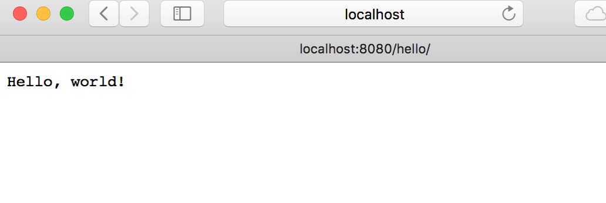
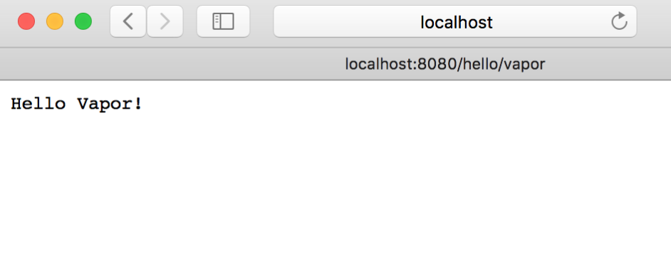
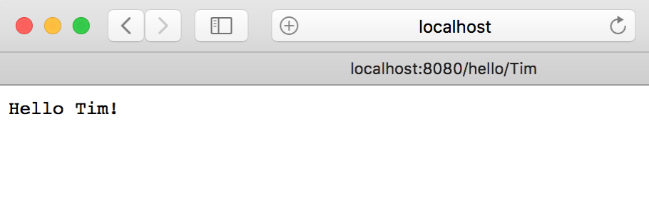
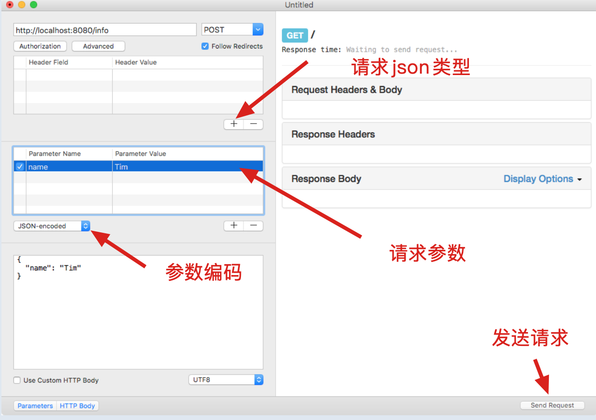
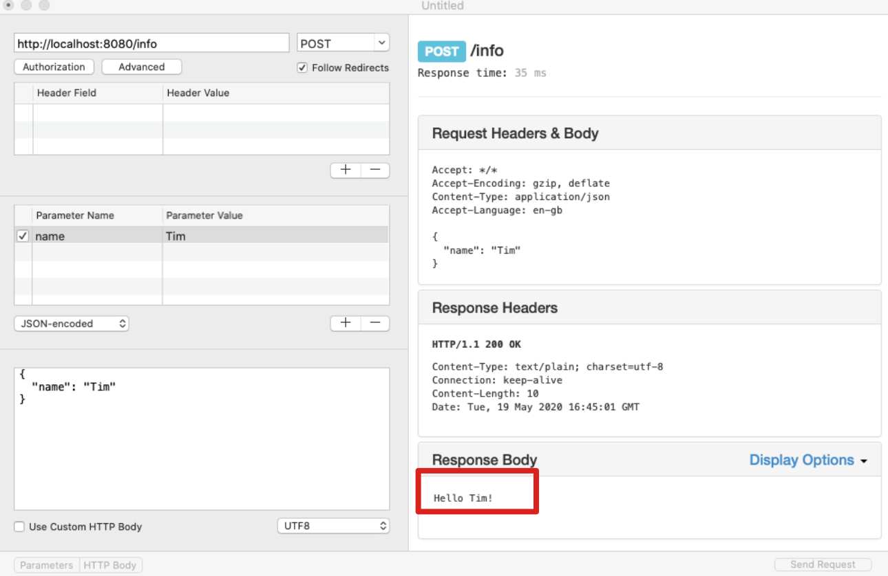
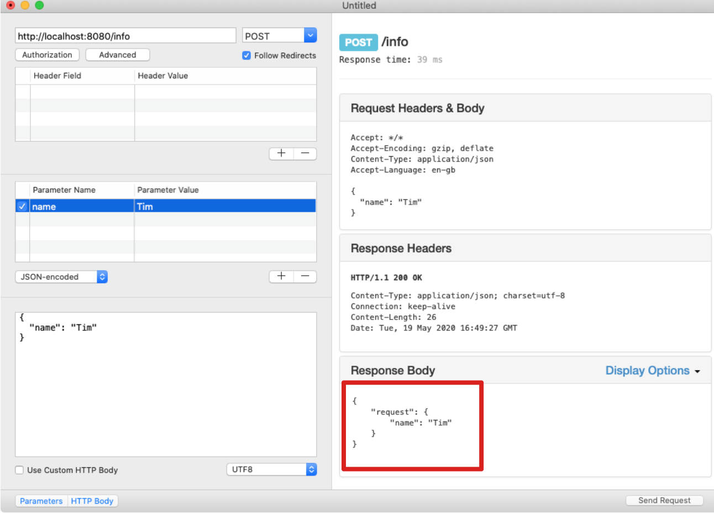

# 基于Vapor 4 搭建服务端模拟接口请求

> 网上有很多基于node搭建的模拟接口请求，身为iOS程序员，这里使用Swift+Vapor搭建一波

> *Note:* Vapor 4 requires Swift 5.2, both in Xcode and from the command line. Xcode 11.4 and 11.5 both provide Swift 5.2.

## 参考文献

[Getting Started with Server-Side Swift with Vapor 4](https://www.raywenderlich.com/11555468-getting-started-with-server-side-swift-with-vapor-4)

[Vapor中文文档](https://cn.docs.vapor.codes/4.0/)

## 安装Vapor

### macOS

```shell
brew install vapor
```

```shell
# To make sure Vapor is correctly installed run
vapor
```

```shell
# success 
> vapor
Usage: vapor <command>

Vapor Toolbox (Server-side Swift web framework)

Commands:
       build Builds an app in the console.
       clean Cleans temporary files.
      heroku Commands for working with Heroku
         new Generates a new app.
         run Runs an app from the console.
  supervisor Commands for working with Supervisord
       xcode Opens an app in Xcode.

Use `vapor <command> [--help,-h]` for more information on a command.
Error: Error: Missing command
>
```

### Linux

#### 安装Swift

查看系统版本

```shell
$ lsb_release -a
LSB Version:	core-9.20170808ubuntu1-noarch:security-9.20170808ubuntu1-noarch
Distributor ID:	Ubuntu
Description:	Ubuntu 18.04.3 LTS
Release:	18.04
Codename:	bionic
```

安装对用版本Swift必要依赖（swift.org上可以查找）

```shell
sudo apt-get install clang
sudo apt-get install libcurl3 libpython2.7
...
```

下载对应版本的Swift

```shell
wget https://swift.org/builds/swift-5.3.3-release/ubuntu1804/swift-5.3.3-RELEASE/swift-5.3.3-RELEASE-ubuntu18.04.tar.gz
```

解压（可自行指定目录）

```shell
tar xzf swift-5.3.3-RELEASE-ubuntu18.04.tar.gz -C ~/swift
```

设置环境变量

```shell
sudo vi ~/.bashrc

export PATH=~/swift/swift-5.3.3-RELEASE-ubuntu18.04.tar.gz/usr/bin:$PATH
```

验证是否安装成功

```shell
swift -version
```

#### 安装Vapor

```shell
# 1
git clone https://github.com/vapor/toolbox.git
# 2
cd toolbox
# 3
git checkout 18.0.0
# 4
swift build -c release --disable-sandbox --enable-test-discovery
# 5
mv .build/release/vapor /usr/local/bin

```

## 搭建App

创建目录

```shell
mkdir ~/vapor
cd ~/vapor
```

新建项目

```shell
$ vapor new HelloVapor
Cloning template...
name: HelloVapor
Would you like to use Fluent? (--fluent)
y/n> n
fluent: No
Would you like to use Leaf? (--leaf)
y/n> n
leaf: No
Generating project files
+ Package.swift
...
```

运行项目

```shell
# 1
cd HelloVapor
# 2
swift run
```

初次会下载安装所有依赖库，完成后项目开始运行

```shell
Resolving https://github.com/vapor/multipart-kit.git at 4.0.0
Cloning https://github.com/apple/swift-nio-extras.git
Resolving https://github.com/apple/swift-nio-extras.git at 1.7.0
[1457/1457] Linking Run
[ NOTICE ] Server starting on http://127.0.0.1:8080
```

浏览器输入*http://localhost:8080/hello*访问



## 在Xcode中运行

打开Package.swift文件

```shell
open Package.swift
```

首次打开Xcode会安装依赖，并在目录下生成隐藏文件夹`.swiftpm`（这个就是Xcode的工程文件，类似iOS项目中的project文件）

## 新建Url路径

编辑`routes.swift`文件

```swift
app.get("hello", "vapor") { req -> String in
  return "Hello Vapor!"
}
```

访问*http://localhost:8080/hello/vapor*



## 获取Url上的参数

```swift
// 1
app.get("hello", ":name") { req -> String in
  //2
  guard let name = req.parameters.get("name") else {
    throw Abort(.internalServerError)
  }
  // 3
  return "Hello, \(name)!"
}
```

访问*http://localhost:8080/hello/Tim*



## 获取Post参数

发送请求（使用软件：*RESTed*）

* *URL*: *http://localhost:8080/info*
* *Method*: *POST*
* header: Content-Type=application/json 
* params：name
* JSON-encoded



在`routes.swift`下面创建请求参数结构体

```swift
struct InfoData: Content {
 let name: String
}
```

获取请求中的参数

```swift
// 1
app.post("info") { req -> String in
  // 2
  let data = try req.content.decode(InfoData.self)
  // 3
  return "Hello \(data.name)!"
}
```



使用curl测试

```shell
$ curl http://localhost:8080/info \
  -H "Content-Type: application/json" \
  -d '{"name":"Tim"}'
Hello Tim!%
```

## 返回JSON

新建响应类型

```swift
struct InfoResponse: Content {
  let request: InfoData
}
```

新建请求路由

```swift
// 1
app.post("info") { req -> InfoResponse in
  let data = try req.content.decode(InfoData.self)
  // 2
  return InfoResponse(request: data)
}
```



## 更新依赖

### 在Xcode中

 *File ▸ Swift Packages ▸ Update to Latest Package Versions*.

### 在Terminal中

```shell
swift package update
```

## Clean and Rebuild

### 在Xcode中

直接clean，build

### 手动删除

删除`.build`

删除`.swiftpm`

删除`.Package.resolved`

删除`DerivedData`

## 遇到的问题

1. Linux上Swift运行报错

```shell
$ swift
error: ld-2.27.so 0x7fffffff0005c564: adding range [0x1464a-0x146ba) which has a base that is less than the function's low PC 0x14dc0. Please file a bug and attach the file at the start of this error message
error: ld-2.27.so 0x7fffffff0005c564: adding range [0x146d0-0x146d6) which has a base that is less than the function's low PC 0x14dc0. Please file a bug and attach the file at the start of this error message
error: ld-2.27.so 0x7fffffff0005c5c5: adding range [0x1464a-0x146ba) which has a base that is less than the function's low PC 0x14dc0. Please file a bug and attach the file at the start of this error message
error: ld-2.27.so 0x7fffffff0005c5c5: adding range [0x146d0-0x146d6) which has a base that is less than the function's low PC 0x14dc0. Please file a bug and attach the file at the start of this error message
Welcome to Swift version 5.3.3 (swift-5.3.3-RELEASE).
Type :help for assistance.
```

解决：https://bugs.swift.org/browse/SR-8690

```shell
sudo apt remove libc6-dbg
```

2. 离开Swift命令行

```shell
# 命令前加:
:quit
```

3. 端口占用

```shell
#查看端口占用情况
lsof -i tcp:8080 
#杀掉进程
kill <pid>
```

4. 查看ubuntu系统版本

```shell
# 查看ubuntu版本
lsb_release -a 
```

5. error: missing LinuxMain.swift file in the Tests directory

When using Swift 5.1 or later, use the `--enable-test-discovery` flag to bypass LinuxMain.swift.

```shell
swift test --enable-test-discovery
swift run --enable-test-discovery
```


