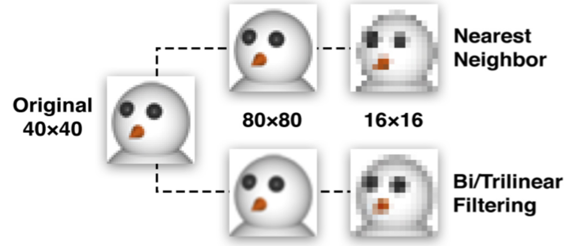

# iOS核心动画

## 一、CALayer

### 1.1、图层的能力

这里有一些 UIView 没有暴露出来的CALayer的功能：

- 阴影，圆角，带颜色的边框 
- 3D变换 
- 非矩形范围 
- 透明遮罩 
- 多级非线性动画

### 1.2、寄宿图

> 这一模块将来探索 CALayer的寄宿图（即图层中包含的图）

1）contents属性

CALayer 有一个属性叫做 contents ，这个属性的类型被定义为id，意味着它可以是任何类型的对象。在这种情况下，可以给 contents 属性赋任何值，app 仍然能够编译通过。但是，在实践中，如果给 contents 赋的不是CGImage， 那么得到的图层将是空白的。

```objective-c
UIView *centerView = [[UIView alloc] initWithFrame:CGRectMake(0, 0, 200, 100)];
centerView.backgroundColor = [UIColor lightGrayColor];
centerView.center = self.view.center;
[self.view addSubview:centerView];

UIImage *image = [UIImage imageNamed:@"1"];
centerView.layer.contents = (__bridge id)(image.CGImage);
```

2）contentGravity属性

类似UIImageView的contentMode

```objective-c
centerView.layer.contentsGravity = kCAGravityResizeAspect;
```

3）contentsScale属性

`contentsScale`属性其实属于支持高分辨率（又称Hi-DPI或Retina）屏幕机制的一部分。它用来判断在绘制图层的时候应该为寄宿图创建的空间大小，和需要显示的图片的拉伸度（假设并没有设置`contentsGravity`属性）。UIView有一个类似功能但是非常少用到的`contentScaleFactor`属性。

如果`contentsScale`设置为1.0，将会以每个点1个像素绘制图片，如果设置为2.0，则会以每个点2个像素绘制图片，这就是我们熟知的Retina屏幕。

当用代码的方式来处理寄宿图的时候，一定要记住要手动的设置图层的`contentsScale`属性，否则，你的图片在Retina设备上就显示得不正确啦。代码如下：

```objective-c
layer.contentsScale = [UIScreen mainScreen].scale;
```

4）contentsRect属性

CALayer的`contentsRect`属性允许我们在图层边框里显示寄宿图的一个子域。

5）contentsCenter属性

`contentsCenter`其实是一个CGRect，它定义了一个固定的边框和一个在图层上可拉伸的区域。 改变`contentsCenter`的值并不会影响到寄宿图的显示，除非这个图层的大小改变了，你才看得到效果。


6）Custom Drawing

给 contents 赋CGImage的值不是唯一的设置寄宿图的方法。也可以直接 用Core Graphics直接绘制寄宿图。

* 能够通过继承UIView并实现 -drawRect: 方法 来自定义绘制。

  * **-drawRect:** 方法没有默认的实现，因为对UIView来说，寄宿图并不是必须 的，它不在意那到底是单调的颜色还是有一个图片的实例。如果UIView检测到 - drawRect: 方法被调用了，它就会为视图分配一个寄宿图，这个寄宿图的像素尺寸等于视图大小乘以 contentsScale 的值。
  * 如果不需要寄宿图，那就不要创建这个方法了，这会造成CPU资源和内存的浪费，这也是为什么苹果建议：**如果没有自定义绘制的任务就不要在子类中写一个空的-drawRect:方法。**
  * 当视图在屏幕上出现的时候 -**drawRect**: 方法就会被自动调用。 - **drawRect**: 方法里面的代码利用**Core Graphics**去绘制一个寄宿图，然后内容就会被缓存起来直到它需要被更新（通常是因为开发者调用了 -setNeedsDisplay 方 法，尽管影响到表现效果的属性值被更改时，一些视图类型会被自动重绘， 如 bounds 属性）。

* 虽然 -drawRect: 方法是一个UIView方法，事实上都是底层 的CALayer安排了重绘工作和保存了因此产生的图片。所以也可以通过使用CALayer来进行自定义寄宿图绘制

  * CALayer有一个可选的 delegate 属性，实现了 CALayerDelegate 协议，当 CALayer需要一个内容特定的信息时，就会从协议中请求。CALayerDelegate是一 个非正式协议，其实就是说没有CALayerDelegate @protocol可以让你在类里面引用啦。你只需要调用你想调用的方法，CALayer会帮你做剩下的。

  * 当需要被重绘时，CALayer会请求它的代理给他一个寄宿图来显示。它通过调用 下面这个方法做到的:

  * ```objective-c
    - (void)displayLayer:(CALayer *)layer;
    // 如果代理不实现 -displayLayer: 方法， CALayer就会转而尝试调用下面这个方法：
    - (void)drawLayer:(CALayer *)layer inContext:(CGContextRef)ctx;
    // force layer to redraw ，类似UIView的setNeedsDisplay
    - (void)display;
    ```

  * 在调用这个方法之前，CALayer创建了一个合适尺寸的空寄宿图（尺寸 由 bounds 和 contentsScale 决定）和一个Core Graphics的绘制上下文环境， 为绘制寄宿图做准备，他作为ctx参数传入。代码如下：

  * ```objective-c
    // 记得需要调用 [layer display] 进行force draw
    - (void)drawLayer:(CALayer *)layer inContext:(CGContextRef)ctx {
        CGContextSetLineWidth(ctx, 10);
        CGContextSetStrokeColorWithColor(ctx, [UIColor redColor].CGColor);
        CGContextStrokeEllipseInRect(ctx, layer.bounds);
    }
    ```

* 当使用寄宿了视图的图层的时候，你也不必实现 -displayLayer: 和 - drawLayer:inContext: 方法来绘制你的寄宿图。通常做法是实现UIView的 - drawRect: 方法，UIView就会帮你做完剩下的工作，包括在需要重绘的时候调 用 -display 方法。

## 二、图层几何学

### 2.1、布局

UIView 有三个比较重要的布局属 性： frame ， bounds 和 center ， CALayer 对应地叫 做 frame ， bounds 和 position 。为了能清楚区分，图层用了“position”，视图用了“center”，但是都代表同样的值。

frame 代表了图层的外部坐标（也就是在父图层上占据的空间）， bounds 是 内部坐标（{0, 0}通常是图层的左上角）， center 和 position 都代表了相对于 父图层 anchorPoint 所在的位置。 anchorPoint 的属性后续介绍到，现在把它想成图层的中心点就好了。


对于视图或者图层来说， frame 并不是一个非常清晰的属性，它其实是一个虚拟属性，是根据 bounds ， position 和 transform 计算而来，所以当其中任何一个值发生改变，frame都会变化。相反，改变frame的值同样会影响到当中的值。

**记住当对图层做变换的时候，比如旋转或者缩放， frame 实际上代表了覆盖在 图层旋转之后的整个轴对齐的矩形区域，也就是说 frame 的宽高可能 和 bounds 的宽高不再一致了**


### 2.2、锚点 anchorPoint

默认来说， anchorPoint 位于图层的中点，所以图层的将会以这个点为中心放置。 anchorPoint 属性并没有被 UIView 接口暴露出来，这也是视图的position 属性被叫做“center”的原因。但是图层的 anchorPoint 可以被移动，比如可以把 它置于图层 frame 的左上角，于是图层的内容将会向右下角的 position 方向移动，而不是居中了。


当改变了 anchorPoint ， position 属性保持固定的值并没 有发生改变，但是 frame 却移动了。

**position是layer中的anchorPoint点在superLayer中的位置坐标，因此可以说, position点是相对suerLayer的，anchorPoint点是相对layer的，两者是相对不同的坐标空间的一个重合点。**

如果单方面修改layer的position位置，会对anchorPoint有什么影响呢？修改anchorPoint又如何影响position呢？
 根据代码测试，两者互不影响，受影响的只会是frame.origin，也就是layer坐标原点相对superLayer会有所改变。换句话说，frame.origin由position和anchorPoint共同决定。

```objective-c
position.x = frame.origin.x + anchorPoint.x * bounds.size.width；  
position.y = frame.origin.y + anchorPoint.y * bounds.size.height；
  
frame.origin.x = position.x - anchorPoint.x * bounds.size.width；  
frame.origin.y = position.y - anchorPoint.y * bounds.size.height；
```

### 2.3、坐标系

CALayer 给不同坐标系之间的图层转换提供了一些工具类方法，这些方法可以把定义在一个图层坐标系下的点或者矩形转换成另一个图层坐标系下 的点或者矩形。

```objective-c
- (CGPoint)convertPoint:(CGPoint)point fromLayer:(CALayer *)layer;
- (CGPoint)convertPoint:(CGPoint)point toLayer:(CALayer *)layer; 
- (CGRect)convertRect:(CGRect)rect fromLayer:(CALayer *)layer; 
- (CGRect)convertRect:(CGRect)rect toLayer:(CALayer *)layer;
```

 **zPosition**

* 3D变换

* **改变图层的显示顺序了**

* ```objective-c
  // zPosition
  UIView *greenView = [[UIView alloc] initWithFrame:CGRectMake(100, 100, 100, 100)];
  greenView.backgroundColor = [UIColor greenColor];
  UITapGestureRecognizer *gTap = [[UITapGestureRecognizer alloc] initWithTarget:self action:@selector(gClick)];
  [greenView addGestureRecognizer:gTap];
  [self.view addSubview:greenView];
  
  UIView *redView = [[UIView alloc] initWithFrame:CGRectMake(150, 150, 100, 100)];
  redView.backgroundColor = [UIColor redColor];
  UITapGestureRecognizer *rTap = [[UITapGestureRecognizer alloc] initWithTarget:self action:@selector(rClick)];
  [redView addGestureRecognizer:rTap];
  [self.view addSubview:redView];
  
  // 切换zPosition
  greenView.layer.zPosition = 1;
  // 改变了图层顺序，但是不改变视图顺序，相交位置点击事件仍然由redView响应
  ```

### 2.4、Hit Testing

CALayer 并不关心任何响应链事件，所以不能直接处理触摸事件或者手势。但是它有一系列的方法处理事件： **-containsPoint:  和 -hitTest:**

1）**-containsPoint**

接受一个在本图层坐标系下的 CGPoint ，如果这个点在图层 frame 范围内就返回 YES 。

这需要把触摸坐标转换成每个图层坐标系下的坐标。

```objective-c
- (void)touchesBegan:(NSSet<UITouch *> *)touches withEvent:(UIEvent *)event {
    CGPoint point = [[touches anyObject] locationInView:self.view];
    BOOL isGreenContain = [self.greenView.layer containsPoint:[self.greenView.layer convertPoint:point fromLayer:self.view.layer]];
    BOOL isRedContain = [self.redView.layer containsPoint:[self.redView.layer convertPoint:point fromLayer:self.view.layer]];
    NSLog(@"isGreenContain:%d,isRedContain:%d",isGreenContain,isRedContain);
}
```

对于重合区域，两个containsPoint都会判断为true

2）**-hitTest**

在父图层进行hitTest，返回合适的叶子节点图层

```objective-c
- (void)touchesBegan:(NSSet<UITouch *> *)touches withEvent:(UIEvent *)event {
    CGPoint point = [[touches anyObject] locationInView:self.view];
    CALayer *layer = [self.view.layer hitTest:point];
    if (layer == self.greenView.layer) {
        NSLog(@"isGreenLayer");
    } else if (layer == self.redView.layer) {
        NSLog(@"isRedLayer");
    } else {
        NSLog(@"isViewLayer");
    }
}
```

**hitTest会返回图层的最上层的最合适的Layer，会考虑zPosition，但是不影响视图View的响应链判断（响应链不考虑zPosition）。例如会返回greenLayer，但是响应的view是redView**

### 2.5、自动布局

 当使用视图的时候，可以充分利用`UIView`类接口暴露出来的`UIViewAutoresizingMask`和`NSLayoutConstraint`API，但如果想随意控制`CALayer`的布局，就需要手工操作。最简单的方法就是使用`CALayerDelegate`如下函数：

```objective-c
- (void)layoutSublayersOfLayer:(CALayer *)layer;
```

当图层的`bounds`发生改变，或者图层的`-setNeedsLayout`方法被调用的时候，这个函数将会被执行。这使得你可以手动地重新摆放或者重新调整子图层的大小，但是不能像`UIView`的`autoresizingMask`和`constraints`属性做到自适应屏幕旋转。

  这也是为什么最好使用视图而不是单独的图层来构建应用程序的另一个重要原因之一。

## 三、视觉效果

### 3.1、拉伸过滤

`CALayer`为此提供了三种拉伸过滤方法，他们是：

- kCAFilterLinear
- kCAFilterNearest
- kCAFilterTrilinear

minification（缩小图片）和magnification（放大图片）默认的过滤器都是`kCAFilterLinear`，这个过滤器采用双线性滤波算法，它在大多数情况下都表现良好。双线性滤波算法通过对多个像素取样最终生成新的值，得到一个平滑的表现不错的拉伸。但是当放大倍数比较大的时候图片就模糊不清了。

`kCAFilterTrilinear`和`kCAFilterLinear`非常相似，大部分情况下二者都看不出来有什么差别。但是，较双线性滤波算法而言，三线性滤波算法存储了多个大小情况下的图片（也叫多重贴图），并三维取样，同时结合大图和小图的存储进而得到最后的结果。



对于大图来说，双线性滤波和三线性滤波表现得更出色

`kCAFilterNearest`是一种比较武断的方法。从名字不难看出，这个算法（也叫最近过滤）就是取样最近的单像素点而不管其他的颜色。这样做非常快，也不会使图片模糊。但是，最明显的效果就是，会使得压缩图片更糟，图片放大之后也显得块状或是马赛克严重。


对于没有斜线的小图来说，最近过滤算法要好很多

### 3.2、组透明

当关闭了组透明后，透明度会混合叠加，当显示一个50%透明度的图层时，图层的每个像素都会一半显示自己的颜色，另一半显示图层下面的颜色。这是正常的透明度的表现。但是如果图层包含一个同样显示50%透明的子图层时，所看到的视图， 50%来自子视图，25%来了图层本身的颜色，另外的25%则来自背景色。


iOS7开始，系统默认开启了组透明，默认不会在有上面的情况；如需全局关闭组透明，在plist中设置`UIViewGroupOpacity`为`NO`。

关闭局部组透明：

```objective-c
v1.layer.allowsGroupOpacity = NO;
```

**可以设置CALayer的一个叫做 shouldRasterize 属性来实现组透明的效果，如果它被设置为YES，在应用透明度之前，图层及 其子图层都会被整合成一个整体的图片，这样就没有透明度混合的问题了**

### 3.3、shouldRasterize 光栅化

> 光栅化就是把layer转化为位图的过程。
>
> 合成，是一个将不同位图放到一起来创建你最终在屏幕上看到图像的过程。
>
> 合成完成后，最终把多张位图合成得到一张位图。

1）开启shouldRasterize意味着什么。

设置一个CALayer的shouldRasterize=YES，相当于提前把一个CALayer光栅化。这个CALayer图层结构就被拍扁了，变成一张位图。

启用shouldRasterize属性会将图层绘制到一个屏幕之外的图像，然后这个图像将会被**缓存**起来。缓存起来是一个重要的特性，它几乎决定了shouldRasterize的所有应用场景。

**如果有很多的子图层或者有复杂的效果应用，开启shouldRasterize就会比重绘所有事务的所有帧划得来得多。但是光栅化原始图像需要时间，而且还会消耗额外的内存。所以需要根据实际情况取舍。**

2）应用场景

* #### 启用shouldRasterize提升复杂层级视图的性能

  * 由于启用shouldRasterize得到的图像会被缓存起来。这大大减少了GPU的负担。试想在一个table view的cell中，有非常复杂的层级结构。滑动tableview的时候，GPU需要进行大量的合成，这有可能会导致性能问题。我们可以尝试将cell的layer的shouldRasterize打开提升性能。

* ####  启用shouldRasterize提升动画性能

  * 对一个层级复杂的视图做动画时，也可以启用shouldRasterize避免GPU每帧都重新合成。

* #### 启用shouldRasterize改善离屏渲染的性能

  * ```objective-c
    - (UITableViewCell *)tableView:(UITableView *)tableView cellForRowAtIndexPath:(NSIndexPath *)indexPath
     {
        //dequeue cell
        UITableViewCell *cell = [self.tableView dequeueReusableCellWithIdentifier:@"Cell" forIndexPath:indexPath];
        ...
        //set text shadow
        cell.textLabel.backgroundColor = [UIColor clearColor];
        cell.textLabel.layer.shadowOffset = CGSizeMake(0, 2);
        cell.textLabel.layer.shadowOpacity = 0.5;
        //rasterize
        cell.layer.shouldRasterize = YES;
        cell.layer.rasterizationScale = [UIScreen mainScreen].scale;
        return cell;
    }
    ```

3）注意事项

在一个经常会变化的layer中开启shouldRasterize是没有多大意义的，因为缓存的总是会被重新创建，而光栅化还要消耗性能，没准适得其反。

## 四、变换

> 将要研究可以用来对图层旋转，摆放或者扭曲的CGAffineTransform ，以及可以将扁平物体转换成三维空间对象 的 CATransform3D。

### 4.1、仿射变换

Core Graphics提供了一系 列函数，对完全没有数学基础的开发者也能够简单地做一些变换。如下几个函数都创建了一个 CGAffineTransform 实例：

```objective-c
CGAffineTransformMakeRotation(CGFloat angle) 
CGAffineTransformMakeScale(CGFloat sx, CGFloat sy) 
CGAffineTransformMakeTranslation(CGFloat tx, CGFloat ty)
```

UIView 可以通过设置 transform 属性做变换，但实际上它只是封装了内部图层 的变换。 CALayer 同样也有一个 transform 属性，但它的类型是 CATransform3D ，而不是 CGAffineTransform ， CALayer 对应 于 UIView 的 transform 属性叫做 affineTransform 

```objective-c
CGAffineTransform transform = CGAffineTransformMakeRotation(M_PI_4); 
self.layerView.layer.affineTransform = transform;

/*
注意我们使用的旋转常量是 M_PI_4 ，而不是你想象的45，因为iOS的变换函数使 用弧度而不是角度作为单位。弧度用数学常量pi的倍数表示，一个pi代表180度，所 以四分之一的pi就是45度。
C的数学函数库（iOS会自动引入）提供了pi的一些简便的换算， M_PI_4 于是就 是pi的四分之一，如果对换算不太清楚的话，可以用如下的宏做换算：
*/
#define RADIANS_TO_DEGREES(x) ((x)/M_PI*180.0)
```

### 4.2、混合变换

> Core Graphics提供了一系列的函数可以在一个变换的基础上做更深层次的变换，
>
> 如果做一个既要缩放又要旋转的变换，这就会非常有用了。

```objective-c
CGAffineTransformRotate(CGAffineTransform t, CGFloat angle) 
CGAffineTransformScale(CGAffineTransform t, CGFloat sx, CGFloat sy) 
CGAffineTransformTranslate(CGAffineTransform t, CGFloat tx, CGFloat ty)
```

当操纵一个变换的时候，初始生成一个什么都不做的变换很重要--也就是创建一 个 CGAffineTransform 类型的空值，矩阵论中称作单位矩阵，Core Graphics同样也提供了一个方便的常量：**CGAffineTransformIdentity**

最后，如果需要混合两个已经存在的变换矩阵，就可以使用如下方法，在两个变换的基础上创建一个新的变换：

```objective-c
CGAffineTransformConcat(CGAffineTransform t1, CGAffineTransform t2);
```

```objective-c
CGAffineTransform transform = CGAffineTransformIdentity;
transform = CGAffineTransformScale(transform, 0.5, 0.5);
transform = CGAffineTransformRotate(transform, M_PI / 180.0 * 30.0);
transform = CGAffineTransformTranslate(transform, 200, 0);
self.greenView.transform = transform;
```

### 4.3、3D变换

和 CGAffineTransform 类似， CATransform3D 也是一个矩阵，但是和2x3的矩 阵不同， CATransform3D 是一个可以在3维空间内做变换的4x4的矩阵。


和 CGAffineTransform 矩阵类似，Core Animation提供了一系列的方法用来创建和组合 CATransform3D 类型的矩阵，和Core Graphics的函数类似，但是3D的平移和旋转多处了一个 z 参数，并且旋转函数除了 angle 之外多出 了 x , y , z 三个参数，分别决定了每个坐标轴方向上的旋转：

```objective-c
CATransform3DMakeRotation(CGFloat angle, CGFloat x, CGFloat y, CGFloat z) 
CATransform3DMakeScale(CGFloat sx, CGFloat sy, CGFloat sz) 
CATransform3DMakeTranslation(Gloat tx, CGFloat ty, CGFloat tz)
```

Z轴和这两个轴分别垂直，指向视角外为正方向。


### 4.4、透视投影

CATransform3D 的透视效果通过一个矩阵中一个很简单的元素来控 制： **m34** 。 **m34**用于按比例缩放X和Y的值来计算到底要离视角多远。


m34 的默认值是0，可以通过设置 m34 为-1.0 / d 来应用透视效果， d 代表了想象中视角相机和屏幕之间的距离，以像素为单位，那应该如何计算这个距离呢？实际上并不需要，大概估算一个就好了**【通常500-1000就已经很好了】**

```objective-c
CATransform3D transform = CATransform3DIdentity;
transform.m34 = -1.0/500;
transform = CATransform3DRotate(transform, M_PI_4, 0, 1, 0);
self.greenView.layer.transform = transform;
```

### 4.5、案例：固体对象

> 用六个独立的视图来构建一个立方体的各个面。

```objective-c
- (void)viewDidLoad {
    [super viewDidLoad];
    
    self.faces = @[_view0,_view1,_view2,_view3,_view4,_view5];
    
    //父View的layer图层
    CATransform3D perspective = CATransform3DIdentity;
    perspective.m34 = -1.0 / 500.0;
    perspective = CATransform3DRotate(perspective, -M_PI_4, 1, 0, 0);
    perspective = CATransform3DRotate(perspective, -M_PI_4, 0, 1, 0);
    self.containerView.layer.sublayerTransform = perspective;
    
    CATransform3D transform = CATransform3DMakeTranslation(0, 0, 100);
    [self addFace:0 withTransform:transform];
    
    //add cube face 2
    transform = CATransform3DMakeTranslation(100, 0, 0);
    transform = CATransform3DRotate(transform, M_PI_2, 0, 1, 0);
    [self addFace:1 withTransform:transform];

    //add cube face 3
    transform = CATransform3DMakeTranslation(0, -100, 0);
    transform = CATransform3DRotate(transform, M_PI_2, 1, 0, 0);
    [self addFace:2 withTransform:transform];

    //add cube face 4
    transform = CATransform3DMakeTranslation(0, 100, 0);
    transform = CATransform3DRotate(transform, -M_PI_2, 1, 0, 0);
    [self addFace:3 withTransform:transform];
    
    //add cube face 5
    transform = CATransform3DMakeTranslation(-100, 0, 0);
    transform = CATransform3DRotate(transform, -M_PI_2, 0, 1, 0);
    [self addFace:4 withTransform:transform];
    
    //add cube face 6
    transform = CATransform3DMakeTranslation(0, 0, -100);
    transform = CATransform3DRotate(transform, M_PI, 0, 1, 0);
    [self addFace:5 withTransform:transform];
    
}
- (void)addFace:(NSInteger)index withTransform:(CATransform3D)transform{
    //获取face视图并将其添加到容器中
    UIView *face = self.faces[index];
    [self.containerView addSubview:face];
    
    //将face视图放在容器的中心
    CGSize containerSize = self.containerView.bounds.size;
    face.center = CGPointMake(containerSize.width / 2.0, containerSize.height / 2.0);
    
    //添加transform
    face.layer.transform = transform;
}
```

## 五、专用图层

### 5.1、CAShapeLayer

CAShapeLayer 是一个通过矢量图形而不是bitmap来绘制的图层子类。你指定诸如颜色和线宽等属性，用 CGPath 来定义想要绘制的图形，最 后CAShapeLayer 就自动渲染出来了。当然也可以用Core Graphics直接向原 始的 CALyer 的内容中绘制一个路径，相比直下，使用 CAShapeLayer 有以下一些优点：

* **渲染快速。** CAShapeLayer 使用了硬件加速，绘制同一图形会比用Core Graphics快很多。
* **高效使用内存。**一个 CAShapeLayer 不需要像普通 CALayer 一样创建一个寄宿图形，所以无论有多大，都不会占用太多的内存。 
* **不会被图层边界剪裁掉。**一个 CAShapeLayer 可以在边界之外绘制。你的图层路径不会像在使用Core Graphics的普通 CALayer 一样被剪裁掉。 
* **不会出现像素化。**当你给 CAShapeLayer 做3D变换时，它不像一个有寄宿图 的普通图层一样变得像素化。

**创建一个CGPath**

CAShapeLayer 可以用来绘制所有能够通过 CGPath 来表示的形状。这个形状不一定要闭合，图层路径也不一定要不可破，事实上你可以在一个图层上绘制好几个 不同的形状。你可以控制一些属性比如 lineWith（线宽，用点表示单 位），lineCap （线条结尾的样子），和 lineJoin （线条之间的结合点的样 子）；但是在图层层面你只有一次机会设置这些属性。如果你想用不同颜色或风格来绘制多个形状，就不得不为每个形状准备一个图层了。

**用例1：用CAShapeLayer绘制一个火柴人**

```objective-c
// CAShapeLayer
- (void)drawMatchstickMan {
    self.containerView.backgroundColor = [UIColor whiteColor];
    [self.view addSubview:self.containerView];
    
    UIBezierPath *path = [UIBezierPath bezierPath];
    [path moveToPoint:CGPointMake(175, 100)];
    [path addArcWithCenter:CGPointMake(150, 100) radius:25 startAngle:0 endAngle:2*M_PI clockwise:YES];
    [path moveToPoint:CGPointMake(150, 125)];
    [path addLineToPoint:CGPointMake(150, 175)];
    [path addLineToPoint:CGPointMake(125, 225)];
    [path moveToPoint:CGPointMake(150, 175)];
    [path addLineToPoint:CGPointMake(175, 225)];
    [path moveToPoint:CGPointMake(100, 150)];
    [path addLineToPoint:CGPointMake(200, 150)];
    
    CAShapeLayer *layer = [CAShapeLayer layer];
    layer.strokeColor = [UIColor redColor].CGColor;
    layer.fillColor = [UIColor clearColor].CGColor;
    layer.lineWidth = 5;
    layer.lineJoin = kCALineJoinRound;
    layer.lineCap = kCALineCapRound;
    layer.path = path.CGPath;
    [self.containerView.layer addSublayer:layer];
}
```

**用例2： 用UIBezierPath绘制圆角**+**边框**

```objective-c
// 绘制圆角+边框
- (void)drawCornerRect {
    [self.view addSubview:self.containerView];
    self.containerView.backgroundColor = [UIColor lightGrayColor];
    // 圆角
    UIBezierPath *path = [UIBezierPath bezierPathWithRoundedRect:self.containerView.bounds byRoundingCorners:UIRectCornerTopLeft | UIRectCornerBottomRight cornerRadii:CGSizeMake(20, 10)];
    CAShapeLayer *cornerLayer = [CAShapeLayer layer];
    cornerLayer.path = path.CGPath;
    self.containerView.layer.mask = cornerLayer;
    // 边框
    CAShapeLayer *borderLayer = [CAShapeLayer layer];
    borderLayer.path = path.CGPath;
    borderLayer.lineWidth = 10;
    borderLayer.strokeColor = [UIColor blueColor].CGColor;
    borderLayer.fillColor = [UIColor clearColor].CGColor;
    borderLayer.lineDashPattern = @[@10,@2];
    [self.containerView.layer addSublayer:borderLayer];
}
```

### 5.2、 CATextLayer

> Core Animation提供了一个 CALayer 的子类 CATextLayer ，它以图层的形式包含了 UILabel 几乎所有的绘制特性，并且额外提供了一些新的特性。

CATextLayer 也要比 UILabel 渲染得快得多。很少有人知道在iOS 6及之前的版本， UILabel 其实是通过WebKit来实现绘制的，这样就造成了当有很多文字的时候就会有极大的性能压力。而 CATextLayer 使用了Core text，并且渲染得 非常快。

**用例1：用CATextLayer来实现一个UILabel**

```objective-c
// CATextLayer
// 注意CATextLayer是通过fontSize设置字体大小的，CFTypeRef会忽略UIFont中的size大小
- (void)textLayerTesting {
    [self.view addSubview:self.containerView];
    self.containerView.frame = CGRectMake(20, 150, 300, 500);
    
    CATextLayer *textLayer = [CATextLayer layer];
    textLayer.frame = self.containerView.bounds;
    [self.containerView.layer addSublayer:textLayer];
    textLayer.foregroundColor = [UIColor redColor].CGColor;
    textLayer.alignmentMode = kCAAlignmentJustified;
    [textLayer setWrapped:YES];
    textLayer.font = (__bridge CFTypeRef)([UIFont systemFontOfSize:0]);
    textLayer.fontSize = 10;
    textLayer.string = @"快速的业务发展也对技术支撑提出了更高的要求，为了保障敏捷的业务开发，提升跨团队的协同合作效率，提高本地研发和 CI/CD 效率，抖音 iOS App 工程架构在不同的阶段进行了不同的技术方案的改进，满足合理的架构演化，同时又不影响正常的业务迭代速度。";
}
```

### 5.3、CATransformLayer

> 当在构造复杂的3D事物的时候，如果能够组织独立元素就太方便了。CATransformLayer 解决了这个问题， CATransformLayer不同于普通 的 CALayer ，因为它不能显示它自己的内容。只有当存在了一个能作用域子图层 的变换它才真正存在。 CATransformLayer 并不平面化它的子图层，所以它能够用于构造一个层级的3D结构。

**用例1：用CATransformLayer装配一个3D图层体系**

```objective-c
// CATransformLayer
- (void)transformLayerTesting {
    self.view.backgroundColor = [UIColor blackColor];
    [self.view addSubview:self.containerView];
    self.containerView.frame = CGRectMake(0, 200, self.view.frame.size.width, 500);
    
    CATransform3D pt = CATransform3DIdentity;
    pt.m34 = -1.0/500;
    self.containerView.layer.sublayerTransform = pt;
    
    CATransform3D t1 = CATransform3DIdentity;
    t1 = CATransform3DTranslate(t1, -100, 0, 0);
    CALayer *cube1 = [self cubeWithTransform:t1];
    [self.containerView.layer addSublayer:cube1];
    
    CATransform3D t2 = CATransform3DIdentity;
    t2 = CATransform3DTranslate(t2, 100, 0, 0);
    t2 = CATransform3DRotate(t2, -M_PI_4, 1, 0, 0);
    t2 = CATransform3DRotate(t2, -M_PI_4, 0, 1, 0);
    CALayer *cube2 = [self cubeWithTransform:t2];
    [self.containerView.layer addSublayer:cube2];
}

- (CALayer *)cubeWithTransform:(CATransform3D)transform {
    //create cube layer
    CATransformLayer *cube = [CATransformLayer layer];
    
    //add cube face 1
    CATransform3D ct = CATransform3DMakeTranslation(0, 0, 50);
    [cube addSublayer:[self faceWithTransform:ct]];
    
    //add cube face 2
    ct = CATransform3DMakeTranslation(50, 0, 0);
    ct = CATransform3DRotate(ct, M_PI_2, 0, 1, 0);
    [cube addSublayer:[self faceWithTransform:ct]];
    
    //add cube face 3
    ct = CATransform3DMakeTranslation(0, -50, 0);
    ct = CATransform3DRotate(ct, M_PI_2, 1, 0, 0);
    [cube addSublayer:[self faceWithTransform:ct]];
    
    //add cube face 4
    ct = CATransform3DMakeTranslation(0, 50, 0);
    ct = CATransform3DRotate(ct, -M_PI_2, 1, 0, 0);
    [cube addSublayer:[self faceWithTransform:ct]];
    
    //add cube face 5
    ct = CATransform3DMakeTranslation(-50, 0, 0);
    ct = CATransform3DRotate(ct, -M_PI_2, 0, 1, 0);
    [cube addSublayer:[self faceWithTransform:ct]];
    
    //add cube face 6
    ct = CATransform3DMakeTranslation(0, 0, -50);
    ct = CATransform3DRotate(ct, M_PI, 0, 1, 0);
    [cube addSublayer:[self faceWithTransform:ct]];
    
    //center the cube layer within the container(将立方体层至于容器中心)
    CGSize containerSize = self.containerView.bounds.size;
    cube.position = CGPointMake(containerSize.width / 2.0, containerSize.height / 2.0);
    
    //apply the transform and return
    cube.transform = transform;
    
    return cube;
}

- (CALayer *)faceWithTransform:(CATransform3D)transform {
    //create cube face layer
    CALayer *face = [CALayer layer];
    face.frame = CGRectMake(-50, -50, 100, 100);
    
    //apply a random color
    CGFloat red = (rand() / (double)INT_MAX);
    CGFloat green = (rand() / (double)INT_MAX);
    CGFloat blue = (rand() / (double)INT_MAX);
    face.backgroundColor = [UIColor colorWithRed:red green:green blue:blue alpha:1.0].CGColor;
    face.transform = transform;
    return face;
}
```

### 5.4、CAGradientLayer

> CAGradientLayer 是用来生成两种或更多颜色平滑渐变的。用Core Graphics复制一个 CAGradientLayer 并将内容绘制到一个普通图层的寄宿图也是有可能的， 但是 CAGradientLayer 的真正好处在于绘制使用了硬件加速

1）**基础渐变**

CAGradientLayer 也有 startPoint 和 endPoint 属性，他们决定了渐变的方向。这两个参数是以单位坐标系进行的定义，所以左上角坐标是{0, 0}，右下角坐标 是{1, 1}

**用例1：简单的两种颜色的对角线渐变**

```objective-c
// gradient
- (void)gradientLayerTesting {
    [self.view addSubview:self.containerView];
    self.containerView.frame = CGRectMake(0, 200, self.view.frame.size.width, 200);
    
    CAGradientLayer *layer = [CAGradientLayer layer];
    layer.frame = self.containerView.bounds;
    [self.containerView.layer addSublayer:layer];
    
    layer.startPoint = CGPointMake(0, 0);
    layer.endPoint = CGPointMake(1, 1);
    layer.colors = @[(__bridge id)[UIColor redColor].CGColor,(__bridge id)[UIColor blueColor].CGColor];
}
```

2）**多重渐变**

> 如果愿意， colors 属性可以包含很多颜色，所以创建一个彩虹一样的多重渐变也是很简单的。默认情况下，这些颜色在空间上均匀地被渲染，但是我们可以用 locations 属性来调整空间。 locations 属性是一个浮点数值的数组 （以 NSNumber 包装）。这些浮点数定义了 colors 属性中每个不同颜色的位 置，同样的，也是以单位坐标系进行标定。0.0代表着渐变的开始，1.0代表着结 束。

locations 数组并不是强制要求的，但是如果你给它赋值了就一定要确保 locations 的数组大小和 colors 数组大小一定要相同，否则你将会得到一个空白的渐变。

**用例2：现在变成了从红到黄最 后到绿色的渐变。 locations 数组指定了0.0，0.25和0.5三个数值，这样这三个渐变就有点像挤在了左上角。**

```objective-c
// gradient2
- (void)gradientLayerTesting2 {
    [self.view addSubview:self.containerView];
    self.containerView.frame = CGRectMake(0, 200, self.view.frame.size.width, 200);
    
    CAGradientLayer *layer = [CAGradientLayer layer];
    layer.frame = self.containerView.bounds;
    [self.containerView.layer addSublayer:layer];
    
    layer.startPoint = CGPointMake(0, 0);
    layer.endPoint = CGPointMake(1, 1);
    layer.locations = @[@0,@0.25,@0.5,@0.75];
    layer.colors = @[(__bridge id)[UIColor redColor].CGColor,(__bridge id)[UIColor yellowColor].CGColor,(__bridge id)[UIColor blueColor].CGColor,(__bridge id)[UIColor greenColor].CGColor];
}
```

### 5.5、CAReplicatorLayer

> CAReplicatorLayer 的目的是为了高效生成许多相似的图层。它会绘制一个或多个图层的子图层，并在每个复制体上应用不同的变换。

1）**重复图层【Repeating layers】**

在屏幕的中间创建了一个小白色方块图层，然后用 CAReplicatorLayer 生成十个图层组成一个圆圈。 instanceCount 属性指定 了图层需要重复多少次。 instanceTransform 指定了一个 CATransform3D 3D 变换（这种情况下，下一图层的位移和旋转将会移动到圆圈的下一个点）。

**用例1：用CAReplicatorLayer重复图层**

```objc
// repeat
- (void)replicatorLayerTesting {
    [self.view addSubview:self.containerView];
    self.containerView.frame = CGRectMake(0, 200, self.view.frame.size.width, 200);
    
    CAReplicatorLayer *replicatorLayer = [CAReplicatorLayer layer];
    replicatorLayer.frame = self.containerView.bounds;
    [self.containerView.layer addSublayer:replicatorLayer];
    
    replicatorLayer.instanceCount = 10;
    
    CATransform3D t = CATransform3DIdentity;
    t = CATransform3DTranslate(t, 0, 10, 0);
    t = CATransform3DRotate(t, M_PI/5, 0, 0, 1);
//    t = CATransform3DTranslate(t, 0, -1, 0);
    replicatorLayer.instanceTransform = t;
    
    replicatorLayer.instanceBlueOffset = -0.1;
    replicatorLayer.instanceGreenOffset = -0.1;
    
    CALayer *layer = [CALayer layer];
    layer.frame = CGRectMake(0, 0, 50, 50);
    layer.backgroundColor = [UIColor whiteColor].CGColor;
    [replicatorLayer addSublayer:layer];
}
```

2）**反射**

> 使用 CAReplicatorLayer 并应用一个负比例变换于一个复制图层，就可以创建指定视图（或整个视图层次）内容的镜像图片
>
> 变换是以CAReplicatorLayer 为基准

```objective-c
// reflict
- (void)reflictTesting {
    [self.view addSubview:self.containerView];
    self.containerView.frame = CGRectMake(0, 200, self.view.frame.size.width, 200);
    
    CAReplicatorLayer *replicatorLayer = [CAReplicatorLayer layer];
    replicatorLayer.frame = self.containerView.bounds;
    [self.containerView.layer addSublayer:replicatorLayer];
    
    replicatorLayer.instanceCount = 2;
    
    CATransform3D t = CATransform3DIdentity;
    t = CATransform3DRotate(t, M_PI, 0, 1, 0);
    replicatorLayer.instanceTransform = t;
    
    replicatorLayer.instanceAlphaOffset = -0.7;
    
    CALayer *layer = [CALayer layer];
    layer.frame = CGRectMake(0, 0, self.view.frame.size.width/2.0, 200);
    layer.contents = (__bridge id)[UIImage imageNamed:@"wal"].CGImage;
    [replicatorLayer addSublayer:layer];
}
```

### 5.6、CAScrollLayer

类似`UIScrollView`，并不处理事件，所以需要视图响应事件在设置`CAScrollLayer`，核心方法属性：

```objective-c
- (void)scrollPoint:(CGPoint)p;
- (void)scrollRectToVisible:(CGRect)r;
@property(readonly) CGRect visibleRect;
```

**案例：用`CAScrollLayer`实现滑动视图**

```objective-c
#import "ScrollView.h"
#import  @implementation ScrollView
+ (Class)layerClass
{
    return [CAScrollLayer class];
}

- (void)setUp
{
    //enable clipping
    self.layer.masksToBounds = YES;

    //attach pan gesture recognizer
    UIPanGestureRecognizer *recognizer = nil;
    recognizer = [[UIPanGestureRecognizer alloc] initWithTarget:self action:@selector(pan:)];
    [self addGestureRecognizer:recognizer];
}

- (id)initWithFrame:(CGRect)frame
{
    //this is called when view is created in code
    if ((self = [super initWithFrame:frame])) {
        [self setUp];
    }
    return self;
}

- (void)awakeFromNib {
    //this is called when view is created from a nib
    [self setUp];
}

- (void)pan:(UIPanGestureRecognizer *)recognizer
{
    //get the offset by subtracting the pan gesture
    //translation from the current bounds origin
    CGPoint offset = self.bounds.origin;
    offset.x -= [recognizer translationInView:self].x;
    offset.y -= [recognizer translationInView:self].y;

    //scroll the layer
    [(CAScrollLayer *)self.layer scrollToPoint:offset];

    //reset the pan gesture translation
    [recognizer setTranslation:CGPointZero inView:self];
}
@end
```

### 5.7、CATiledLayer

`CATiledLayer`为载入大图造成的性能问题提供了一个解决方案：将大图分解成小片然后将他们单独按需载入。

`CATiledLayer`很好地和`UIScrollView`集成在一起。除了设置图层和滑动视图边界以适配整个图片大小，我们真正要做的就是实现`-drawLayer:inContext:`方法，当需要载入新的小图时，`CATiledLayer`就会调用到这个方法。

**案例：加载分解后的多个小图，一个简单的滚动`CATiledLayer`实现 **

```objective-c
#import "ViewController.h"
#import 

@interface ViewController ()

@property (nonatomic, weak) IBOutlet UIScrollView *scrollView;

@end

@implementation ViewController

- (void)viewDidLoad
{
    [super viewDidLoad];
    //add the tiled layer
    CATiledLayer *tileLayer = [CATiledLayer layer];
    tileLayer.frame = CGRectMake(0, 0, 2048, 2048);
    tileLayer.delegate = self; [self.scrollView.layer addSublayer:tileLayer];

    //configure the scroll view
    self.scrollView.contentSize = tileLayer.frame.size;

    //draw layer
    [tileLayer setNeedsDisplay];
}

- (void)drawLayer:(CATiledLayer *)layer inContext:(CGContextRef)ctx
{
    //determine tile coordinate
    CGRect bounds = CGContextGetClipBoundingBox(ctx);
    NSInteger x = floor(bounds.origin.x / layer.tileSize.width);
    NSInteger y = floor(bounds.origin.y / layer.tileSize.height);

    //load tile image
    NSString *imageName = [NSString stringWithFormat: @"Snowman_%02i_%02i", x, y];
    NSString *imagePath = [[NSBundle mainBundle] pathForResource:imageName ofType:@"jpg"];
    UIImage *tileImage = [UIImage imageWithContentsOfFile:imagePath];

    //draw tile
    UIGraphicsPushContext(ctx);
    [tileImage drawInRect:bounds];
    UIGraphicsPopContext();
}
@end
```

当你滑动这个图片，你会发现当`CATiledLayer`载入小图的时候，他们会淡入到界面中。这是`CATiledLayer`的默认行为。（你可能已经在iOS 6之前的苹果地图程序中见过这个效果）你可以用`fadeDuration`属性改变淡入时长或直接禁用掉。`CATiledLayer`（不同于大部分的`UIKit`和Core Animation方法）支持多线程绘制，`-drawLayer:inContext:`方法可以在多个线程中同时地并发调用，所以请小心谨慎地确保你在这个方法中实现的绘制代码是线程安全的。

**注意：**tileLayer.contentsScale = [UIScreen mainScreen].scale;

`tileSize`是以像素为单位，而不是点

### 5.8、CAEmitterLayer

> **在iOS 5中，苹果引入了一个新的 CALayer子类叫 做 CAEmitterLayer 。 CAEmitterLayer 是一个高性能的粒子引擎，被用来创建 实时例子动画如：烟雾，火，雨等等这些效果。**

**清单6.13 用`CAEmitterLayer`创建爆炸效果**

```objective-c
#import "ViewController.h"
#import 

@interface ViewController ()

@property (nonatomic, weak) IBOutlet UIView *containerView;

@end


@implementation ViewController

- (void)viewDidLoad
{
    [super viewDidLoad];
    
    //create particle emitter layer
    CAEmitterLayer *emitter = [CAEmitterLayer layer];
    emitter.frame = self.containerView.bounds;
    [self.containerView.layer addSublayer:emitter];

    //configure emitter
    emitter.renderMode = kCAEmitterLayerAdditive;
    emitter.emitterPosition = CGPointMake(emitter.frame.size.width / 2.0, emitter.frame.size.height / 2.0);

    //create a particle template
    CAEmitterCell *cell = [[CAEmitterCell alloc] init];
    cell.contents = (__bridge id)[UIImage imageNamed:@"Spark.png"].CGImage;
    cell.birthRate = 150;
    cell.lifetime = 5.0;
    cell.color = [UIColor colorWithRed:1 green:0.5 blue:0.1 alpha:1.0].CGColor;
    cell.alphaSpeed = -0.4;
    cell.velocity = 50;
    cell.velocityRange = 50;
    cell.emissionRange = M_PI * 2.0;

    //add particle template to emitter
    emitter.emitterCells = @[cell];
}
@end
```

`CAEMitterCell`的属性基本上可以分为三种：

- 这种粒子的某一属性的初始值。比如，`color`属性指定了一个可以混合图片内容颜色的混合色。在示例中，我们将它设置为桔色。
- 例子某一属性的变化范围。比如`emissionRange`属性的值是2π，这意味着例子可以从360度任意位置反射出来。如果指定一个小一些的值，就可以创造出一个圆锥形
- 指定值在时间线上的变化。比如，在示例中，我们将`alphaSpeed`设置为-0.4，就是说例子的透明度每过一秒就是减少0.4，这样就有发射出去之后逐渐小时的效果。

`CAEmitterLayer`的属性它自己控制着整个例子系统的位置和形状。一些属性比如`birthRate`，`lifetime`和`celocity`，这些属性在`CAEmitterCell`中也有。这些属性会以相乘的方式作用在一起，这样你就可以用一个值来加速或者扩大整个例子系统。其他值得提到的属性有以下这些：

- `preservesDepth`，是否将3D例子系统平面化到一个图层（默认值）或者可以在3D空间中混合其他的图层
- `renderMode`，控制着在视觉上粒子图片是如何混合的。

### 5.9、CAEAGLLayer

### 5.10、AVPlayerLayer

`AVPlayerLayer`是有别的框架（AVFoundation）提供的，它和Core Animation紧密地结合在一起，提供了一个`CALayer`子类来显示自定义的内容类型。

`AVPlayerLayer`是用来在iOS上播放视频的。他是高级接口例如`MPMoivePlayer`的底层实现，提供了显示视频的底层控制。`AVPlayerLayer`的使用相当简单：你可以用`+playerLayerWithPlayer:`方法创建一个已经绑定了视频播放器的图层，或者你可以先创建一个图层，然后用`player`属性绑定一个`AVPlayer`实例。

`AVPlayerLayer`是`CALayer`的子类，它继承了父类的所有特性。我们并不会受限于要在一个矩形中播放视频；清单6.16演示了在3D，圆角，有色边框，蒙板，阴影等效果

```objective-c
// avplayerLayer
- (void)avplayerLayerTesting {
    [self.view addSubview:self.containerView];
    self.containerView.frame = CGRectMake(0, 200, self.view.frame.size.width, 200);
    NSURL *url = [[NSBundle mainBundle] URLForResource:@"test" withExtension:@"mp4"];
    AVPlayer *player = [AVPlayer playerWithURL:url];
    AVPlayerLayer *playerLayer = [AVPlayerLayer playerLayerWithPlayer:player];
    playerLayer.frame = self.containerView.bounds;
    CATransform3D t = CATransform3DIdentity;
    t = CATransform3DMakeRotation(M_PI_4, 1, 1, 1);
    t.m34 = -1.0/500;
    playerLayer.transform = t;
    [self.containerView.layer addSublayer:playerLayer];
    [player play];
}
```

## 六、隐式动画

### 6.1、事务

> 在做动画时，会发现动画会被平滑的完成，而不是跳变，其实这就是隐式动画。是因为并没有指定任何动画的类型。我们仅仅改变了一个属性，然后Core Animation来决定如何并且何时去做动画。

```objective-c
- (void)touchesBegan:(NSSet<UITouch *> *)touches withEvent:(UIEvent *)event {
    [CATransaction begin];
    [CATransaction setAnimationDuration:1];
    CGFloat red = arc4random() / (CGFloat)INT_MAX;
    CGFloat green = arc4random() / (CGFloat)INT_MAX;
    CGFloat blue = arc4random() / (CGFloat)INT_MAX;
    self.testLayer.backgroundColor = [UIColor colorWithRed:red green:green blue:blue alpha:1.0].CGColor;
    [CATransaction commit];
}

- (void)transactionTesting {
    [self.view addSubview:self.containerView];
    self.containerView.frame = CGRectMake(0, 200, self.view.frame.size.width, 200);
    
    self.testLayer = [CALayer layer];
    self.testLayer.frame = self.containerView.bounds;
    [self.containerView.layer addSublayer:self.testLayer];
    self.testLayer.backgroundColor = [UIColor redColor].CGColor;
}
```

`UIView`有两个方法，`+beginAnimations:context:`和`+commitAnimations`，和`CATransaction`的`+begin`和`+commit`方法类似。实际上在`+beginAnimations:context:`和`+commitAnimations`之间所有视图或者图层属性的改变而做的动画都是由于设置了`CATransaction`的原因。

```objective-c
[CATransaction setCompletionBlock:^{
        NSLog(@"事务完成");
    }];
```

本地事务未完成下次事务又来的时候，本地事务会立即结束。

图层默认会有隐式动画，0.25s

### 6.2、图层行为

> 对于直接添加到UIView上的layer，会发现隐式动画立即完成。

Core Animation通常对`CALayer`的所有属性（可动画的属性）做动画，但是`UIView`把它关联的图层的这个特性关闭了。

我们把改变属性时`CALayer`自动应用的动画称作*行为*，当`CALayer`的属性被修改时候，它会调用`-actionForKey:`方法，传递属性的名称。剩下的操作都在`CALayer`的头文件中有详细的说明，实质上是如下几步：

- 图层首先检测它是否有委托，并且是否实现`CALayerDelegate`协议指定的`-actionForLayer:forKey`方法。如果有，直接调用并返回结果。
- 如果没有委托，或者委托没有实现`-actionForLayer:forKey`方法，图层接着检查包含属性名称对应行为映射的`actions`字典。
- 如果`actions字典`没有包含对应的属性，那么图层接着在它的`style`字典接着搜索属性名。
- 最后，如果在`style`里面也找不到对应的行为，那么图层将会直接调用定义了每个属性的标准行为的`-defaultActionForKey:`方法。

所以一轮完整的搜索结束之后，`-actionForKey:`要么返回空（这种情况下将不会有动画发生），要么是`CAAction`协议对应的对象，最后`CALayer`拿这个结果去对先前和当前的值做动画。

于是这就解释了UIKit是如何禁用隐式动画的：每个`UIView`对它关联的图层都扮演了一个委托，并且提供了`-actionForLayer:forKey`的实现方法。当不在一个动画块的实现中，`UIView`对所有图层行为返回`nil`，但是在动画block范围之内，它就返回了一个非空值。

当然返回`nil`并不是禁用隐式动画唯一的办法，`CATransacition`有个方法叫做`+setDisableActions:`，可以用来对所有属性打开或者关闭隐式动画。如果在清单7.2的`[CATransaction begin]`之后添加下面的代码，同样也会阻止动画的发生：

```objective-c
[CATransaction setDisableActions:YES];
```

总结一下，我们知道了如下几点

- `UIView`关联的图层禁用了隐式动画，对这种图层做动画的唯一办法就是使用`UIView`的动画函数（而不是依赖`CATransaction`），或者继承`UIView`，并覆盖`-actionForLayer:forKey:`方法，或者直接创建一个显式动画。
- 对于单独存在的图层，我们可以通过实现图层的`-actionForLayer:forKey:`委托方法，或者提供一个`actions`字典来控制隐式动画。

**案例：使用推进过渡的色值动画**

```objective-c
- (void)touchesBegan:(NSSet<UITouch *> *)touches withEvent:(UIEvent *)event {
    CGFloat red = arc4random() / (CGFloat)INT_MAX;
    CGFloat green = arc4random() / (CGFloat)INT_MAX;
    CGFloat blue = arc4random() / (CGFloat)INT_MAX;
    self.testLayer.backgroundColor = [UIColor colorWithRed:red green:green blue:blue alpha:1.0].CGColor;
}

- (void)transactionTesting {
    self.testLayer = [CALayer layer];
    self.testLayer.frame = CGRectMake(200, 200, 200, 200);
    [self.view.layer addSublayer:self.testLayer];
    self.testLayer.backgroundColor = [UIColor redColor].CGColor;
    CATransition *transition = [CATransition animation];
    transition.type = kCATransitionPush;
    transition.subtype = kCATransitionFromLeft;
    self.testLayer.actions = @{@"backgroundColor":transition};
}
```

### 6.3、呈现与模型

CALayer 的属性行为其实很不正常，因为改变一个图层的属性并没有立刻生效，而是通过一段时间渐变更新。这是怎么做到的呢？

当你改变一个图层的属性，属性值的确是立刻更新的（如果你读取它的数据，你会发现它的值在你设置它的那一刻就已经生效了），但是屏幕上并没有马上发生改 变。这是因为你设置的属性并没有直接调整图层的外观，相反，他只是定义了图层动画结束之后将要变化的外观。

当设置 CALayer 的属性，实际上是在定义当前事务结束之后图层如何显示的模 型。Core Animation扮演了一个控制器的角色，并且负责根据图层行为和事务设置去不断更新视图的这些属性在屏幕上的状态。

每个图层属性的显示值都被存储在一个叫做呈现图层的独立图层当中，他可以通 过 -**presentationLayer** 方法来访问。**这个呈现图层实际上是模型图层的复制**， **但是它的属性值代表了在任何指定时刻当前外观效果。在呈现图层上调用 – modelLayer 将会返回它正在呈现所依赖的 CALayer 。


```objective-c
- (void)touchesBegan:(NSSet<UITouch *> *)touches withEvent:(UIEvent *)event {
    CGPoint point = [[touches anyObject] locationInView:self.view];
    if ([self.testLayer.presentationLayer hitTest:point]) {
        CGFloat red = arc4random() / (CGFloat)INT_MAX;
        CGFloat green = arc4random() / (CGFloat)INT_MAX;
        CGFloat blue = arc4random() / (CGFloat)INT_MAX;
        self.testLayer.backgroundColor = [UIColor colorWithRed:red green:green blue:blue alpha:1.0].CGColor;
    } else {
        [CATransaction begin];
        [CATransaction setAnimationDuration:4.0];
        self.testLayer.position = point;
        [CATransaction commit];
    }
}

- (void)presentationTesting {
    self.testLayer = [CALayer layer];
    self.testLayer.frame = CGRectMake(0, 0, 100, 100);
    self.testLayer.position = self.view.center;
    self.testLayer.backgroundColor = [UIColor redColor].CGColor;
    [self.view.layer addSublayer:self.testLayer];
}
```

## 七、显示动画

> **隐式动画是在iOS平台创建动态用户界面的一种直 接方式，也是UIKit动画机制的基础，不过它并不能涵盖所有的动画类型。接下来将要研究一下显式动画，它能够对一些属性做指定的自定义动画，或者创建非线性动画，比如沿着任意一条曲线移动。**


### 7.1、属性动画

#### 7.1.1、CABaseAnimation

> **使用CABaseAnimation可以实现视图的移动、旋转动画、缩小动画等**

```objective-c
- (void)animationTesting {
    self.testLayer = [CALayer layer];
    self.testLayer.frame = CGRectMake(0, 0, 100, 100);
    self.testLayer.position = self.view.center;
    self.testLayer.backgroundColor = [UIColor redColor].CGColor;
    [self.view.layer addSublayer:self.testLayer];
    
    CABasicAnimation *animtion = [CABasicAnimation animationWithKeyPath:@"transform.rotation.z"];
    animtion.toValue = @(M_PI_2);
    animtion.duration = 4;
    animtion.cumulative = YES;
    animtion.repeatCount = INFINITY;
    animtion.autoreverses = YES;
    [self.testLayer addAnimation:animtion forKey:@"rotation"];
}
```

#### 7.1.2、关键帧动画CAKeyframeAnimation

CAKeyframeAnimation 是另一种UIKit没有暴露出来但功能强大的类。 和 CABasicAnimation 类似， **CAKeyframeAnimation 同样 是 CAPropertyAnimation 的一个子类，它依然作用于单一的一个属性，但是 和 CABasicAnimation不一样的是，它不限制于设置一个起始和结束的值，而是可以根据一连串随意的值来做动画。**

```objective-c
CAKeyframeAnimation *animation = [CAKeyframeAnimation animationWithKeyPath:@"backgroundColor"];
    animation.duration = 2.0;
    animation.values = @[
        (__bridge id)[UIColor blueColor].CGColor,
        (__bridge id)[UIColor redColor].CGColor,
        (__bridge id)[UIColor greenColor].CGColor,
        (__bridge id)[UIColor blueColor].CGColor ];
    animation.repeatCount = INFINITY;
    [self.testLayer addAnimation:animation forKey:nil];
```

**案例： 沿着一个贝塞尔曲线对图层做动画**

```objective-c
// 关键帧动画2
    [self.view addSubview:self.containerView];
    self.containerView.frame = CGRectMake(0, 200, self.view.frame.size.width, 500);
    self.containerView.backgroundColor = [UIColor lightGrayColor];
    UIBezierPath *bezierPath = [[UIBezierPath alloc] init];
    [bezierPath moveToPoint:CGPointMake(0, 150)];
    [bezierPath addCurveToPoint:CGPointMake(self.view.frame.size.width, 150) controlPoint1:CGPointMake(75, 0) controlPoint2:CGPointMake(225, 300)];
    CAShapeLayer *pathLayer = [CAShapeLayer layer];
    pathLayer.path = bezierPath.CGPath;
    pathLayer.fillColor = [UIColor clearColor].CGColor;
    pathLayer.strokeColor = [UIColor redColor].CGColor;
    pathLayer.lineWidth = 3.0f;
    [self.containerView.layer addSublayer:pathLayer];
    
    CALayer *airLayer = [CALayer layer];
    airLayer.frame = CGRectMake(0, 0, 64, 64);
    airLayer.position = CGPointMake(0, 150);
    airLayer.contents = (__bridge id)[UIImage imageNamed:@"Airplane"].CGImage;
    [self.containerView.layer addSublayer:airLayer];
    
    CAKeyframeAnimation *animation = [CAKeyframeAnimation animation];
    animation.keyPath = @"position";
    animation.duration = 4.0f;
    animation.path = bezierPath.CGPath;
    // 根据path切线自动旋转
    animation.rotationMode = kCAAnimationRotateAuto;
    animation.repeatCount = INFINITY;
    [airLayer addAnimation:animation forKey:nil];
```

### 7.2、动画组CAAnimationGroup

CABasicAnimation 和 CAKeyframeAnimation 仅仅作用于单独的属性， 而 CAAnimationGroup 可以把这些动画组合在一起。 CAAnimationGroup 是另一个继承于CAAnimation 的子类，它添加了一个 animations 数组的属性，用来组合别的动画。

```objective-c
// 动画组
    CABasicAnimation *baseAnimation = [CABasicAnimation animation];
    baseAnimation.keyPath = @"backgroundColor";
    baseAnimation.toValue = (__bridge id)[UIColor redColor].CGColor;
    
    CAAnimationGroup *group = [CAAnimationGroup animation];
    group.animations = @[animation,baseAnimation];
    group.duration = 4.0f;
    group.repeatCount = INFINITY;
    [airLayer addAnimation:group forKey:nil];
```

### 7.3、过渡动画

为了创建一个过渡动画，我们将使用 CATransition ，同样是另一 个CAAnimation 的子类，和别的子类不同， CATransition有一 个type 和 subtype 来标识变换效果。

过渡并不像属性动画那样平滑地在两个值之间做动画，而是影响到整个图层的变化。过渡动画首先展示之前的图层外观，然后通过一个交换过渡到新的外观。

```objective-c
//set up crossfade transition
    CATransition *transition = [CATransition animation];
    transition.type = kCATransitionFade;
    //apply transition to imageview backing layer
    [self.imageView.layer addAnimation:transition forKey:nil];
    //cycle to next image
    UIImage *currentImage = self.imageView.image;
    NSUInteger index = [self.images indexOfObject:currentImage];
    index = (index + 1) % [self.images count];
    self.imageView.image = self.images[index];
```

你可以从代码中看出，过渡动画和之前的属性动画或者动画组添加到图层上的方式一致，都是通过`-addAnimation:forKey:`方法。**但是和属性动画不同的是，对指定的图层一次只能使用一次`CATransition`，因此，无论你对动画的键设置什么值，过渡动画都会对它的键设置成“transition”，也就是常量`kCATransition`。**

#### 7.3.1、隐式过渡

`CATransision`可以对图层任何变化平滑过渡的事实使得它成为那些不好做动画的属性图层行为的理想候选。苹果当然意识到了这点，并且当设置了`CALayer`的`content`属性的时候，`CATransition`的确是默认的行为。但是对于视图关联的图层，或者是其他隐式动画的行为，这个特性依然是被禁用的，但是对于你自己创建的图层，这意味着对图层`contents`图片做的改动都会自动附上淡入淡出的动画。

#### 7.3.2、对图层树的动画

`CATransition`并不作用于指定的图层属性，这就是说你可以在即使不能准确得知改变了什么的情况下对图层做动画，例如，在不知道`UITableView`哪一行被添加或者删除的情况下，直接就可以平滑地刷新它，或者在不知道`UIViewController`内部的视图层级的情况下对两个不同的实例做过渡动画。

只需要将动画添加到被影响图层的`superlayer`。

**案例 对`UITabBarController`做动画**

```objective-c
#import "AppDelegate.h"
#import "FirstViewController.h" 
#import "SecondViewController.h"
#import 
@implementation AppDelegate
- (BOOL)application:(UIApplication *)application didFinishLaunchingWithOptions:(NSDictionary *)launchOptions
{
    self.window = [[UIWindow alloc] initWithFrame: [[UIScreen mainScreen] bounds]];
    UIViewController *viewController1 = [[FirstViewController alloc] init];
    UIViewController *viewController2 = [[SecondViewController alloc] init];
    self.tabBarController = [[UITabBarController alloc] init];
    self.tabBarController.viewControllers = @[viewController1, viewController2];
    self.tabBarController.delegate = self;
    self.window.rootViewController = self.tabBarController;
    [self.window makeKeyAndVisible];
    return YES;
}
- (void)tabBarController:(UITabBarController *)tabBarController didSelectViewController:(UIViewController *)viewController
{
    //set up crossfade transition
    CATransition *transition = [CATransition animation];
    transition.type = kCATransitionFade;
    //apply transition to tab bar controller's view
    [self.tabBarController.view.layer addAnimation:transition forKey:nil];
}
@end
```

#### 7.3.3 自定义动画

过渡动画做基础的原则就是对原始的图层外观截图，然后添加一段动画，平滑过渡到图层改变之后那个截图的效果。如果我们知道如何对图层截图，我们就可以使用属性动画来代替`CATransition`或者是UIKit的过渡方法来实现动画。

事实证明，对图层做截图还是很简单的。`CALayer`有一个`-renderInContext:`方法，可以通过把它绘制到Core Graphics的上下文中捕获当前内容的图片，然后在另外的视图中显示出来。如果我们把这个截屏视图置于原始视图之上，就可以遮住真实视图的所有变化，于是重新创建了一个简单的过渡效果。

**案例 用`renderInContext:`创建自定义过渡效果**

```objective-c
@implementation ViewController
- (IBAction)performTransition
{
    //preserve the current view snapshot
    UIGraphicsBeginImageContextWithOptions(self.view.bounds.size, YES, 0.0);
    [self.view.layer renderInContext:UIGraphicsGetCurrentContext()];
    UIImage *coverImage = UIGraphicsGetImageFromCurrentImageContext();
    //insert snapshot view in front of this one
    UIView *coverView = [[UIImageView alloc] initWithImage:coverImage];
    coverView.frame = self.view.bounds;
    [self.view addSubview:coverView];
    //update the view (we'll simply randomize the layer background color)
    CGFloat red = arc4random() / (CGFloat)INT_MAX;
    CGFloat green = arc4random() / (CGFloat)INT_MAX;
    CGFloat blue = arc4random() / (CGFloat)INT_MAX;
    self.view.backgroundColor = [UIColor colorWithRed:red green:green blue:blue alpha:1.0];
    //perform animation (anything you like)
    [UIView animateWithDuration:1.0 animations:^{
        //scale, rotate and fade the view
        CGAffineTransform transform = CGAffineTransformMakeScale(0.01, 0.01);
        transform = CGAffineTransformRotate(transform, M_PI_2);
        coverView.transform = transform;
        coverView.alpha = 0.0;
    } completion:^(BOOL finished) {
        //remove the cover view now we're finished with it
        [coverView removeFromSuperview];
    }];
}
@end
```

### 7.4、取消动画

为了终止一个指定的动画，你可以用如下方法把它从图层移除掉：

```objective-c
- (void)removeAnimationForKey:(NSString *)key;
```

或者移除所有动画：

```objective-c
- (void)removeAllAnimations;
```

动画一旦被移除，图层的外观就立刻更新到当前的模型图层的值。一般说来，动画在结束之后被自动移除，除非设置`removedOnCompletion`为`NO`，如果你设置动画在结束之后不被自动移除，那么当它不需要的时候你要手动移除它；否则它会一直存在于内存中，直到图层被销毁。

## 参考文献

[Core Animation动画](https://juejin.cn/post/6920908515758309383)

[如何使用shouldRasterize属性进行性能调优](https://juejin.cn/post/6844903871328813070)

