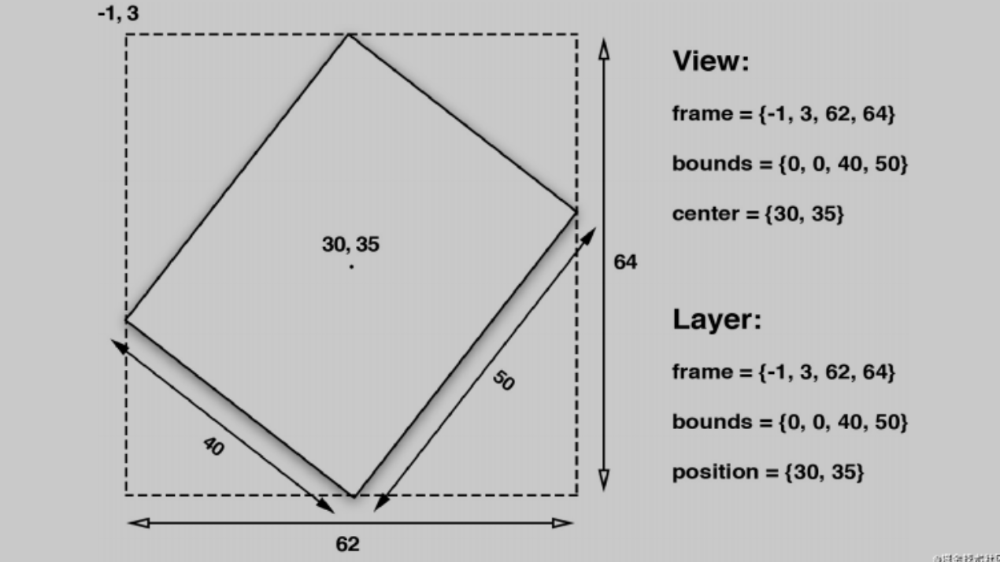

# iOS核心动画

## 一、CALayer

### 1.1、图层的能力

这里有一些 UIView 没有暴露出来的CALayer的功能：

- 阴影，圆角，带颜色的边框 
- 3D变换 
- 非矩形范围 
- 透明遮罩 
- 多级非线性动画

### 1.2、寄宿图

> 这一模块将来探索 CALayer的寄宿图（即图层中包含的图）

1）contents属性

CALayer 有一个属性叫做 contents ，这个属性的类型被定义为id，意味着它可以是任何类型的对象。在这种情况下，可以给 contents 属性赋任何值，app 仍然能够编译通过。但是，在实践中，如果给 contents 赋的不是CGImage， 那么得到的图层将是空白的。

```objective-c
UIView *centerView = [[UIView alloc] initWithFrame:CGRectMake(0, 0, 200, 100)];
centerView.backgroundColor = [UIColor lightGrayColor];
centerView.center = self.view.center;
[self.view addSubview:centerView];

UIImage *image = [UIImage imageNamed:@"1"];
centerView.layer.contents = (__bridge id)(image.CGImage);
```

2）contentGravity属性

类似UIImageView的contentMode

```objective-c
centerView.layer.contentsGravity = kCAGravityResizeAspect;
```

3）Custom Drawing

给 contents 赋CGImage的值不是唯一的设置寄宿图的方法。也可以直接 用Core Graphics直接绘制寄宿图。

* 能够通过继承UIView并实现 -drawRect: 方法 来自定义绘制。

  * **-drawRect:** 方法没有默认的实现，因为对UIView来说，寄宿图并不是必须 的，它不在意那到底是单调的颜色还是有一个图片的实例。如果UIView检测到 - drawRect: 方法被调用了，它就会为视图分配一个寄宿图，这个寄宿图的像素尺寸等于视图大小乘以 contentsScale 的值。
  * 如果不需要寄宿图，那就不要创建这个方法了，这会造成CPU资源和内存的浪费，这也是为什么苹果建议：**如果没有自定义绘制的任务就不要在子类中写一个空的-drawRect:方法。**
  * 当视图在屏幕上出现的时候 -**drawRect**: 方法就会被自动调用。 - **drawRect**: 方法里面的代码利用**Core Graphics**去绘制一个寄宿图，然后内容就会被缓存起来直到它需要被更新（通常是因为开发者调用了 -setNeedsDisplay 方 法，尽管影响到表现效果的属性值被更改时，一些视图类型会被自动重绘， 如 bounds 属性）。

* 虽然 -drawRect: 方法是一个UIView方法，事实上都是底层 的CALayer安排了重绘工作和保存了因此产生的图片。所以也可以通过使用CALayer来进行自定义寄宿图绘制

  * CALayer有一个可选的 delegate 属性，实现了 CALayerDelegate 协议，当 CALayer需要一个内容特定的信息时，就会从协议中请求。CALayerDelegate是一 个非正式协议，其实就是说没有CALayerDelegate @protocol可以让你在类里面引用啦。你只需要调用你想调用的方法，CALayer会帮你做剩下的。

  * 当需要被重绘时，CALayer会请求它的代理给他一个寄宿图来显示。它通过调用 下面这个方法做到的:

  * ```objective-c
    - (void)displayLayer:(CALayer *)layer;
    // 如果代理不实现 -displayLayer: 方法， CALayer就会转而尝试调用下面这个方法：
    - (void)drawLayer:(CALayer *)layer inContext:(CGContextRef)ctx;
    // force layer to redraw ，类似UIView的setNeedsDisplay
    - (void)display;
    ```

  * 在调用这个方法之前，CALayer创建了一个合适尺寸的空寄宿图（尺寸 由 bounds 和 contentsScale 决定）和一个Core Graphics的绘制上下文环境， 为绘制寄宿图做准备，他作为ctx参数传入。代码如下：

  * ```objective-c
    // 记得需要调用 [layer display] 进行force draw
    - (void)drawLayer:(CALayer *)layer inContext:(CGContextRef)ctx {
        CGContextSetLineWidth(ctx, 10);
        CGContextSetStrokeColorWithColor(ctx, [UIColor redColor].CGColor);
        CGContextStrokeEllipseInRect(ctx, layer.bounds);
    }
    ```

* 当使用寄宿了视图的图层的时候，你也不必实现 -displayLayer: 和 - drawLayer:inContext: 方法来绘制你的寄宿图。通常做法是实现UIView的 - drawRect: 方法，UIView就会帮你做完剩下的工作，包括在需要重绘的时候调 用 -display 方法。

## 二、图层几何学

### 2.1、布局

UIView 有三个比较重要的布局属 性： frame ， bounds 和 center ， CALayer 对应地叫 做 frame ， bounds 和 position 。为了能清楚区分，图层用了“position”，视图用了“center”，但是都代表同样的值。

frame 代表了图层的外部坐标（也就是在父图层上占据的空间）， bounds 是 内部坐标（{0, 0}通常是图层的左上角）， center 和 position 都代表了相对于 父图层 anchorPoint 所在的位置。 anchorPoint 的属性后续介绍到，现在把它想成图层的中心点就好了。


对于视图或者图层来说， frame 并不是一个非常清晰的属性，它其实是一个虚拟属性，是根据 bounds ， position 和 transform 计算而来，所以当其中任何一个值发生改变，frame都会变化。相反，改变frame的值同样会影响到当中的值。

**记住当对图层做变换的时候，比如旋转或者缩放， frame 实际上代表了覆盖在 图层旋转之后的整个轴对齐的矩形区域，也就是说 frame 的宽高可能 和 bounds 的宽高不再一致了**



### 2.2、锚点 anchorPoint

默认来说， anchorPoint 位于图层的中点，所以图层的将会以这个点为中心放置。 anchorPoint 属性并没有被 UIView 接口暴露出来，这也是视图的position 属性被叫做“center”的原因。但是图层的 anchorPoint 可以被移动，比如可以把 它置于图层 frame 的左上角，于是图层的内容将会向右下角的 position 方向移动，而不是居中了。


当改变了 anchorPoint ， position 属性保持固定的值并没 有发生改变，但是 frame 却移动了。

**position是layer中的anchorPoint点在superLayer中的位置坐标，因此可以说, position点是相对suerLayer的，anchorPoint点是相对layer的，两者是相对不同的坐标空间的一个重合点。**

如果单方面修改layer的position位置，会对anchorPoint有什么影响呢？修改anchorPoint又如何影响position呢？
 根据代码测试，两者互不影响，受影响的只会是frame.origin，也就是layer坐标原点相对superLayer会有所改变。换句话说，frame.origin由position和anchorPoint共同决定。

```objective-c
position.x = frame.origin.x + anchorPoint.x * bounds.size.width；  
position.y = frame.origin.y + anchorPoint.y * bounds.size.height；
  
frame.origin.x = position.x - anchorPoint.x * bounds.size.width；  
frame.origin.y = position.y - anchorPoint.y * bounds.size.height；
```

### 2.3、坐标系

CALayer 给不同坐标系之间的图层转换提供了一些工具类方法，这些方法可以把定义在一个图层坐标系下的点或者矩形转换成另一个图层坐标系下 的点或者矩形。

```objective-c
- (CGPoint)convertPoint:(CGPoint)point fromLayer:(CALayer *)layer;
- (CGPoint)convertPoint:(CGPoint)point toLayer:(CALayer *)layer; 
- (CGRect)convertRect:(CGRect)rect fromLayer:(CALayer *)layer; 
- (CGRect)convertRect:(CGRect)rect toLayer:(CALayer *)layer;
```

 **zPosition**

* 3D变换

* **改变图层的显示顺序了**

* ```objective-c
  // zPosition
  UIView *greenView = [[UIView alloc] initWithFrame:CGRectMake(100, 100, 100, 100)];
  greenView.backgroundColor = [UIColor greenColor];
  UITapGestureRecognizer *gTap = [[UITapGestureRecognizer alloc] initWithTarget:self action:@selector(gClick)];
  [greenView addGestureRecognizer:gTap];
  [self.view addSubview:greenView];
  
  UIView *redView = [[UIView alloc] initWithFrame:CGRectMake(150, 150, 100, 100)];
  redView.backgroundColor = [UIColor redColor];
  UITapGestureRecognizer *rTap = [[UITapGestureRecognizer alloc] initWithTarget:self action:@selector(rClick)];
  [redView addGestureRecognizer:rTap];
  [self.view addSubview:redView];
  
  // 切换zPosition
  greenView.layer.zPosition = 1;
  // 改变了图层顺序，但是不改变视图顺序，相交位置点击事件仍然由redView响应
  ```

### 2.4、Hit Testing


作者：赤霄_chaos
链接：https://www.jianshu.com/p/6ec1302a105a
来源：简书
著作权归作者所有。商业转载请联系作者获得授权，非商业转载请注明出处。


作者：国孩
链接：https://juejin.cn/post/6920908515758309383
来源：掘金
著作权归作者所有。商业转载请联系作者获得授权，非商业转载请注明出处。


## 参考文献

[Core Animation动画](https://juejin.cn/post/6920908515758309383)

