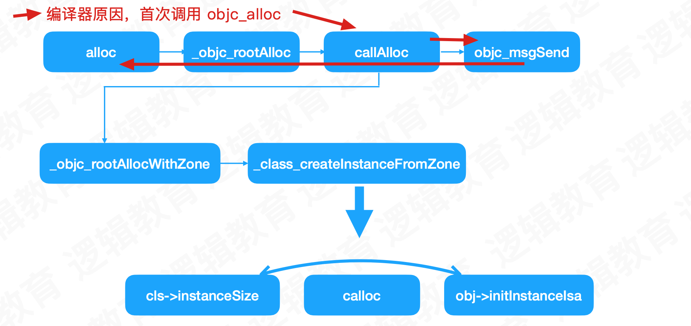

# OC对象原理

## 对象的alloc流程

虽然在`NSObject`的`alloc`方法中打了断点，但是并未进入，进入的是：

```objective-c
id
objc_alloc(Class cls)
{
    return callAlloc(cls, true/*checkNil*/, false/*allocWithZone*/);
}
```

原因：由于llvm对OC对象的处理，OC类在调用alloc方法时，会先调用`objc_alloc`函数，后续在`callAlloc`中调用`alloc`方法

```c++
...
case OMF_alloc:
    if (isClassMessage &&
        Runtime.shouldUseRuntimeFunctionsForAlloc() &&
        ResultType->isObjCObjectPointerType()) {
        // [Foo alloc] -> objc_alloc(Foo) or
        // [self alloc] -> objc_alloc(self)
        if (Sel.isUnarySelector() && Sel.getNameForSlot(0) == "alloc")
          return CGF.EmitObjCAlloc(Receiver, CGF.ConvertType(ResultType));
...

/// Allocate the given objc object.
///   call i8* \@objc_alloc(i8* %value)
llvm::Value *CodeGenFunction::EmitObjCAlloc(llvm::Value *value,
                                            llvm::Type *resultType) {
  return emitObjCValueOperation(*this, value, resultType,
                                CGM.getObjCEntrypoints().objc_alloc,
                                "objc_alloc");
}
```

```objc
static ALWAYS_INLINE id
callAlloc(Class cls, bool checkNil, bool allocWithZone=false)
{
#if __OBJC2__
    if (slowpath(checkNil && !cls)) return nil;
    if (fastpath(!cls->ISA()->hasCustomAWZ())) {
        return _objc_rootAllocWithZone(cls, nil);
    }
#endif

    // No shortcuts available.
    if (allocWithZone) {
        return ((id(*)(id, SEL, struct _NSZone *))objc_msgSend)(cls, @selector(allocWithZone:), nil);
    }
    return ((id(*)(id, SEL))objc_msgSend)(cls, @selector(alloc));
}
```



## alloc核心方法

### instanceSize

* 计算需要开辟的内存空间
  * 源码可以看出，至少16字节
  * 

```objective-c
inline size_t instanceSize(size_t extraBytes) const {
        if (fastpath(cache.hasFastInstanceSize(extraBytes))) {
            return cache.fastInstanceSize(extraBytes);
        }

        size_t size = alignedInstanceSize() + extraBytes;
        // CF requires all objects be at least 16 bytes.
        if (size < 16) size = 16;
        return size;
    }
// 这里是调用的计算方法
// Class's ivar size rounded up to a pointer-size boundary.
    uint32_t alignedInstanceSize() const {
        return word_align(unalignedInstanceSize());
    }

// 对象的实例变量大小
// 至少为8 isa指针
    // May be unaligned depending on class's ivars.
    uint32_t unalignedInstanceSize() const {
        ASSERT(isRealized());
        uint32_t size = data()->ro()->instanceSize;
        return size;
    }

// 8字节对齐 8的倍数
// 64位系统中，是7，算法表示按8对齐，为8的倍数
// #   define WORD_MASK 7UL 
static inline uint32_t word_align(uint32_t x) {
    return (x + WORD_MASK) & ~WORD_MASK;
}
```

### calloc

* 开辟内存，返回指针

```objective-c
obj = (id)calloc(1, size);
```

### initInstanceIsa

* 地址空间关联到相应的类

```objective-c
obj->initInstanceIsa(cls, hasCxxDtor);
```

## 结构体内存对齐

* 对象声明的实例变量是按照结构体的内存对齐方式进行
* 对象的属性，底层会进行重排优化，进行合并成一个字节进行存储

结构体内存对齐原则：

* 结构体或联合体的数据成员，第一个数据成员放在offset为0的位置，后续每个成员存储的起始位置要从该成员大小的整数倍开始。如果该成员有子成员，按最大子成员的大小整数倍开始
* 包含子成员的数据占用大小是最大子成员大小的整数倍
* 结构体总大小是内部最大成员整数倍

## 对象的大小

### sizeof

* 类型大小

### class_getInstanceSize

* 对象占用空间大小，包含结构体对齐

### malloc_size

* 实际分配的大小
* 看源码是因为16字节对齐
* libmalloc

* calloc是一个函数生命，在实际运行中，会进行赋值

```c++
void 	*(* MALLOC_ZONE_FN_PTR(calloc))(struct _malloc_zone_t *zone, size_t num_items, size_t size); /* same as malloc, but block returned is set to zero */

// 实际调用的时候
ptr = zone->calloc(zone, num_items, size);
```

在Xcode进行打印，找到赋值的最终调用位置

```shell
(lldb) p zone->calloc
(void *(*)(_malloc_zone_t *, size_t, size_t)) $0 = 0x00000001002f4ca5 (.dylib`default_zone_calloc at malloc.c:385)
(lldb) p zone->calloc
(void *(*)(_malloc_zone_t *, size_t, size_t)) $1 = 0x00000001002fa3d1 (.dylib`nano_calloc at nano_malloc.c:878)
```

最终调用

```c++
static void *
nano_calloc(nanozone_t *nanozone, size_t num_items, size_t size)
{
	size_t total_bytes;

	if (calloc_get_size(num_items, size, 0, &total_bytes)) {
		return NULL;
	}

	if (total_bytes <= NANO_MAX_SIZE) {
    // 核心代码
		void *p = _nano_malloc_check_clear(nanozone, total_bytes, 1);
		if (p) {
			return p;
		} else {
			/* FALLTHROUGH to helper zone */
		}
	}
	malloc_zone_t *zone = (malloc_zone_t *)(nanozone->helper_zone);
	return zone->calloc(zone, 1, total_bytes);
}
```

_nano_malloc_check_clear函数中的核心代码：

```c++
// 分配大小来自
size_t slot_bytes = segregated_size_to_fit(nanozone, size, &slot_key); // Note slot_key is set here


#define NANO_REGIME_QUANTA_SIZE	(1 << SHIFT_NANO_QUANTUM)	// 16
#define SHIFT_NANO_QUANTUM		4

static MALLOC_INLINE size_t
segregated_size_to_fit(nanozone_t *nanozone, size_t size, size_t *pKey)
{
	size_t k, slot_bytes;

	if (0 == size) {
		size = NANO_REGIME_QUANTA_SIZE; // Historical behavior
	}
  // + 15 左移4位
	k = (size + NANO_REGIME_QUANTA_SIZE - 1) >> SHIFT_NANO_QUANTUM; // round up and shift for number of quanta
  // 右移4位
	slot_bytes = k << SHIFT_NANO_QUANTUM;							// multiply by power of two quanta size
	*pKey = k - 1;													// Zero-based!

	return slot_bytes;
}
// 上面的算法意思是16字节对齐
```

## clang

```shell
clang -rewrite-objc main.m -o main.cpp

# 使用xcrun更方便 xcrun在clang的基础上进行了一些封装
# 模拟器
$ xcrun -sdk iphonesimulator clang -arch x86_64 -rewrite-objc main.m -o main-x64.cpp
# 手机
$ xcrun -sdk iphoneos clang -arch arm64 -rewrite-objc main.m -o main-arm64.cpp
```

## 结构体位域

```c
struct Direction {
	BOOL front : 1;
	BOOL back  : 1;
	BOOL left  : 1;
	BOOL right : 1;
};
```

#### 联合体配合位域

```objective-c
#import "LGCar.h"

#define LGDirectionFrontMask    (1 << 0)
#define LGDirectionBackMask     (1 << 1)
#define LGDirectionLeftMask     (1 << 2)
#define LGDirectionRightMask    (1 << 3)

@interface LGCar(){
    // 联合体
    union {
        char bits;
        // 位域
        struct {
            char front  : 1;
            char back   : 1;
            char left   : 1;
            char right  : 1;
        };
    } _direction;
}
@end


@implementation LGCar

- (instancetype)init
{
    self = [super init];
    if (self) {
        _direction.bits = 0b0000000000;
    }
    return self;
}

- (void)setFront:(BOOL)isFront {
        
    if (isFront) {
        _direction.bits |= LGDirectionFrontMask;
    } else {
        _direction.bits |= ~LGDirectionFrontMask;
    }
    NSLog(@"%s",__func__);
}

- (BOOL)isFront{
    return _direction.front;
}

- (void)setBack:(BOOL)isBack {
    _direction.back = isBack;

    NSLog(@"%s",__func__);
}

- (BOOL)isBack{
    return _direction.back;
}

@end
```

## nonPointerIsa

* 使用指针存储更多东西

### isa联合体

```c++
union isa_t {
    isa_t() { }
    isa_t(uintptr_t value) : bits(value) { }

    uintptr_t bits;

private:
    // Accessing the class requires custom ptrauth operations, so
    // force clients to go through setClass/getClass by making this
    // private.
    Class cls;

public:
#if defined(ISA_BITFIELD)
    struct {
        ISA_BITFIELD;  // defined in isa.h
    };

    bool isDeallocating() {
        return extra_rc == 0 && has_sidetable_rc == 0;
    }
    void setDeallocating() {
        extra_rc = 0;
        has_sidetable_rc = 0;
    }
#endif

    void setClass(Class cls, objc_object *obj);
    Class getClass(bool authenticated);
    Class getDecodedClass(bool authenticated);
};
```

x86_64中关于`ISA_BITFIELD`的一些宏定义

```c++
#		if __x86_64__
#   define ISA_MASK        0x00007ffffffffff8ULL
#   define ISA_MAGIC_MASK  0x001f800000000001ULL
#   define ISA_MAGIC_VALUE 0x001d800000000001ULL
#   define ISA_HAS_CXX_DTOR_BIT 1
#   define ISA_BITFIELD                                                        \
      uintptr_t nonpointer        : 1;                                         \
      uintptr_t has_assoc         : 1;                                         \
      uintptr_t has_cxx_dtor      : 1;                                         \
      uintptr_t shiftcls          : 44; /*MACH_VM_MAX_ADDRESS 0x7fffffe00000*/ \
      uintptr_t magic             : 6;                                         \
      uintptr_t weakly_referenced : 1;                                         \
      uintptr_t unused            : 1;                                         \
      uintptr_t has_sidetable_rc  : 1;                                         \
      uintptr_t extra_rc          : 8
```

x86_64中，ISA是中间44，arm64是中间33

手动计算ISA

x86_64中，先>>3，在<<20,在>>17

arm64中，先>>3,，再<<31,再>>28


## 遗留问题

* 地址空间如何关联到相应的类
* _read_imags，dyld的加载流程，类的加载流程