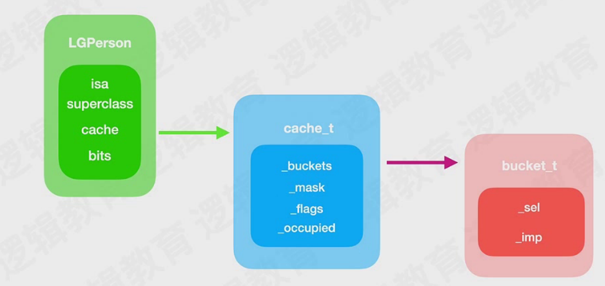

# 类

## isa流程

对象-isa->类-isa->元类-isa->根NSObject元类

类对象的地址在编译时就确定了，使用MachOView分析，可以直接在Section64(\_DATA,\_Objc_classrefs)和Section64(\_DATA,\_objc_classlist)中可以看到地址

在符号表中也可以看到元类的符号，都是这编译期有编译器生成


isa流程图 objc_getClass

superclass流程 objc_getSuperclass

## iskindof、ismemberof

isMemberOf 是否是相同的类，如果是类对象调用，取isa在去比较。如果是对象调用，调用[self class]，去比较

isKindOf 是否是相同或者子类，如果是类对象调用，取isa再去比较，然后再去取了isa之后的superclass一直比较到顶。如果是对象调用，调用[self class]，去比较

类对象的class返回它自己，就还是类对象自己，要获取元类需要objc_getClass(类)

NSObject是所有类的父类，包含元类，所以所有对象，包含类对象的isKindOfClass：[NSObject Class]都是YES

查看汇编，并非走得是iskindof源码，而是走得objc_opt_iskindofclass。编译器搞鬼

```objc
// Calls [obj isKindOfClass]
BOOL
objc_opt_isKindOfClass(id obj, Class otherClass)
{
#if __OBJC2__
    if (slowpath(!obj)) return NO;
    Class cls = obj->getIsa();
    if (fastpath(!cls->hasCustomCore())) {
        for (Class tcls = cls; tcls; tcls = tcls->getSuperclass()) {
            if (tcls == otherClass) return YES;
        }
        return NO;
    }
#endif
    return ((BOOL(*)(id, SEL, Class))objc_msgSend)(obj, @selector(isKindOfClass:), otherClass);
}
```

## 

## 类的结构

对象的结构：isa，实例变量

类似的结构：isa （8）、superclass（8）、cache（16）、bits

cache类型：cache_t，类型大小16字节

### bits

通过类地址平移0x20获得bits

对bits进行类型强转（class_data_bits_t *）0x0000000

调用data（）方法，0x00000->data()


```shell
# 打印对象内存信息
(lldb) x/8g p
0x10122abc0: 0x011d80010000838d 0x0000000000000000
0x10122abd0: 0x0000000000000000 0x0000000000000000
0x10122abe0: 0x0000000000000009 0x00007fff30010ad8
0x10122abf0: 0x00007fff3e2db6e0 0x00007fff3ccd8c98

# 获取对象isa指针
(lldb) p/x 0x011d80010000838d & 0x00007ffffffffff8ULL
(long) $2 = 0x0000000100008388

# bits相对类对象首地址偏移0x20 isa地址加20后进行bits类型强转
(lldb) p (class_data_bits_t *)0x00000001000083a8
(class_data_bits_t *) $5 = 0x00000001000083a8

# 调用bits的data()方法，获取class_rw_t * 
(lldb) p $5->data()
(class_rw_t *) $7 = 0x0000000101234810

# 从class_rw_t中获取methods
(lldb) p $7->methods()
(const method_array_t) $8 = {
  list_array_tt<method_t, method_list_t, method_list_t_authed_ptr> = {
     = {
      list = {
        ptr = 0x00000001000080b8
      }
      arrayAndFlag = 4295000248
    }
  }
}
# 从methods中获取method_list_t
(lldb) p $8.list.ptr
(method_list_t *const) $9 = 0x00000001000080b8
(lldb) p *$9
(method_list_t) $10 = {
  entsize_list_tt<method_t, method_list_t, 4294901763, method_t::pointer_modifier> = (entsizeAndFlags = 27, count = 13)
}
# 从method_list_t中获取method_t 
(lldb) p $10.get(0).big() #底层没有description方法，需要big方法进行打印显示
(method_t::big) $11 = {
  name = "bycycle"
  types = 0x0000000100003f75 "s16@0:8"
  imp = 0x0000000100003cf0 (KCObjcBuild`-[Person bycycle] at main.m:25)
}


# 从class_rw_t中获取properties
(lldb) p $7->properties()
(const property_array_t) $14 = {
  list_array_tt<property_t, property_list_t, RawPtr> = {
     = {
      list = {
        ptr = 0x00000001000082c0
      }
      arrayAndFlag = 4295000768
    }
  }
}
# 从properties获取 property_list_t
(lldb) p $14.list.ptr
(property_list_t *const) $15 = 0x00000001000082c0
(lldb) p *$15
(property_list_t) $16 = {
  entsize_list_tt<property_t, property_list_t, 0, PointerModifierNop> = (entsizeAndFlags = 16, count = 6)
}
# 从property_list_t中获取property_t
(lldb) p $16.get(0)
(property_t) $17 = (name = "name", attributes = "Tc,N,V_name")

```

#### ro & rw & ext

dirty_memory、clean_memory：分类加载，修改了类的内容

### set原理

objc_setProperty

通过ivars，sel->imp,imp是未实现的，指向setProperty。编译时期，llvm生成

？什么时候使用setProperty，什么时候是内存平移找到ivar后之后赋值

llvm

if (IsCopy) {

​	Kind = GetSetProperty;

​	return;

}

setProperty底层进行copy操作


### 类方法存储在元类

class_getClassMethod方法，底层调用的是，获取元类的对象方法

class_getInstanceMethod(cls->getMeta(),sel);

getMeta()函数，当是类的时候，返回元类，当是元类的时候返回与元类自己

底层没有所谓的类方法、对象方法，只是看在哪里获取


### objc_msgSend

Xcode有个build setting中，有objc_msgSend的配置，和参数一个两个有关

objc_msgSendSuper

objc_super {

​	id receiver

​	Class super_class

}

汇编分析：

ENTRY \_objc\_msgSend

cmp p0, #0   // 比较消息接收者是否是0，是否存在

GetClassFromIsa_p16  // p16最终就等于class，通过recieve获取isa，获取class

ExtractISA    // 这里就是获取最终的isa指针

上面走完后，继续往下走：

CacheLookUp

LLookupStart

----循环--找缓存

缓存命中 CacheHit   NORMAL -> TailCallCachedImp -> call imp objc_msgSend(sel,imp)

总结：

reciever是否存在

receiver->isa->class(p16)

class-内存平移-cache（bucket mask）

bucket掩码->bucket

mask掩码->mask

insert哈希函数

第一次查找的index

bucket+index查找具体的bucket{imp sel}

判断sel==_cmd，相等的话CacheHit ->imp^isa = imp，调用objc_msgSend；不相等的话，--平移继续查找


如果一直没找到，即没有缓存，调用MissLabelDynamic。这个是CacheLookUp的一个参数。即\_\_objc_msgSend_uncached->lookUpImpOrForward(C)->慢速查找-methodlist


也可以通过汇编查看msgSend流程


慢速查找流程：lookupimporforward

​	方法查找需要用到rw和ro，所以需要保证类已经加载和初始化

​	二分查找、如果同名方法，找分类的。二分查找相同元素的边界问题。--。找最前面的。分类在类的前面

​	找到后，缓存 调用

​	找不到，找父类缓存，再找父类慢速查找，一直找到没有

​	最终没找到，imp = forward_imp


​	顺便调用

callInitialize

class initialize


cache_getImp，这里有坑，查找父类的方法，缓存没找到的话，不是直接找父类的父类，先返回0，然后在方法里面判断0，继续找父类的父类


### 寻找imp的过程

根据sel查找imp的过程


### cache

偏移16字节

bucket_t，保存sel->imp



当lldb p或者po打印不出来的时候，寻找是否有方法可以输出相关信息

发现调用了方法，但是cache中，buckets中没有缓存。因为buckets使用hash来进行存储，直接打印，相当于直接获取第一个，不一定有值

有插入、才有读取

insert(sel,imp,reciever)，插入过程有hash，冲突的话，再hash


occupy 存入了多少

mask = capacity-1

bucket两倍扩容：旧的回收，新的继续放，相当于老的没有了

cache初始4、扩容为8，mask为7

当使用lldb调用方法触发缓存时，会发现cache初始就为7，因为lldb除了调用方法，还调用了一些其他对象方法，导致其它的方法也被调用，被缓存，刚好导致扩容了一次。（mask从3->7）

调用了这两个方法

// respondsToSelector

// class

还少一个？

往bucket里面插值，必须要调用b[i].set方法去插值。insert是插cache

buckets最后一个存边界，所以mask = capacity-1。因为最后一个是边界，存0x1，然后cache的首地址（这里存疑）

验证不通过lldb，通过代码直接调用，会不会有边界。


哈希：开放定址 & 拉链

0.75扩容，负载因子


```cpp
// 系统函数，打印imp信息
// 参见以下函数，全局搜索
inline IMP rawImp()
  _sel.load()
  _imp.load()
```

insert流程

cache中关于imp的算法，双重异或。存编码异或一次，取解码异或一次

imp()方法，imp(bucket_t *，cls())，这里的cls(),就是用于异或的参数，如果不传，就不异或，就是原始值


* cache中关于arm的内容

  在arm中，cache往buckets中存值，如果存在哈希冲突，就往前存值。如果存不进去，就过掉while循环，调用bad cache

  arm64中，先存imp，在存sel。其他架构先存sel，在存imp


## 十、动态方法决议

找不到方法，赋值`imp = forward_imp = __objc_msgForward_impcache`  <-汇编

在上面返回之前，会调用：

resolve为啥走两次

为啥resolveClass后还要调用resolveInstance


aop


消息转发

extern void instrumentObjcMessageSends(BOOL flag)  mac开发模式

调用传yes，打印输出一些消息转发的流程log


hopper反汇编cf


