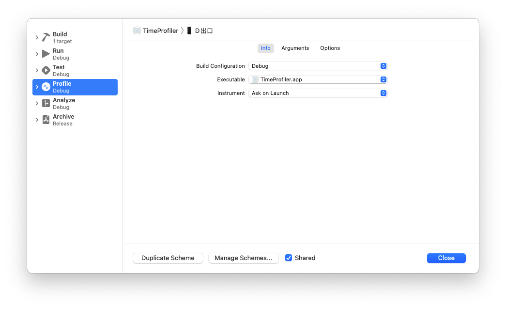
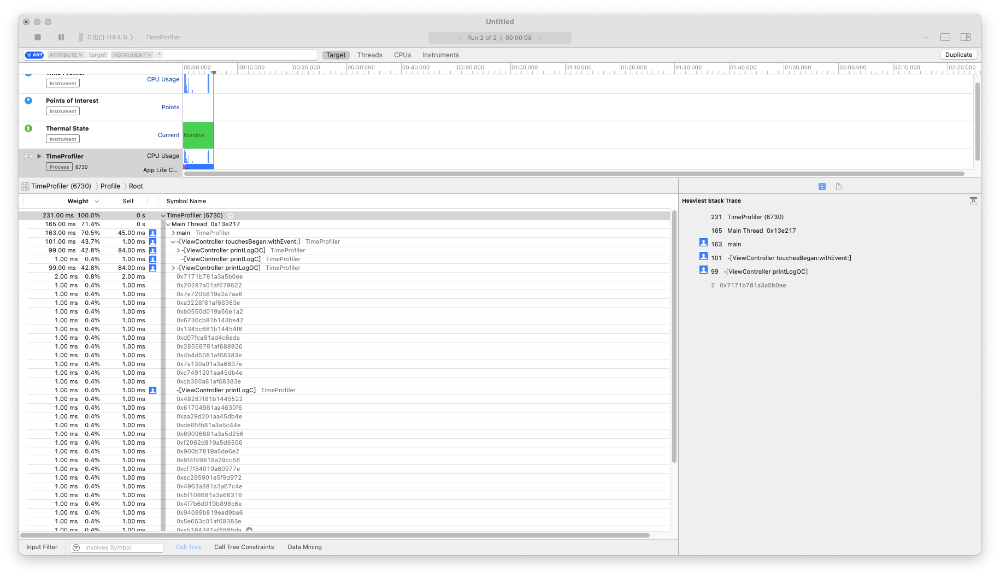
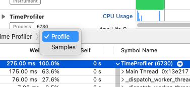
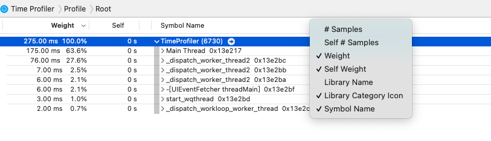
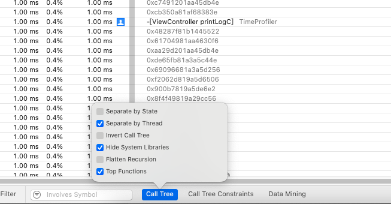

# Time Profiler

## 1、设置profile为debug模式

> 要不然只能看到方法地址，看不到方法名，没有符号文件进行解析

## 2、使用

详情面板:在time profiler下主要是看Call Tree和Sample List这两种视图，一般使用Call Tree查看，比较简单明了：

Weight：函数运行的时间，这个时间是累积时间

Self：在栈顶次数

Symbol Name：被调用函数的符号信息

Separate by Thread（建议选择）：线程分离,只有这样才能在调用路径中能够清晰看到占用CPU最大的线程.每个线程应该分开考虑。只有这样你才能揪出那些大量占用CPU的"重"线程，按线程分开做分析，这样更容易揪出那些吃资源的问题线程。特别是对于主线程，它要处理和渲染所有的接口数据，一旦受到阻塞，程序必然卡顿或停止响应。

Invert Call Tree（不建议选择）：调用树倒返过来，将习惯性的从根向下一级一级的显示，如选上就会返过来从最底层调用向一级一级的显示。如果想要查看那个方法调用为最深时使用会更方便些。

Hide Missing Symbols（建议选择）：隐藏丢失的符号，比如应用或者系统的dSYM文件找不到的话，在详情面板上是看不到方法名的，只能看一些读不明的十六进值，所以对我们来说是没有意义的，去掉了会使阅读更清楚些。

Hide System Libraries（建议选择）：选上它只会展示与应用有关的符号信息，一般情况下我们只关心自己写的代码所需的耗时，而不关心系统库的CPU耗时。

Flatten Recursion（一般不选）：选上它会将调用栈里递归函数作为一个入口。

Top Functions（可选）：选上它会将最耗时的函数降序排列，而这种耗时是累加的，比如A调用了B，那么A的耗时数是会包含B的耗时数。

