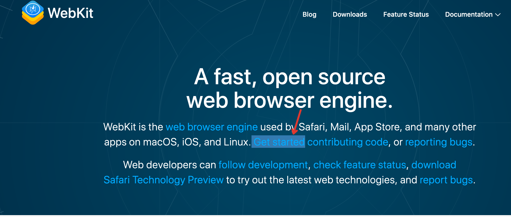
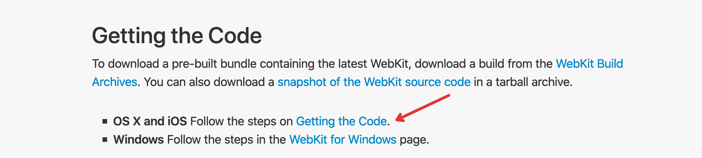
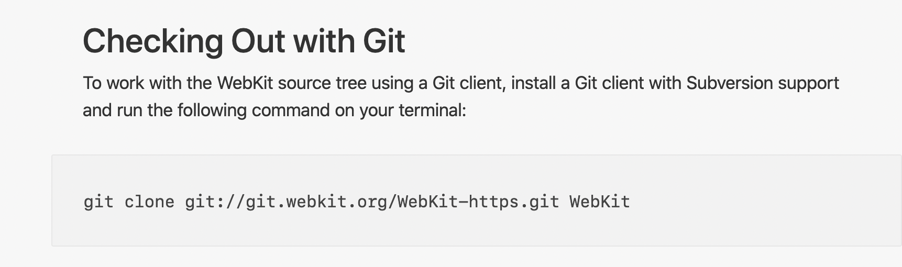
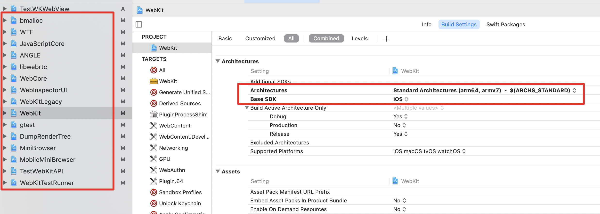
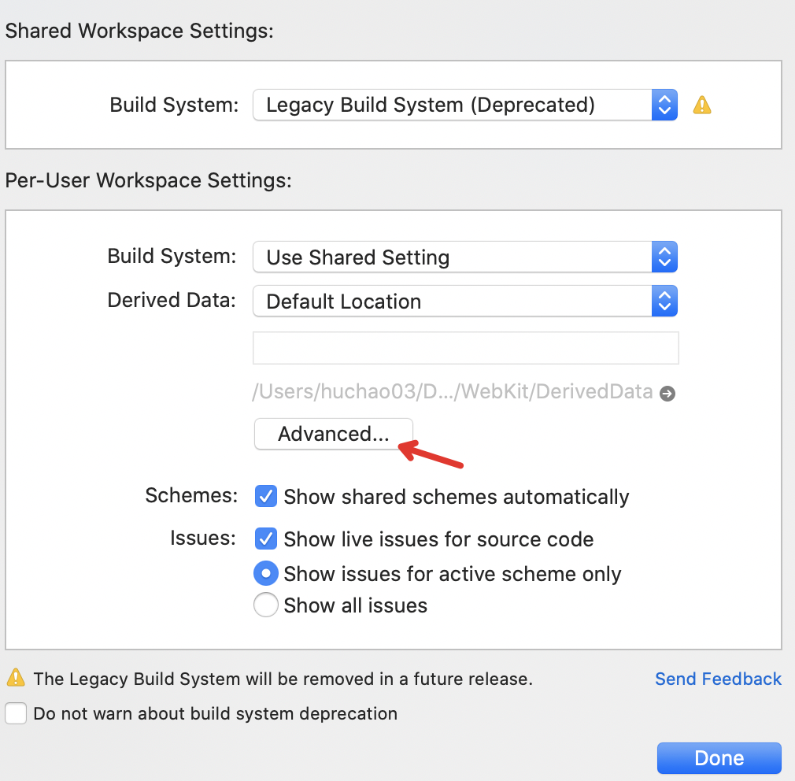
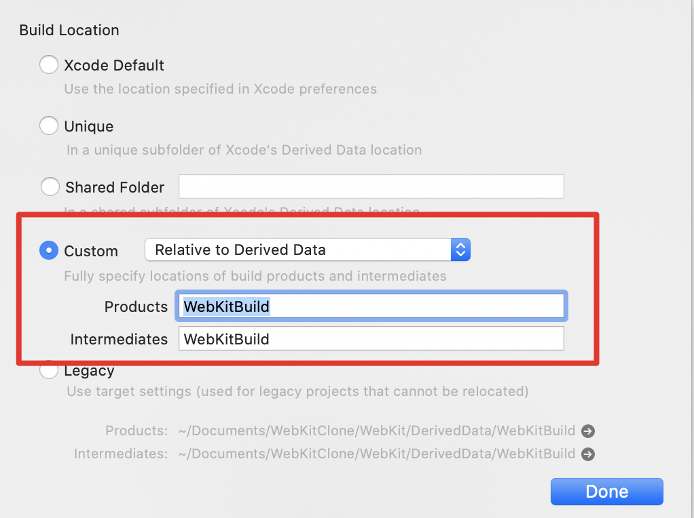
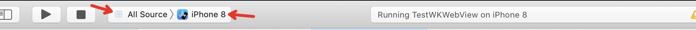
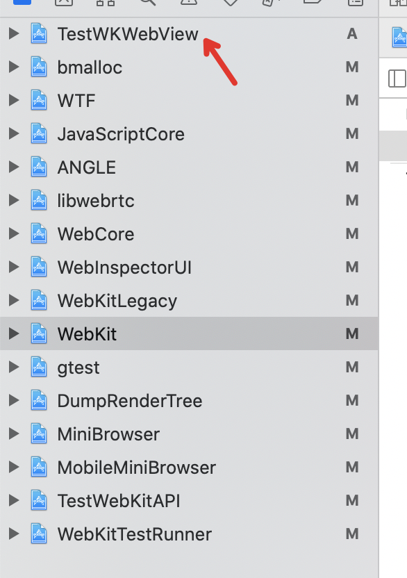
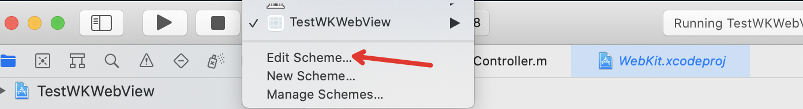
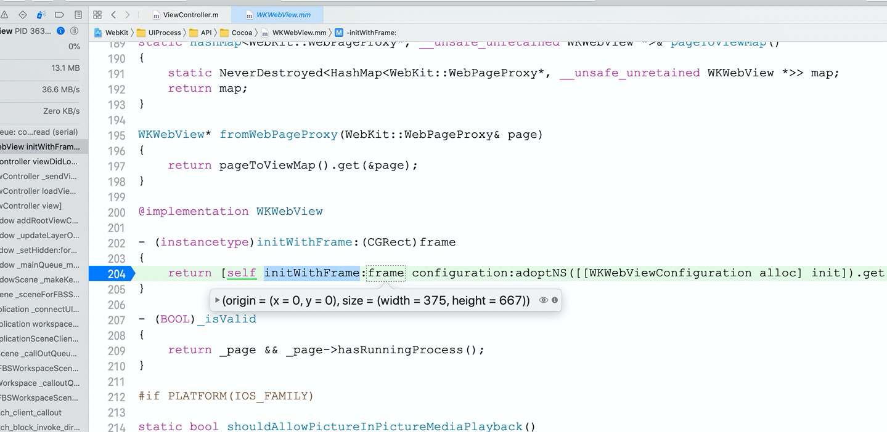

# WebKit 编译

> 参考自：[Xcode编译WebKit](https://www.cnblogs.com/chaoguo1234/p/14016984.html)

## 1.下载WebKit源码

1)进入https://webkit.org/

2)点击页面的 Get Started 进入新页面，如下图所示



3)点击 Getting the code 进入新页面，如下图所示



 4)在源码下载页面，有多种下载方式，包括直接下载代码zip包，通过SVN下载，通过Git下载。这里选择使用Git的方式进行下载，在控制台运行下面的命令。下载量有点大，约6G左右，耐心等待即可，下载完成会生成一个WebKit目录。



我是从这个地址下载的：

```shell
git clone git://git.webkit.org/WebKit.git WebKit
```

## 2.Xcode编译

1)Embedded Builds

下载的WebKit目录里面有一个Tools/Scripts目录，这里面有各种脚本，包括使用命令行编译WebKit的脚本`build-webkit`，但是使用Xcode编译的时候用不着它。另一个重要的脚本就是`configure-xcode-for-embedded-development，在控制台运行如下命令:`

```shell
sudo Tools/Scripts/configure-xcode-for-embedded-development
```

 之所以需要这个脚本，是因为iOS属于嵌入式平台，编译给iOS嵌入式平台的WebKit需要一些命令行工具，上面的脚本就是让Xcode能够构建这些命令行工具的。否则，在编译诸如`JavaScriptCore`的时候，就会报如下错误:`‘com.apple.product-type.tool’, but there’s no such product type for the embedded platform。`

需要注意的是，运行完上面脚本之后，最好重启一下Xcode。

2)更改Xcode配置

WebKit源码下载完成之后，用Xcode打开里面的WebKit.xcworkspace。默认情况下，WebKit.xcworkspace里面的各个工程都是macos配置，需要进行更改， 左边红框就是需要更改的工程，右边红框是更改后的配置。



 3)设置构建产物存储位置

选择Xcode的File菜单->Workspace Settings...打开Workspace设置窗口:



选择Advanced...按钮，打开如下窗口，按红框所示进行配置:



4)编译

 选中 All Source选项，选择一个模拟器，然后点击Xcode的构建按钮开始构建。剩下的就是耐心等待，等待激动人心的 Build Success 提示(可能编译完成后有一个关于MiniBrowser工程的弹窗，直接关闭即可，不影响编译)。



## 3.创建调试工程

编译好WebKit之后，我们的目的当然是进行调试，以便用来学习WebKit的源码。那么，如何才能让我们新建的工程里面，使用自己编译的WebKit.framework，而不是系统自带的呢？

1)用Xcode新建一个新的Project，示例里面是TestWKWebView，并将这个Project添加到WebKit.xcworkspace。



2)设置TestWKWebView的scheme

如下图所示，点击Edit Scheme，打开设置窗口



在`Edit`设置窗口选择 `Arguments`选项，在 `Environment Variables`里面添加一项，**Name**:`DYLD_FRAMEWORK_PATH` **Value**:`Path_To_WebKit/DerivedData/WebKitBuild/Debug-iphonesimulator`，这里的`Path_To_WebKit`就是WebKit目录所在路径。一个方便的方法是，在`Xcode`的`WebKit`工程打开`Product`目录，找到`WebKit.framework`然后`Show in Finder`，将包含`WebKit.framework`的目录复制下来即可。


做好上面的设置之后，就可以编写测试程序，然后打上断点,看是否能够成功断在WebKit的源码里面， 如果你能够成功进入断点，那么恭喜你，你已经能够调试WebKit源码了。




## 参考文献

[Xcode编译WebKit](https://www.cnblogs.com/chaoguo1234/p/14016984.html)

http://webkit.org/

