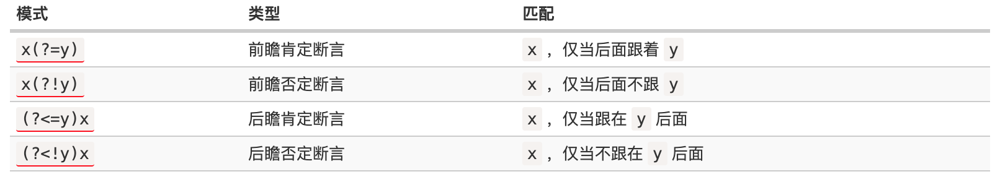
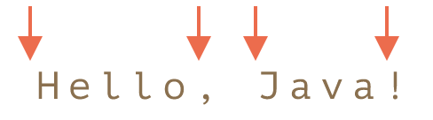

# 正则表达式

## 参考文献

[learn-regex](https://github.com/ziishaned/learn-regex)

[一文掌握开发利器：正则表达式](https://mp.weixin.qq.com/s/wkCHL_QzAJwWEg9JZaZnCQ)

[现代JavaScript教程/正则表达式](https://zh.javascript.info/regular-expressions)

## 1. 基本匹配

正则表达式其实就是在执行搜索时的格式，它由一些字母和数字组合而成。 例如：一个正则表达式 `the`，它表示一个规则：由字母`t`开始，接着是`h`，再接着是`e`。

```js
let string = "i am the first";
let regex = /the/;
console.log(string.match(regex))
/**
 * [ 'the', index: 5, input: 'i am the first', groups: undefined ]
 */
```

## 2. 元字符

| 元字符 | 描述                                                         |
| ------ | :----------------------------------------------------------- |
| .      | 句号匹配任意单个字符除了换行符。                             |
| [ ]    | 字符种类。匹配方括号内的任意字符。                           |
| [^ ]   | 否定的字符种类。匹配除了方括号里的任意字符                   |
| *      | 匹配>=0个重复的在*号之前的字符。                             |
| +      | 匹配>=1个重复的+号前的字符。                                 |
| ?      | 标记?之前的字符为可选.                                       |
| {n,m}  | 匹配num个大括号之前的字符或字符集 (n <= num <= m).           |
| (xyz)  | 字符集，匹配与 xyz 完全相等的字符串.                         |
| \|     | 或运算符，匹配符号前或后的字符.                              |
| \      | 转义字符,用于匹配一些保留的字符 `[ ] ( ) { } . * + ? ^ $ \ |` |
| ^      | 从开始行开始匹配.                                            |
| $      | 从末端开始匹配.                                              |

###  2.1 点运算符 `.`

`.`是元字符中最简单的例子。 `.`匹配任意单个字符，但不匹配换行符。 例如，表达式`.ar`匹配一个任意字符后面跟着是`a`和`r`的字符串。

```js
let string = "far a way from home";
let regex = /.ar/;
console.log(string.match(regex))
/**
 * [ 'far',
  index: 0,
  input: 'far a way from home',
  groups: undefined ]
 */
```

### 2.2 字符集 `[]`

字符集也叫做字符类。 方括号用来指定一个字符集。 在方括号中使用连字符来指定字符集的范围。 在方括号中的字符集不关心顺序。 例如，表达式`[rh]om` 匹配 `rom` 和 `hom`。

```js
let string = "far a way from home";
let regex = /[rh]om/g;
console.log(string.match(regex))
/**
[ 'rom', 'hom' ]
 */
```

> 方括号的句号就表示句号。 表达式 `ar[.]` 匹配 `ar.`字符串

#### 2.2.1 否定字符集

一般来说 `^` 表示一个字符串的开头，但它用在一个方括号的开头的时候，它表示这个字符集是否定的。 例如，表达式`[^h]om` 匹配一个后面跟着`om`的除了`h`的任意字符。

```js
let string = "far a way from home";
let regex = /[^h]om/g;
console.log(string.match(regex))
/**
[ 'rom' ]
 */
```

### 2.3 重复次数

后面跟着元字符 `+`，`*` or `?` 的，用来指定匹配子模式的次数。 这些元字符在不同的情况下有着不同的意思。

#### 2.3.1 `*` 号

`*`号匹配 在`*`之前的字符出现`大于等于0`次。 例如，表达式 `a*` 匹配0或更多个以a开头的字符。表达式`[a-z]*` 匹配一个行中所有以小写字母开头的字符串。

```js
let string = "ther is aaaaaabc";
let regex = /a*bc/;
console.log(string.match(regex))
/**
[ 'aaaaaabc',
  index: 8,
  input: 'ther is aaaaaabc',
  groups: undefined ]
 */
```

`*`字符和`.`字符搭配可以匹配所有的字符`.*`。

 `*`和表示匹配空格的符号`\s`连起来用，如表达式`\s*cat\s*`匹配0或更多个空格开头和0或更多个空格结尾的cat字符串。

```js
let string = "The fat cat sat on the concatenation.";
let regex = /\s*cat\s*/g;
console.log(string.match(regex))
/**
[ ' cat ', 'cat' ]
 */
```

#### 2.3.2 `+` 号

`+`号匹配`+`号之前的字符出现 >=1 次。 例如表达式`c.+t` 匹配以首字母`c`开头以`t`结尾，中间跟着至少一个字符的字符串。

```js
let string = "there is a caaaat";
let regex = /ca+t/;
console.log(string.match(regex))
/**
[ 'caaaat',
  index: 11,
  input: 'there is a caaaat',
  groups: undefined ]
 */
```

#### 2.3.3 `?` 号

在正则表达式中元字符 `?` 标记在符号前面的字符为可选，即出现 0 或 1 次。 例如，表达式 `[T]?he` 匹配字符串 `he` 和 `The`。

```js
let string = "The fat cat sat on the mat.";
let regex = /[T]?he/g;
console.log(string.match(regex))
/**
[ 'The', 'he' ]
 */
```

### 2.4 `{}` 号

在正则表达式中 `{}` 是一个量词，常用来限定一个或一组字符可以重复出现的次数。 例如， 表达式 `[0-9]{2,3}` 匹配最少 2 位最多 3 位 0~9 的数字。

```js
let string = "The number was 9.9997 but we rounded it off to 10.0.";
let regex = /[0-9]{2,3}/g;
console.log(string.match(regex))
/**
[ '999', '10' ]
 */

```

我们可以省略第二个参数。 例如，`[0-9]{2,}` 匹配至少两位 0~9 的数字。

```js
let string = "The number was 9.9997 but we rounded it off to 10.0.";
let regex = /[0-9]{2,}/g;
console.log(string.match(regex))
/**
[ '9997', '10' ]
 */
```

如果逗号也省略掉则表示重复固定的次数。 例如，`[0-9]{3}` 匹配3位数字

```js
let string = "The number was 9.9997 but we rounded it off to 10.0.";
let regex = /[0-9]{3}/g;
console.log(string.match(regex))
/**
[ '999' ]
 */
```

### 2.5 `(...)` 特征标群

特征标群是一组写在 `(...)` 中的子模式。`(...)` 中包含的内容将会被看成一个整体，和数学中小括号（ ）的作用相同。例如, 表达式 `(ab)*` 匹配连续出现 0 或更多个 `ab`。如果没有使用 `(...)` ，那么表达式 `ab*` 将匹配连续出现 0 或更多个 `b` 。再比如之前说的 `{}` 是用来表示前面一个字符出现指定次数。但如果在 `{}` 前加上特征标群 `(...)` 则表示整个标群内的字符重复 N 次。

我们还可以在 `()` 中用或字符 `|` 表示或。例如，`(c|g|p)ar` 匹配 `car` 或 `gar` 或 `par`.

```js
let string = "The number was 9.9997 but we rounded it off to 10.0.";
let regex = /n(um)?/g;
console.log(string.match(regex))
/**
[ 'num', 'n' ]
 */

let string = "The number was 9.9997 but we rounded it off to 10.0.";
let regex = /o(u|f)/g;
console.log(string.match(regex))
/**
[ 'ou', 'of' ]
 */
```

### 2.6 `|` 或运算符

或运算符就表示或，用作判断条件。

例如 `(T|t)he|car` 匹配 `(T|t)he` 或 `car`。

```js
let string = "The car is parked in the garage.";
let regex = /[T|t]he|car/g;
console.log(string.match(regex))
/**
[ 'The', 'car', 'the' ]
 */
```

### 2.7 转码特殊字符

反斜线 `\` 在表达式中用于转码紧跟其后的字符。用于指定 `{ } [ ] / \ + * . $ ^ | ?` 这些特殊字符。如果想要匹配这些特殊字符则要在其前面加上反斜线 `\`。

例如 `.` 是用来匹配除换行符外的所有字符的。如果想要匹配句子中的 `.` 则要写成 `\.` 以下这个例子 `\.?`是选择性匹配`.`

```js
let string = "The fat cat sat on the mat.";
let regex = /(f|c|m)at\./g;
console.log(string.match(regex))
/**
[ 'mat.' ]
 */
```

### 2.8 锚点

在正则表达式中，想要匹配指定开头或结尾的字符串就要使用到锚点。`^` 指定开头，`$` 指定结尾。

#### 2.8.1 `^` 号

`^` 用来检查匹配的字符串是否在所匹配字符串的开头。

例如，在 `abc` 中使用表达式 `^a` 会得到结果 `a`。但如果使用 `^b` 将匹配不到任何结果。因为在字符串 `abc` 中并不是以 `b` 开头。

例如，`^(T|t)he` 匹配以 `The` 或 `the` 开头的字符串。

```js
let string = "The car is parked in the garage.";
let regex = /(T|t)he/g;
console.log(string.match(regex))
/**
[ 'The', 'the' ]
 */

let string = "The car is parked in the garage.";
let regex = /^(T|t)he/g;
console.log(string.match(regex))
/**
[ 'The' ]
 */
```

#### 2.8.2 `$` 号

同理于 `^` 号，`$` 号用来匹配字符是否是最后一个。

例如，`(at\.)$` 匹配以 `at.` 结尾的字符串。

```js
let string = "The fat cat. sat. on the mat.";
let regex = /at\./g;
console.log(string.match(regex))
/**
[ 'at.', 'at.', 'at.' ]
 */

let string = "The fat cat. sat. on the mat.";
let regex = /at\.$/g;
console.log(string.match(regex))
/**
[ 'at.' ]
 */
```

## 3. 简写字符集

正则表达式提供一些常用的字符集简写。如下:

| 简写 | 描述                                               |
| ---- | -------------------------------------------------- |
| .    | 除换行符外的所有字符                               |
| \w   | 匹配所有字母数字，等同于 `[a-zA-Z0-9_]`            |
| \W   | 匹配所有非字母数字，即符号，等同于： `[^\w]`       |
| \d   | 匹配数字： `[0-9]`                                 |
| \D   | 匹配非数字： `[^\d]`                               |
| \s   | 匹配所有空格字符，等同于： `[\t\n\f\r\p{Z}]`       |
| \S   | 匹配所有非空格字符： `[^\s]`                       |
| \f   | 匹配一个换页符                                     |
| \n   | 匹配一个换行符                                     |
| \r   | 匹配一个回车符                                     |
| \t   | 匹配一个制表符                                     |
| \v   | 匹配一个垂直制表符                                 |
| \p   | 匹配 CR/LF（等同于 `\r\n`），用来匹配 DOS 行终止符 |

## 4. 零宽度断言（前后预查）

> 注：在shell上测试不支持，后续看下为啥

先行断言和后发断言都属于**非捕获簇**（不捕获文本 ，也不针对组合计进行计数）。 先行断言用于判断所匹配的格式是否在另一个确定的格式之前，匹配结果不包含该确定格式（仅作为约束）。

例如，我们想要获得所有跟在 `$` 符号后的数字，我们可以使用正后发断言 `(?<=\$)[0-9\.]*`。 这个表达式匹配 `$` 开头，之后跟着 `0,1,2,3,4,5,6,7,8,9,.` 这些字符可以出现大于等于 0 次。

零宽度断言如下：

| 符号 | 描述            |
| ---- | --------------- |
| ?=   | 正先行断言-存在 |
| ?!   | 负先行断言-排除 |
| ?<=  | 正后发断言-存在 |
| ?<!  | 负后发断言-排除 |



### 4.1 `?=...` 正先行断言

`?=...` 正先行断言，表示第一部分表达式之后必须跟着 `?=...`定义的表达式。

返回结果只包含满足匹配条件的第一部分表达式。 定义一个正先行断言要使用 `()`。在括号内部使用一个问号和等号： `(?=...)`。

正先行断言的内容写在括号中的等号后面。 例如，表达式 `(T|t)he(?=\sfat)` 匹配 `The` 和 `the`，在括号中我们又定义了正先行断言 `(?=\sfat)` ，即 `The` 和 `the` 后面紧跟着 `(空格)fat`。

```js
let string = "The fat cat. sat. on the mat.";
let regex = /[T|t]he(?=\sfat)/g;
console.log(string.match(regex))
/**
[ 'The' ]
 */
```

### 4.2 `?!...` 负先行断言

负先行断言 `?!` 用于筛选所有匹配结果，筛选条件为 其后不跟随着断言中定义的格式。 `正先行断言` 定义和 `负先行断言` 一样，区别就是 `=` 替换成 `!` 也就是 `(?!...)`。

表达式 `(T|t)he(?!\sfat)` 匹配 `The` 和 `the`，且其后不跟着 `(空格)fat`。

```js
let string = "The fat cat. sat. on the mat.";
let regex = /[T|t]he(?!\sfat)/g;
console.log(string.match(regex))
/**
[ 'the' ]
 */
```

### 4.3 `?<= ...` 正后发断言

正后发断言 记作`(?<=...)` 用于筛选所有匹配结果，筛选条件为 其前跟随着断言中定义的格式。 例如，表达式 `(?<=(T|t)he\s)(fat|mat)` 匹配 `fat` 和 `mat`，且其前跟着 `The` 或 `the`。

```js
let string = "The fat cat. sat. on the mat.";
let regex = /(?<=\sf)at./g;
console.log(string.match(regex))
/**
 * index = 5
[ 'at' ]
 */
```

### 4.4 `?<!...` 负后发断言

负后发断言 记作 `(?<!...)` 用于筛选所有匹配结果，筛选条件为 其前不跟随着断言中定义的格式。 例如，表达式 `(?<!(T|t)he\s)(cat)` 匹配 `cat`，且其前不跟着 `The` 或 `the`。

```js
let string = "The fat cat. sat. on the mat.";
let regex = /(?<!\sf)at./g;
console.log(string.match(regex))
/**
 * cat. sat. mat.
[ 'at.', 'at.', 'at.' ]
 */
```

## 5. 标志

标志也叫模式修正符，因为它可以用来修改表达式的搜索结果。 这些标志可以任意的组合使用，它也是整个正则表达式的一部分。

| 标志 | 描述                                                  |
| ---- | ----------------------------------------------------- |
| i    | 忽略大小写。                                          |
| g    | 全局搜索。                                            |
| m    | 多行修饰符：锚点元字符 `^` `$` 工作范围在每行的起始。 |

### 5.1 忽略大小写 (Case Insensitive)

修饰语 `i` 用于忽略大小写。 例如，表达式 `/The/gi` 表示在全局搜索 `The`，在后面的 `i` 将其条件修改为忽略大小写，则变成搜索 `the` 和 `The`，`g` 表示全局搜索。

```js
let string = "The fat cat. sat. on the mat.";
let regex = /The/ig;
console.log(string.match(regex))
/**
 * 
[ 'The', 'the' ]
 */
```

### 5.2 全局搜索 (Global search)

修饰符 `g` 常用于执行一个全局搜索匹配，即（不仅仅返回第一个匹配的，而是返回全部）。 例如，表达式 `/.(at)/g` 表示搜索 任意字符（除了换行）+ `at`，并返回全部结果。

```js
let string = "The fat cat. sat. on the mat.";
let regex = /The/ig;
console.log(string.match(regex))
/**
 * 
[ 'The', 'the' ]
 */

```

### 5.3 多行修饰符 (Multiline)

多行修饰符 `m` 常用于执行一个多行匹配。

像之前介绍的 `(^,$)` 用于检查格式是否是在待检测字符串的开头或结尾。但我们如果想要它在每行的开头和结尾生效，我们需要用到多行修饰符 `m`。

例如，表达式 `/at(.)?$/gm` 表示小写字符 `a` 后跟小写字符 `t` ，末尾可选除换行符外任意字符。根据 `m` 修饰符，现在表达式匹配每行的结尾。

```js
let string = "The fat\ncat.\nsat.\non the mat.\n";
let regex = /at[.]?$/ig;
console.log(string.match(regex))
/**
 * 
null
 */
 
 let string = "The fat\ncat.\nsat.\non the mat.\n";
let regex = /at[.]?$/igm;
console.log(string.match(regex))
/**
 * 
[ 'at', 'at.', 'at.', 'at.' ]
 */

let string = `1st place: Winnie
2nd place: Piglet
33rd place: Eeyore`;
let regex = /\w+\n/gim;
console.log(string.match(regex))
/**
 * 
[ 'Winnie\n', 'Piglet\n' ]
 */
```

## 6. 贪婪匹配与惰性匹配 (Greedy vs lazy matching)

正则表达式默认采用贪婪匹配模式，在该模式下意味着会匹配尽可能长的子串。我们可以使用 `?` 将贪婪匹配模式转化为惰性匹配模式。

```js
let string = "The fat cat sat on the mat.";
let regex = /.*at/;
console.log(string.match(regex))
/**
 * 
[ 'The fat',
  index: 0,
  input: 'The fat cat sat on the mat.',
  groups: undefined ]
 */

let string = "The fat cat sat on the mat.";
let regex = /.*?at/;
console.log(string.match(regex))
/**
 * 
[ 'The fat',
  index: 0,
  input: 'The fat cat sat on the mat.',
  groups: undefined ]
 */
```

## 7. 捕获组

捕获组就是把正则表达式中子表达式匹配的内容，保存到内存中以数字编号或显式命名的组里，方便后面引用。当然，这种引用既可以是在正则表达式内部，也可以是在正则表达式外部。

捕获组有两种形式，一种是普通捕获组，另一种是命名捕获组，通常所说的捕获组指的是普通捕获组。语法如下：

普通捕获组：\(Expression)

命名捕获组：\(?<name>Expression)

### 7.1 普通捕获组

编号规则：编号为0的捕获组，指的是正则表达式整体，其他捕获组的编号是按照“(”出现的顺序，从左到右，从1开始进行编号的。

```javascript
let string = "12345-23-23-234234234";
let regex = /(\d{4})-(\d{2}-(\d\d))/;
console.log(string.match(regex))
/*
[ '2345-23-23',
  '2345',
  '23-23',
  '23',
  index: 1,
  input: '12345-23-23-234234234',
  groups: undefined ]
*/

let match = 'a'.match(/a(z)?(c)?/);
console.log(match)
/**
[ 'a',
  undefined,
  undefined,
  index: 0,
  input: 'a',
  groups: undefined ]
  */

let match = 'ac'.match(/a(z)?(c)?/)
console.log(match)
/**
[ 'ac', undefined, 'c', index: 0, input: 'ac', groups: undefined ]
*/
```

### 7.2 命名捕获组

命名捕获组通过显式命名，可以通过组名方便的访问到指定的组，而不需要去一个个的数编号，同时避免了在正则表达式扩展过程中，捕获组的增加或减少对引用结果导致的不可控。

```js
let string = "12345-23-23-234234234";
let regex = /(?<year>\d{4})-(?<date>\d{2}-(?<day>\d\d))/;
console.log(string.match(regex))
/*
[ '2345-23-23',
  '2345',
  '23-23',
  '23',
  index: 1,
  input: '12345-23-23-234234234',
  groups: { year: '2345', day: '23', date: '23-23' } ]
*/
```

### 7.3 捕获组的引用

对捕获组的引用一般有以下几种：

#### 7.3.1 模式中的引用

正则表达式中，对前面捕获组捕获的内容进行引用，称为反向引用；

我们不仅可以在结果或替换字符串中使用捕获组 `(...)` 的内容，还可以在模式本身中使用它们。

* 按编号反向引用：\N

可以使用 `\N` 在模式中引用一个组，其中 `N` 是组号。

为了弄清那为什么有帮助，让我们考虑一项任务。

我们需要找到带引号的字符串：单引号 `'...'` 或双引号 `"..."`– 应匹配两种变体。

如何找到它们？

我们可以将两种引号放在方括号中：`['"](.*?)['"]`，但它会找到带有混合引号的字符串，例如 `"...'` 和 `'..."`。当一种引号出现在另一种引号内，比如在字符串 `"She's the one!"` 中时，便会导致不正确的匹配：

```js
let str = `He said: "She's the one!".`;

let regexp = /['"](.*?)['"]/g;

// 不是我们想要的结果
alert( str.match(regexp) ); // "She'
```

如我们所见，该模式找到了一个开头的引号 `"`，然后文本被匹配，直到另一个引号 `'`，该匹配结束。

为了确保模式查找的结束引号与开始的引号完全相同，我们可以将其包装到捕获组中并对其进行反向引用：`(['"])(.*?)\1`。

这是正确的代码：

```js
let str = `He said: "She's the one!".`;

let regexp = /(['"])(.*?)\1/g;

alert( str.match(regexp) ); // "She's the one!"
```

现在可以了！正则表达式引擎会找到第一个引号 `(['"])` 并记住其内容。那是第一个捕获组。

`\1` 在模式中进一步的含义是“查找与第一（捕获）分组相同的文本”，在我们的示例中为完全相同的引号。

与此类似，`\2` 表示第二（捕获）分组的内容，`\3` – 第三分组，依此类推。

> 如果我们在组中使用 `?:`，那么我们将无法引用它。用 `(?:...)` 捕获的组被排除，引擎不会存储。
>
> **不要搞混了： 在模式中用** `\1`**，在替换项中用：**`$1`
>
> 在替换字符串中我们使用美元符号：`$1`，而在模式中 – 使用反斜杠 `\1`。

* 按命名反向引用：`\k`\

如果正则表达式中有很多括号对（注：捕获组），给它们起个名字方便引用。

要引用命名组，我们可以使用：`\k<name>`。

在下面的示例中引号组命名为 `?<quote>`，因此反向引用为 `\k<quote>`：

```js
let str = `He said: "She's the one!".`;

let regexp = /(?<quote>['"])(.*?)\k<quote>/g;

alert( str.match(regexp) ); // "She's the one!"
```


#### 7.3.2 模式中的条件判断结构

正则表达式中，(?(name)yes|no)的条件判断结构；

#### 7.3.3 程序中的引用

在程序中，对捕获组捕获内容的引用。

方法 `str.replace(regexp, replacement)` 用 `replacement` 替换 `str` 中匹配 `regexp` 的所有捕获组。这使用 `$n` 来完成，其中 `n` 是组号。

```js
let str = "John Bull";
let regexp = /(\w+) (\w+)/;
// 用$n获取捕获组的引用，然后生成字符串替换
let result = str.replace(regexp,'$2,$1')
console.log(result)
/**
 * Bull,John
 */

//对于命名括号，引用为 $<name>。
//例如，让我们将日期格式从 “year-month-day” 更改为 “day.month.year”：
let regexp = /(?<year>[0-9]{4})-(?<month>[0-9]{2})-(?<day>[0-9]{2})/g;
let str = "2019-10-30, 2020-01-01";
// 有数组的话，对数组中的每一项都进行替换
console.log(str.replace(regexp, '$<day>.$<month>.$<year>'))
/**
 * 30.10.2019, 01.01.2020
 */
```

### 7.4 非捕获组(?:)

不需要使用捕获功能是，尽量使用非捕获组

```js
// 捕获组与非捕获组
() => (?:)
```

## 8. Unicode 属性（Unicode properties）\p{…}

Unicode 中的每一个字符都具有很多的属性。它们描述了一个字符属于哪个“类别”，包含了各种关于字符的信息。

例如，如果一个字符具有 `Letter` 属性，这意味着这个字符归属于（任意语言的）一个字母表。而 `Number` 属性则表示这是一个数字：也许是阿拉伯语，亦或者是中文，等等。

我们可以查找具有某种属性的字符，写作 `\p{…}`。为了顺利使用 `\p{…}`，一个正则表达式必须使用修饰符 `u`。

举个例子，`\p{Letter}` 表示任何语言中的一个字母。我们也可以使用 `\p{L}`，因为 `L` 是 `Letter` 的一个别名（alias）。对于每种属性而言，几乎都存在对应的缩写别名。

在下面的例子中 3 种字母将会被查找出：英语、格鲁吉亚语和韩语。

```js
let str = "A ბ ㄱ";

alert( str.match(/\p{L}/gu) ); // A,ბ,ㄱ
alert( str.match(/\p{L}/g) ); // null（没有匹配的文本，因为没有修饰符“u”）
```

以下是主要的字符类别和它们对应的子类别：

- 字母（Letter）`L`:
  - 小写（lowercase） `Ll`
  - 修饰（modifier） `Lm`,
  - 首字母大写（titlecase） `Lt`,
  - 大写（uppercase） `Lu`,
  - 其它（other） `Lo`。
- 数字（Number）`N`:
  - 十进制数字（decimal digit） `Nd`,
  - 字母数字（letter number） `Nl`,
  - 其它（other） `No`。
- 标点符号（Punctuation）`P`:
  - 链接符（connector） `Pc`,
  - 横杠（dash） `Pd`,
  - 起始引用号（initial quote） `Pi`,
  - 结束引用号（final quote） `Pf`,
  - 开（open） `Ps`,
  - 闭（close） `Pe`,
  - 其它（other） `Po`。
- 标记（Mark）`M`(accents etc):
  - 间隔合并（spacing combining） `Mc`,
  - 封闭（enclosing） `Me`,
  - 非间隔（non-spacing） `Mn`。
- 符号（Symbol）`S`:
  - 货币（currency） `Sc`,
  - 修饰（modifier） `Sk`,
  - 数学（math） `Sm`,
  - 其它（other） `So`。
- 分隔符（Separator）`Z`:
  - 行（line） `Zl`,
  - 段落（paragraph） `Zp`,
  - 空格（space） `Zs`。
- 其它（Other）`C`:
  - 控制符（control） `Cc`,
  - 格式（format） `Cf`,
  - 未分配（not assigned） `Cn`,
  - 私有（private use） `Co`,
  - 代理伪字符（surrogate） `Cs`。

因此，比如说我们需要小写的字母，就可以写成 `\p{Ll}`，标点符号写作 `\p{P}` 等等。

也有其它派生的类别，例如：

- `Alphabetic` (`Alpha`), 包含了字母 `L`, 加上字母数字 `Nl` （例如 Ⅻ – 罗马数字 12），加上一些其它符号 `Other_Alphabetic` (`OAlpha`)。
- `Hex_Digit` 包括 16 进制数字 `0-9`，`a-f`。
- …等等

Unicode 支持相当数量的属性，列出整个清单需要占用大量的空间，因此在这里列出相关的链接：

- 列出一个字符的所有属性 https://unicode.org/cldr/utility/character.jsp.
- 按照属性列出所有的字符 https://unicode.org/cldr/utility/list-unicodeset.jsp.
- 属性的对应缩写形式：https://www.unicode.org/Public/UCD/latest/ucd/PropertyValueAliases.txt.
- 以文本格式整理的所有 Unicode 字符，包含了所有的属性：https://www.unicode.org/Public/UCD/latest/ucd/.

### 实例：16 进制数字

举个例子，让我们来查找 16 进制数字，写作 `xFF` 其中 `F` 是一个 16 进制的数字（0…1 或者 A…F）。

一个 16 进制数字可以表示为 `\p{Hex_Digit}`：

```js
let string = "there:0xAA 哈哈";
let regex = /x\p{Hex_Digit}\p{Hex_Digit}/u;
console.log(string.match(regex))
/**
 * 
[ 'xAA', index: 7, input: 'there:0xAA 哈哈', groups: undefined ]
 */
```

### 实例：中文字符

让我们再来考虑中文字符。

有一个 unicode 属性 `Script` （一个书写系统），这个属性可以有一个值：`Cyrillic`，`Greek`，`Arabic`，`Han` （中文）等等，[这里是一个完整的列表](https://en.wikipedia.org/wiki/Script_(Unicode))。

为了实现查找一个给定的书写系统中的字符，我们需要使用 `Script=<value>`，例如对于西里尔字符：`\p{sc=Cyrillic}`, 中文字符：`\p{sc=Han}`，等等。

```js
let string = "there:0xAA 哈哈";
let regex = /\p{sc=Han}/gu;
console.log(string.match(regex))
/**
 * 
[ '哈', '哈' ]
 */
```

## 9. 词边界 \b

词边界 `\b` 是一种检查，就像 `^` 和 `$` 一样。

当正则表达式引擎（实现搜索正则表达式的程序模块）遇到 `\b` 时，它会检查字符串中的位置是否是词边界。

有三种不同的位置可作为词边界：

- 在字符串开头，如果第一个字符是单词字符 `\w`。
- 在字符串中的两个字符之间，其中一个是单词字符 `\w`，另一个不是。
- 在字符串末尾，如果最后一个字符是单词字符 `\w`。

例如，可以在 `Hello, Java!` 中找到匹配 `\bJava\b` 的单词，其中 `Java` 是一个独立的单词，而在 `Hello, JavaScript!` 中则不行。

```js
let string = `Hello Java!`;
let regex = /\bJava\b/;
console.log(string.match(regex))
/**
 * 
[ 'Java', index: 6, input: 'Hello Java!', groups: undefined ]
 */

let string = `Hello JavaScript!`;
let regex = /\bJava\b/;
console.log(string.match(regex))
/**
 * 
null
*/
```

在字符串 `Hello, Java!` 中，以下位置对应于 `\b`：



